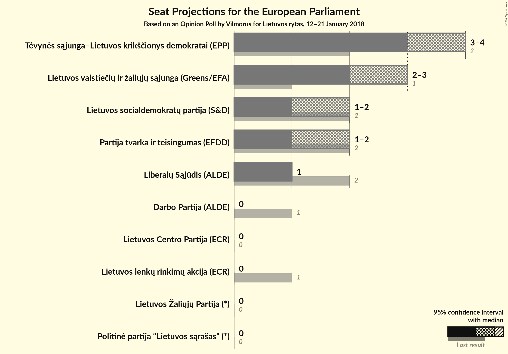

# Opinion Poll by Vilmorus for Lietuvos rytas, 12–21 January 2018

<a href="#voting-intentions">Voting Intentions</a> | <a href="#seats">Seats</a> | <a href="#coalitions">Coalitions</a> | <a href="#technical-information">Technical Information</a>

## Voting Intentions

### Confidence Intervals

| Party | Last Result | Poll Result | 80% Confidence Interval | 90% Confidence Interval | 95% Confidence Interval | 99% Confidence Interval |
|:-----:|:-----------:|:-----------:|:-----------------------:|:-----------------------:|:-----------------------:|:-----------------------:|
| Tėvynės sąjunga–Lietuvos krikščionys demokratai (EPP) | 17.4% | 29.0% | 27.3–30.9% |26.7–31.4% |26.3–31.9% |25.5–32.8% |
| Lietuvos valstiečių ir žaliųjų sąjunga (Greens/EFA) | 6.6% | 23.0% | 21.4–24.8% |20.9–25.3% |20.5–25.7% |19.8–26.5% |
| Partija tvarka ir teisingumas (EFDD) | 14.2% | 14.0% | 12.7–15.5% |12.3–15.9% |12.0–16.3% |11.4–17.0% |
| Lietuvos socialdemokratų partija (S&D) | 17.3% | 14.0% | 12.7–15.5% |12.3–15.9% |12.0–16.3% |11.4–17.0% |
| Liberalų Sąjūdis (ALDE) | 16.6% | 7.0% | 6.0–8.1% |5.8–8.4% |5.6–8.7% |5.2–9.3% |
| Lietuvos lenkų rinkimų akcija (ECR) | 8.1% | 4.0% | 3.3–4.9% |3.1–5.1% |2.9–5.3% |2.6–5.8% |
| Lietuvos Centro Partija (*) | 0.0% | 3.0% | N/A |N/A |N/A |N/A |
| Darbo Partija (ALDE) | 12.4% | 3.0% | 2.4–3.8% |2.3–4.0% |2.1–4.2% |1.9–4.6% |
| Lietuvos Žaliųjų Partija (*) | 3.6% | 1.0% | N/A |N/A |N/A |N/A |
| Politinė partija “Lietuvos sąrašas” (*) | 0.0% | 1.0% | N/A |N/A |N/A |N/A |

*Note:* The poll result column reflects the actual value used in the calculations. Published results may vary slightly, and in addition be rounded to fewer digits.

## Seats

### Confidence Intervals

| Party | Last Result | Median | 80% Confidence Interval | 90% Confidence Interval | 95% Confidence Interval | 99% Confidence Interval |
|:-----:|:-----------:|:------:|:-----------------------:|:-----------------------:|:-----------------------:|:-----------------------:|
| <a href="#tėvynės-sąjunga–lietuvos-krikščionys-demokratai-(epp)">Tėvynės sąjunga–Lietuvos krikščionys demokratai (EPP)</a> | 2 | 4 | 3–4 |3–4 |3–4 |3–4 |
| <a href="#lietuvos-valstiečių-ir-žaliųjų-sąjunga-(greens/efa)">Lietuvos valstiečių ir žaliųjų sąjunga (Greens/EFA)</a> | 1 | 3 | 2–3 |2–3 |2–3 |2–3 |
| <a href="#partija-tvarka-ir-teisingumas-(efdd)">Partija tvarka ir teisingumas (EFDD)</a> | 2 | 2 | 1–2 |1–2 |1–2 |1–2 |
| <a href="#lietuvos-socialdemokratų-partija-(s&d)">Lietuvos socialdemokratų partija (S&D)</a> | 2 | 2 | 1–2 |1–2 |1–2 |1–2 |
| <a href="#liberalų-sąjūdis-(alde)">Liberalų Sąjūdis (ALDE)</a> | 2 | 1 | 1 |1 |1 |0–1 |
| <a href="#lietuvos-lenkų-rinkimų-akcija-(ecr)">Lietuvos lenkų rinkimų akcija (ECR)</a> | 1 | 0 | 0 |0 |0 |0–1 |
| <a href="#lietuvos-centro-partija-(*)">Lietuvos Centro Partija (*)</a> | 0 | N/A | N/A |N/A |N/A |N/A |
| <a href="#darbo-partija-(alde)">Darbo Partija (ALDE)</a> | 1 | 0 | 0 |0 |0 |0 |
| <a href="#lietuvos-Žaliųjų-partija-(*)">Lietuvos Žaliųjų Partija (*)</a> | 0 | N/A | N/A |N/A |N/A |N/A |
| <a href="#politinė-partija-“lietuvos-sąrašas”-(*)">Politinė partija “Lietuvos sąrašas” (*)</a> | 0 | N/A | N/A |N/A |N/A |N/A |

