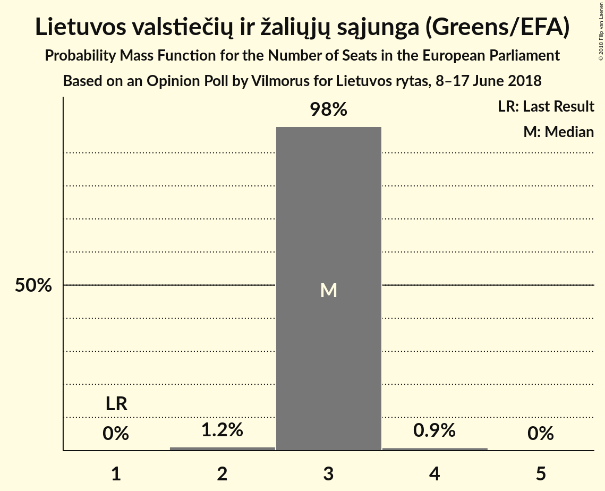
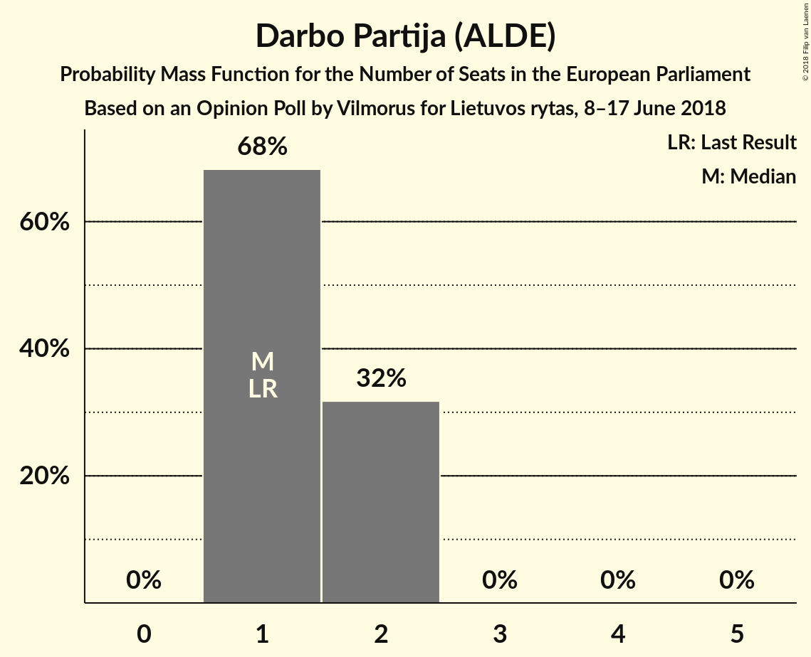
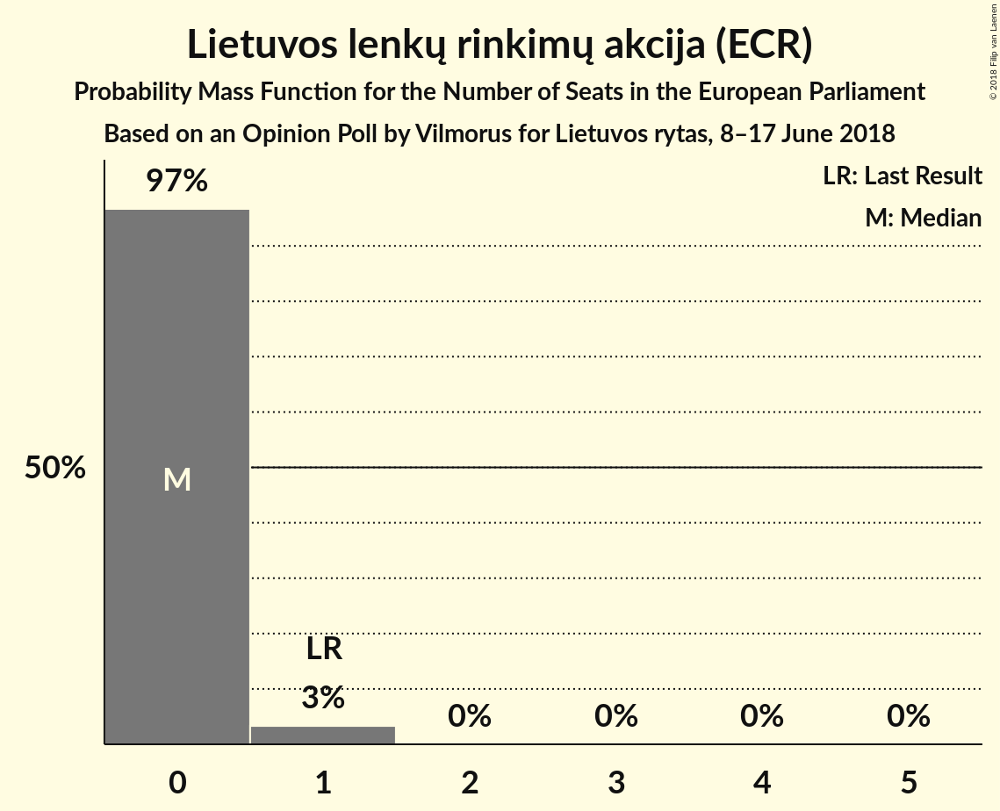
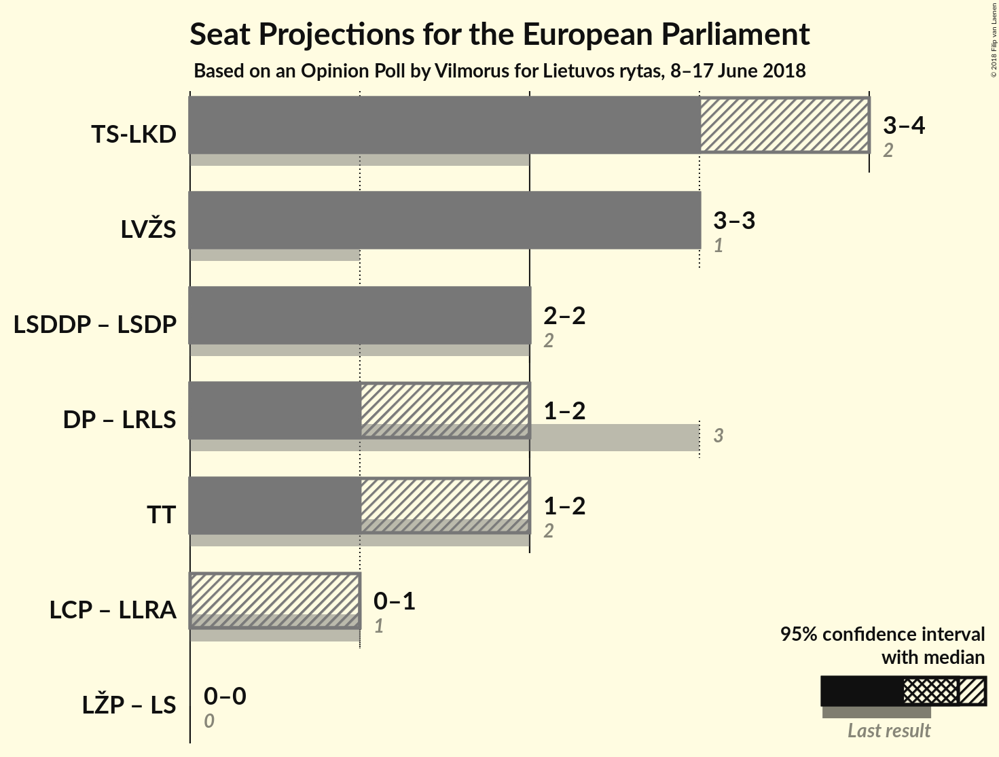

# Opinion Poll by Vilmorus for Lietuvos rytas, 8–17 June 2018

<a href="#voting-intentions">Voting Intentions</a> | <a href="#seats">Seats</a> | <a href="#coalitions">Coalitions</a> | <a href="#technical-information">Technical Information</a>

## Voting Intentions

### Confidence Intervals

| Party | Last Result | Poll Result | 80% Confidence Interval | 90% Confidence Interval | 95% Confidence Interval | 99% Confidence Interval |
|:-----:|:-----------:|:-----------:|:-----------------------:|:-----------------------:|:-----------------------:|:-----------------------:|
| Tėvynės sąjunga–Lietuvos krikščionys demokratai (EPP) | 17.4% | 26.0% | 24.3–27.8% |23.8–28.3% |23.4–28.8% |22.6–29.7% |
| Lietuvos valstiečių ir žaliųjų sąjunga (Greens/EFA) | 6.6% | 24.0% | 22.3–25.8% |21.9–26.2% |21.5–26.7% |20.7–27.6% |
| Darbo Partija (ALDE) | 12.4% | 11.0% | 9.9–12.4% |9.5–12.8% |9.3–13.1% |8.7–13.8% |
| Partija tvarka ir teisingumas (EFDD) | 14.2% | 10.0% | 8.9–11.3% |8.5–11.6% |8.3–11.9% |7.8–12.6% |
| Lietuvos socialdemokratų partija (S&D) | 17.3% | 8.0% | 7.0–9.2% |6.8–9.6% |6.5–9.8% |6.1–10.4% |
| Lietuvos socialdemokratų darbo partija (S&D) | 0.0% | 8.0% | 7.0–9.2% |6.8–9.6% |6.5–9.8% |6.1–10.4% |
| Lietuvos Centro Partija (*) | 0.0% | 5.0% | 4.3–6.0% |4.0–6.3% |3.9–6.5% |3.5–7.0% |
| Lietuvos lenkų rinkimų akcija (ECR) | 8.0% | 4.0% | 3.3–4.9% |3.1–5.1% |2.9–5.3% |2.6–5.8% |
| Liberalų Sąjūdis (ALDE) | 16.6% | 3.0% | 2.4–3.8% |2.3–4.0% |2.1–4.2% |1.9–4.6% |

*Note:* The poll result column reflects the actual value used in the calculations. Published results may vary slightly, and in addition be rounded to fewer digits.

## Seats

### Confidence Intervals

| Party | Last Result | Median | 80% Confidence Interval | 90% Confidence Interval | 95% Confidence Interval | 99% Confidence Interval |
|:-----:|:-----------:|:------:|:-----------------------:|:-----------------------:|:-----------------------:|:-----------------------:|
| <a href="#tėvynės-sąjunga–lietuvos-krikščionys-demokratai-(epp)">Tėvynės sąjunga–Lietuvos krikščionys demokratai (EPP)</a> | 2 | 3 | 3–4 |3–4 |3–4 |3–4 |
| <a href="#lietuvos-valstiečių-ir-žaliųjų-sąjunga-(greens/efa)">Lietuvos valstiečių ir žaliųjų sąjunga (Greens/EFA)</a> | 1 | 3 | 3 |3 |3 |2–4 |
| <a href="#darbo-partija-(alde)">Darbo Partija (ALDE)</a> | 1 | 1 | 1–2 |1–2 |1–2 |1–2 |
| <a href="#partija-tvarka-ir-teisingumas-(efdd)">Partija tvarka ir teisingumas (EFDD)</a> | 2 | 1 | 1 |1–2 |1–2 |1–2 |
| <a href="#lietuvos-socialdemokratų-partija-(s&d)">Lietuvos socialdemokratų partija (S&D)</a> | 2 | 1 | 1 |1 |1 |1 |
| <a href="#lietuvos-socialdemokratų-darbo-partija-(s&d)">Lietuvos socialdemokratų darbo partija (S&D)</a> | 0 | 1 | 1 |1 |1 |1 |
| <a href="#lietuvos-centro-partija-(*)">Lietuvos Centro Partija (*)</a> | 0 | 0 | 0–1 |0–1 |0–1 |0–1 |
| <a href="#lietuvos-lenkų-rinkimų-akcija-(ecr)">Lietuvos lenkų rinkimų akcija (ECR)</a> | 1 | 0 | 0 |0 |0–1 |0–1 |
| <a href="#liberalų-sąjūdis-(alde)">Liberalų Sąjūdis (ALDE)</a> | 2 | 0 | 0 |0 |0 |0 |

### Tėvynės sąjunga–Lietuvos krikščionys demokratai (EPP)

*For a full overview of the results for this party, see the [Tėvynės sąjunga–Lietuvos krikščionys demokratai (EPP)](party-tėvynėssąjunga–lietuvoskrikščionysdemokrataiepp.html) page.*

| Number of Seats | Probability | Accumulated | Special Marks |
|:---------------:|:-----------:|:-----------:|:-------------:|
| 2 | 0.1% | 100% | Last Result |
| 3 | 90% | 99.9% | Median |
| 4 | 10% | 10% |  |
| 5 | 0% | 0% |  |

### Lietuvos valstiečių ir žaliųjų sąjunga (Greens/EFA)

*For a full overview of the results for this party, see the [Lietuvos valstiečių ir žaliųjų sąjunga (Greens/EFA)](party-lietuvosvalstiečiųiržaliųjųsąjungagreensefa.html) page.*

| Number of Seats | Probability | Accumulated | Special Marks |
|:---------------:|:-----------:|:-----------:|:-------------:|
| 1 | 0% | 100% | Last Result |
| 2 | 1.2% | 100% |  |
| 3 | 98% | 98.8% | Median |
| 4 | 0.9% | 0.9% |  |
| 5 | 0% | 0% |  |

### Darbo Partija (ALDE)

*For a full overview of the results for this party, see the [Darbo Partija (ALDE)](party-darbopartijaalde.html) page.*

| Number of Seats | Probability | Accumulated | Special Marks |
|:---------------:|:-----------:|:-----------:|:-------------:|
| 1 | 68% | 100% | Last Result, Median |
| 2 | 32% | 32% |  |
| 3 | 0% | 0% |  |

### Partija tvarka ir teisingumas (EFDD)

*For a full overview of the results for this party, see the [Partija tvarka ir teisingumas (EFDD)](party-partijatvarkairteisingumasefdd.html) page.*

| Number of Seats | Probability | Accumulated | Special Marks |
|:---------------:|:-----------:|:-----------:|:-------------:|
| 1 | 91% | 100% | Median |
| 2 | 9% | 9% | Last Result |
| 3 | 0% | 0% |  |

### Lietuvos socialdemokratų partija (S&D)

*For a full overview of the results for this party, see the [Lietuvos socialdemokratų partija (S&D)](party-lietuvossocialdemokratųpartijasd.html) page.*

| Number of Seats | Probability | Accumulated | Special Marks |
|:---------------:|:-----------:|:-----------:|:-------------:|
| 1 | 99.8% | 100% | Median |
| 2 | 0.2% | 0.2% | Last Result |
| 3 | 0% | 0% |  |

### Lietuvos socialdemokratų darbo partija (S&D)

*For a full overview of the results for this party, see the [Lietuvos socialdemokratų darbo partija (S&D)](party-lietuvossocialdemokratųdarbopartijasd.html) page.*

| Number of Seats | Probability | Accumulated | Special Marks |
|:---------------:|:-----------:|:-----------:|:-------------:|
| 0 | 0% | 100% | Last Result |
| 1 | 99.6% | 100% | Median |
| 2 | 0.4% | 0.4% |  |
| 3 | 0% | 0% |  |

### Lietuvos Centro Partija (*)

*For a full overview of the results for this party, see the [Lietuvos Centro Partija (*)](party-lietuvoscentropartija.html) page.*

| Number of Seats | Probability | Accumulated | Special Marks |
|:---------------:|:-----------:|:-----------:|:-------------:|
| 0 | 54% | 100% | Last Result, Median |
| 1 | 46% | 46% |  |
| 2 | 0% | 0% |  |

### Lietuvos lenkų rinkimų akcija (ECR)

*For a full overview of the results for this party, see the [Lietuvos lenkų rinkimų akcija (ECR)](party-lietuvoslenkųrinkimųakcijaecr.html) page.*

| Number of Seats | Probability | Accumulated | Special Marks |
|:---------------:|:-----------:|:-----------:|:-------------:|
| 0 | 97% | 100% | Median |
| 1 | 3% | 3% | Last Result |
| 2 | 0% | 0% |  |

### Liberalų Sąjūdis (ALDE)

*For a full overview of the results for this party, see the [Liberalų Sąjūdis (ALDE)](party-liberalųsąjūdisalde.html) page.*

| Number of Seats | Probability | Accumulated | Special Marks |
|:---------------:|:-----------:|:-----------:|:-------------:|
| 0 | 99.9% | 100% | Median |
| 1 | 0.1% | 0.1% |  |
| 2 | 0% | 0% | Last Result |

## Coalitions

### Confidence Intervals

| Coalition | Last Result | Median | Majority? | 80% Confidence Interval | 90% Confidence Interval | 95% Confidence Interval | 99% Confidence Interval |
|:---------:|:-----------:|:------:|:---------:|:-----------------------:|:-----------------------:|:-----------------------:|:-----------------------:|
| Tėvynės sąjunga–Lietuvos krikščionys demokratai (EPP) | 2 | 3 | 0% | 3–4 | 3–4 | 3–4 | 3–4 |
| Lietuvos valstiečių ir žaliųjų sąjunga (Greens/EFA) | 1 | 3 | 0% | 3 | 3 | 3 | 2–4 |
| Lietuvos socialdemokratų darbo partija (S&D) – Lietuvos socialdemokratų partija (S&D) | 2 | 2 | 0% | 2 | 2 | 2 | 2–3 |
| Darbo Partija (ALDE) – Liberalų Sąjūdis (ALDE) | 3 | 1 | 0% | 1–2 | 1–2 | 1–2 | 1–2 |
| Partija tvarka ir teisingumas (EFDD) | 2 | 1 | 0% | 1 | 1–2 | 1–2 | 1–2 |
| Lietuvos lenkų rinkimų akcija (ECR) | 1 | 0 | 0% | 0 | 0 | 0–1 | 0–1 |

### Tėvynės sąjunga–Lietuvos krikščionys demokratai (EPP)

| Number of Seats | Probability | Accumulated | Special Marks |
|:---------------:|:-----------:|:-----------:|:-------------:|
| 2 | 0.1% | 100% | Last Result |
| 3 | 90% | 99.9% | Median |
| 4 | 10% | 10% |  |
| 5 | 0% | 0% |  |

### Lietuvos valstiečių ir žaliųjų sąjunga (Greens/EFA)

| Number of Seats | Probability | Accumulated | Special Marks |
|:---------------:|:-----------:|:-----------:|:-------------:|
| 1 | 0% | 100% | Last Result |
| 2 | 1.2% | 100% |  |
| 3 | 98% | 98.8% | Median |
| 4 | 0.9% | 0.9% |  |
| 5 | 0% | 0% |  |

### Lietuvos socialdemokratų darbo partija (S&D) – Lietuvos socialdemokratų partija (S&D)

| Number of Seats | Probability | Accumulated | Special Marks |
|:---------------:|:-----------:|:-----------:|:-------------:|
| 2 | 99.4% | 100% | Last Result, Median |
| 3 | 0.6% | 0.6% |  |
| 4 | 0% | 0% |  |

### Darbo Partija (ALDE) – Liberalų Sąjūdis (ALDE)

| Number of Seats | Probability | Accumulated | Special Marks |
|:---------------:|:-----------:|:-----------:|:-------------:|
| 1 | 68% | 100% | Median |
| 2 | 32% | 32% |  |
| 3 | 0% | 0% | Last Result |

### Partija tvarka ir teisingumas (EFDD)

| Number of Seats | Probability | Accumulated | Special Marks |
|:---------------:|:-----------:|:-----------:|:-------------:|
| 1 | 91% | 100% | Median |
| 2 | 9% | 9% | Last Result |
| 3 | 0% | 0% |  |

### Lietuvos lenkų rinkimų akcija (ECR)

| Number of Seats | Probability | Accumulated | Special Marks |
|:---------------:|:-----------:|:-----------:|:-------------:|
| 0 | 97% | 100% | Median |
| 1 | 3% | 3% | Last Result |
| 2 | 0% | 0% |  |

## Technical Information

### Opinion Poll

+ **Polling firm:** Vilmorus
+ **Commissioner(s):** Lietuvos rytas
+ **Fieldwork period:** 8–17 June 2018

### Calculations

+ **Sample size:** 1034
+ **Simulations done:** 1,048,576
+ **Error estimate:** 2.44%

