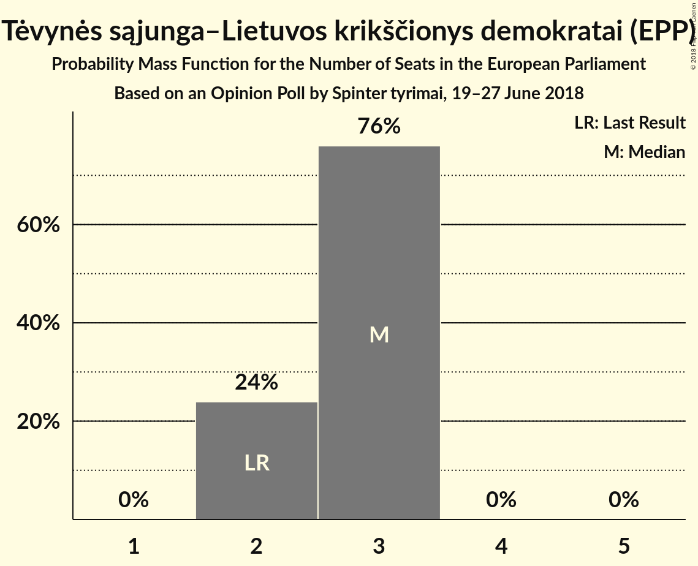
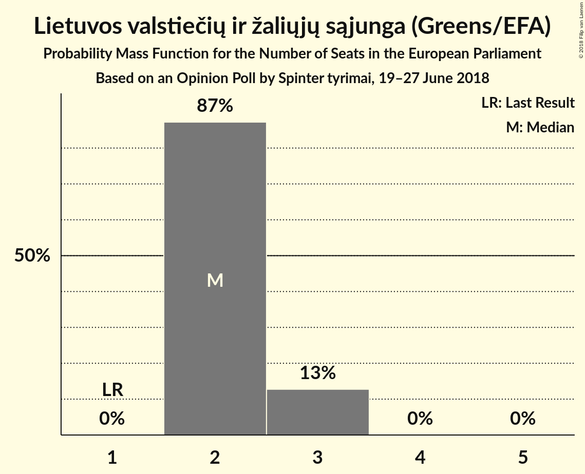
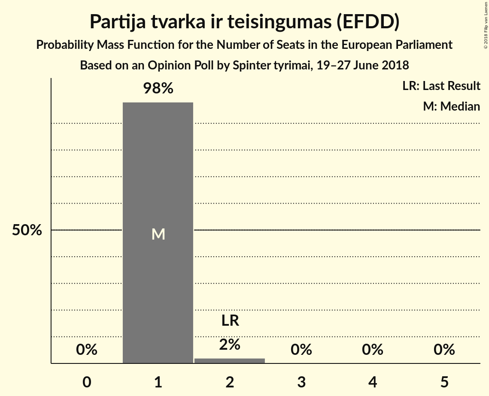
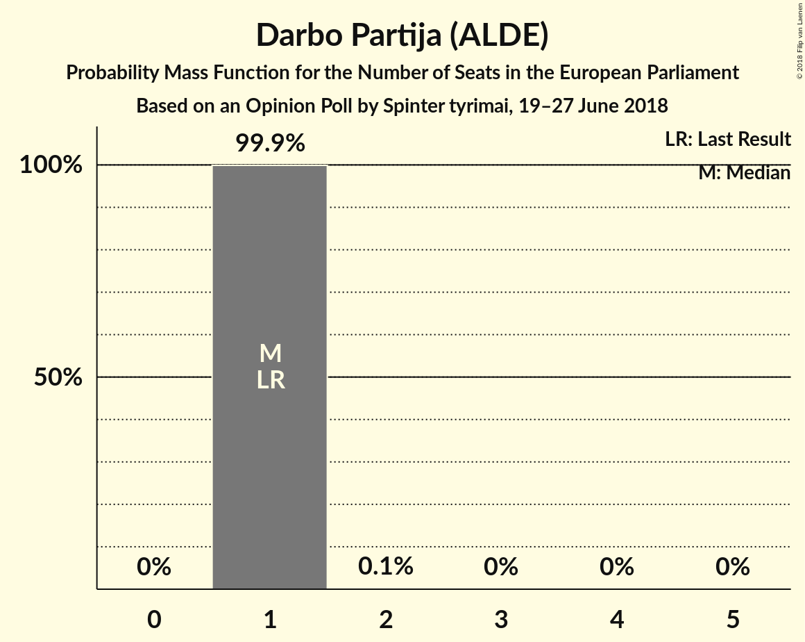
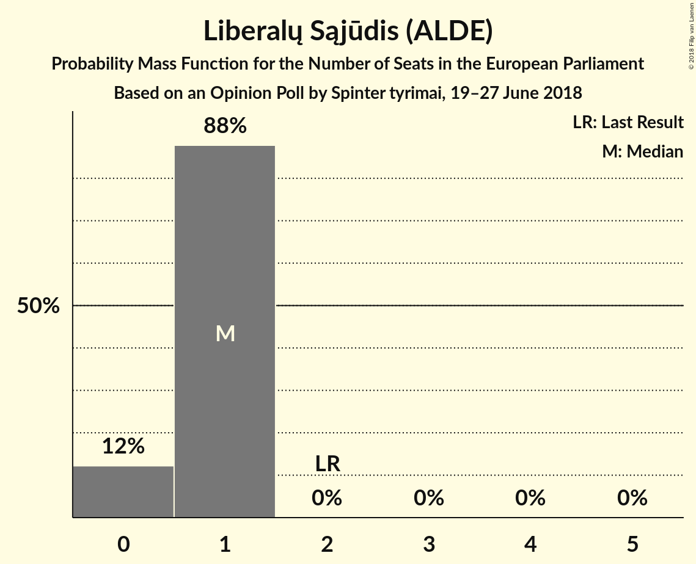
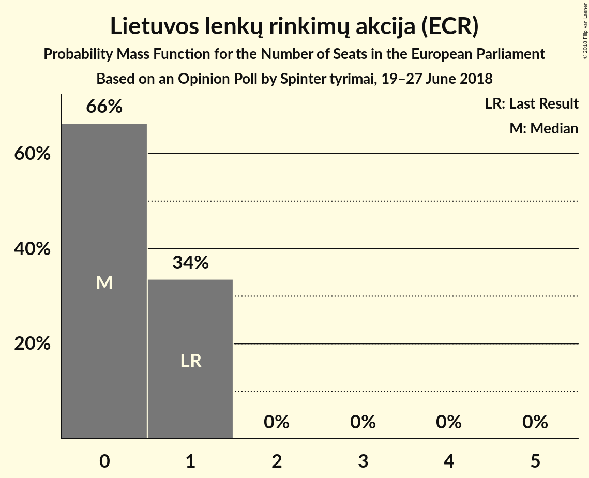
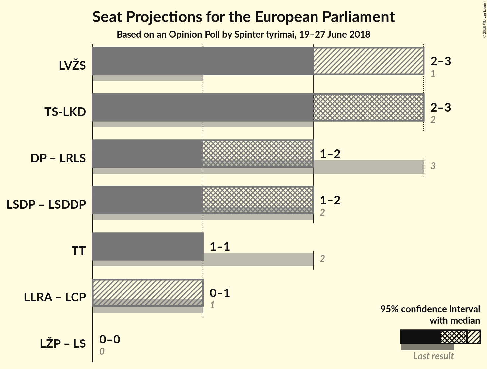

# Opinion Poll by Spinter tyrimai, 19–27 June 2018

<a href="#voting-intentions">Voting Intentions</a> | <a href="#seats">Seats</a> | <a href="#coalitions">Coalitions</a> | <a href="#technical-information">Technical Information</a>

## Voting Intentions

### Confidence Intervals

| Party | Last Result | Poll Result | 80% Confidence Interval | 90% Confidence Interval | 95% Confidence Interval | 99% Confidence Interval |
|:-----:|:-----------:|:-----------:|:-----------------------:|:-----------------------:|:-----------------------:|:-----------------------:|
| Tėvynės sąjunga–Lietuvos krikščionys demokratai (EPP) | 17.4% | 23.0% | 21.4–24.8% |20.9–25.3% |20.5–25.7% |19.8–26.6% |
| Lietuvos valstiečių ir žaliųjų sąjunga (Greens/EFA) | 6.6% | 20.0% | 18.5–21.7% |18.0–22.2% |17.7–22.6% |16.9–23.5% |
| Partija tvarka ir teisingumas (EFDD) | 14.2% | 11.0% | 9.8–12.3% |9.5–12.7% |9.2–13.1% |8.6–13.7% |
| Lietuvos socialdemokratų partija (S&D) | 17.3% | 10.0% | 8.8–11.3% |8.5–11.7% |8.3–12.0% |7.8–12.7% |
| Darbo Partija (ALDE) | 12.4% | 9.0% | 7.9–10.2% |7.6–10.6% |7.3–10.9% |6.9–11.5% |
| Liberalų Sąjūdis (ALDE) | 16.6% | 6.0% | 5.1–7.1% |4.9–7.4% |4.7–7.6% |4.3–8.2% |
| Lietuvos socialdemokratų darbo partija (S&D) | 0.0% | 6.0% | 5.1–7.1% |4.9–7.4% |4.7–7.6% |4.3–8.2% |
| Lietuvos lenkų rinkimų akcija (ECR) | 8.0% | 5.0% | 4.2–6.0% |4.0–6.3% |3.8–6.5% |3.5–7.0% |
| Lietuvos Centro Partija (ECR) | 0.0% | 4.0% | 3.3–4.9% |3.1–5.2% |2.9–5.4% |2.6–5.9% |

*Note:* The poll result column reflects the actual value used in the calculations. Published results may vary slightly, and in addition be rounded to fewer digits.

## Seats

### Confidence Intervals

| Party | Last Result | Median | 80% Confidence Interval | 90% Confidence Interval | 95% Confidence Interval | 99% Confidence Interval |
|:-----:|:-----------:|:------:|:-----------------------:|:-----------------------:|:-----------------------:|:-----------------------:|
| <a href="#tėvynės-sąjunga–lietuvos-krikščionys-demokratai-(epp)">Tėvynės sąjunga–Lietuvos krikščionys demokratai (EPP)</a> | 2 | 3 | 2–3 |2–3 |2–3 |2–3 |
| <a href="#lietuvos-valstiečių-ir-žaliųjų-sąjunga-(greens/efa)">Lietuvos valstiečių ir žaliųjų sąjunga (Greens/EFA)</a> | 1 | 2 | 2–3 |2–3 |2–3 |2–3 |
| <a href="#partija-tvarka-ir-teisingumas-(efdd)">Partija tvarka ir teisingumas (EFDD)</a> | 2 | 1 | 1 |1 |1 |1–2 |
| <a href="#lietuvos-socialdemokratų-partija-(s&d)">Lietuvos socialdemokratų partija (S&D)</a> | 2 | 1 | 1 |1 |1 |1–2 |
| <a href="#darbo-partija-(alde)">Darbo Partija (ALDE)</a> | 1 | 1 | 1 |1 |1 |1 |
| <a href="#liberalų-sąjūdis-(alde)">Liberalų Sąjūdis (ALDE)</a> | 2 | 1 | 0–1 |0–1 |0–1 |0–1 |
| <a href="#lietuvos-socialdemokratų-darbo-partija-(s&d)">Lietuvos socialdemokratų darbo partija (S&D)</a> | 0 | 1 | 0–1 |0–1 |0–1 |0–1 |
| <a href="#lietuvos-lenkų-rinkimų-akcija-(ecr)">Lietuvos lenkų rinkimų akcija (ECR)</a> | 1 | 0 | 0–1 |0–1 |0–1 |0–1 |
| <a href="#lietuvos-centro-partija-(ecr)">Lietuvos Centro Partija (ECR)</a> | 0 | 0 | 0 |0–1 |0–1 |0–1 |

### Tėvynės sąjunga–Lietuvos krikščionys demokratai (EPP)

*For a full overview of the results for this party, see the [Tėvynės sąjunga–Lietuvos krikščionys demokratai (EPP)](party-tėvynėssąjunga–lietuvoskrikščionysdemokrataiepp.html) page.*

| Number of Seats | Probability | Accumulated | Special Marks |
|:---------------:|:-----------:|:-----------:|:-------------:|
| 2 | 24% | 100% | Last Result |
| 3 | 76% | 76% | Median |
| 4 | 0% | 0% |  |

### Lietuvos valstiečių ir žaliųjų sąjunga (Greens/EFA)

*For a full overview of the results for this party, see the [Lietuvos valstiečių ir žaliųjų sąjunga (Greens/EFA)](party-lietuvosvalstiečiųiržaliųjųsąjungagreensefa.html) page.*

| Number of Seats | Probability | Accumulated | Special Marks |
|:---------------:|:-----------:|:-----------:|:-------------:|
| 1 | 0% | 100% | Last Result |
| 2 | 87% | 100% | Median |
| 3 | 13% | 13% |  |
| 4 | 0% | 0% |  |

### Partija tvarka ir teisingumas (EFDD)

*For a full overview of the results for this party, see the [Partija tvarka ir teisingumas (EFDD)](party-partijatvarkairteisingumasefdd.html) page.*

| Number of Seats | Probability | Accumulated | Special Marks |
|:---------------:|:-----------:|:-----------:|:-------------:|
| 1 | 98% | 100% | Median |
| 2 | 2% | 2% | Last Result |
| 3 | 0% | 0% |  |

### Lietuvos socialdemokratų partija (S&D)

*For a full overview of the results for this party, see the [Lietuvos socialdemokratų partija (S&D)](party-lietuvossocialdemokratųpartijasd.html) page.*

| Number of Seats | Probability | Accumulated | Special Marks |
|:---------------:|:-----------:|:-----------:|:-------------:|
| 1 | 99.3% | 100% | Median |
| 2 | 0.7% | 0.7% | Last Result |
| 3 | 0% | 0% |  |

### Darbo Partija (ALDE)

*For a full overview of the results for this party, see the [Darbo Partija (ALDE)](party-darbopartijaalde.html) page.*

| Number of Seats | Probability | Accumulated | Special Marks |
|:---------------:|:-----------:|:-----------:|:-------------:|
| 1 | 99.9% | 100% | Last Result, Median |
| 2 | 0.1% | 0.1% |  |
| 3 | 0% | 0% |  |

### Liberalų Sąjūdis (ALDE)

*For a full overview of the results for this party, see the [Liberalų Sąjūdis (ALDE)](party-liberalųsąjūdisalde.html) page.*

| Number of Seats | Probability | Accumulated | Special Marks |
|:---------------:|:-----------:|:-----------:|:-------------:|
| 0 | 12% | 100% |  |
| 1 | 88% | 88% | Median |
| 2 | 0% | 0% | Last Result |

### Lietuvos socialdemokratų darbo partija (S&D)

*For a full overview of the results for this party, see the [Lietuvos socialdemokratų darbo partija (S&D)](party-lietuvossocialdemokratųdarbopartijasd.html) page.*

| Number of Seats | Probability | Accumulated | Special Marks |
|:---------------:|:-----------:|:-----------:|:-------------:|
| 0 | 10% | 100% | Last Result |
| 1 | 90% | 90% | Median |
| 2 | 0% | 0% |  |

### Lietuvos lenkų rinkimų akcija (ECR)

*For a full overview of the results for this party, see the [Lietuvos lenkų rinkimų akcija (ECR)](party-lietuvoslenkųrinkimųakcijaecr.html) page.*

| Number of Seats | Probability | Accumulated | Special Marks |
|:---------------:|:-----------:|:-----------:|:-------------:|
| 0 | 66% | 100% | Median |
| 1 | 34% | 34% | Last Result |
| 2 | 0% | 0% |  |

### Lietuvos Centro Partija (ECR)

*For a full overview of the results for this party, see the [Lietuvos Centro Partija (ECR)](party-lietuvoscentropartijaecr.html) page.*

| Number of Seats | Probability | Accumulated | Special Marks |
|:---------------:|:-----------:|:-----------:|:-------------:|
| 0 | 95% | 100% | Last Result, Median |
| 1 | 5% | 5% |  |
| 2 | 0% | 0% |  |

## Coalitions

### Confidence Intervals

| Coalition | Last Result | Median | Majority? | 80% Confidence Interval | 90% Confidence Interval | 95% Confidence Interval | 99% Confidence Interval |
|:---------:|:-----------:|:------:|:---------:|:-----------------------:|:-----------------------:|:-----------------------:|:-----------------------:|
| Lietuvos valstiečių ir žaliųjų sąjunga (Greens/EFA) | 1 | 2 | 0% | 2–3 | 2–3 | 2–3 | 2–3 |
| Tėvynės sąjunga–Lietuvos krikščionys demokratai (EPP) | 2 | 3 | 0% | 2–3 | 2–3 | 2–3 | 2–3 |
| Darbo Partija (ALDE) – Liberalų Sąjūdis (ALDE) | 3 | 2 | 0% | 1–2 | 1–2 | 1–2 | 1–2 |
| Lietuvos socialdemokratų partija (S&D) – Lietuvos socialdemokratų darbo partija (S&D) | 2 | 2 | 0% | 2 | 1–2 | 1–2 | 1–3 |
| Partija tvarka ir teisingumas (EFDD) | 2 | 1 | 0% | 1 | 1 | 1 | 1–2 |
| Lietuvos lenkų rinkimų akcija (ECR) | 1 | 0 | 0% | 0–1 | 0–1 | 0–1 | 0–1 |

### Lietuvos valstiečių ir žaliųjų sąjunga (Greens/EFA)

| Number of Seats | Probability | Accumulated | Special Marks |
|:---------------:|:-----------:|:-----------:|:-------------:|
| 1 | 0% | 100% | Last Result |
| 2 | 87% | 100% | Median |
| 3 | 13% | 13% |  |
| 4 | 0% | 0% |  |

### Tėvynės sąjunga–Lietuvos krikščionys demokratai (EPP)

| Number of Seats | Probability | Accumulated | Special Marks |
|:---------------:|:-----------:|:-----------:|:-------------:|
| 2 | 24% | 100% | Last Result |
| 3 | 76% | 76% | Median |
| 4 | 0% | 0% |  |

### Darbo Partija (ALDE) – Liberalų Sąjūdis (ALDE)

| Number of Seats | Probability | Accumulated | Special Marks |
|:---------------:|:-----------:|:-----------:|:-------------:|
| 1 | 12% | 100% |  |
| 2 | 88% | 88% | Median |
| 3 | 0.1% | 0.1% | Last Result |
| 4 | 0% | 0% |  |

### Lietuvos socialdemokratų partija (S&D) – Lietuvos socialdemokratų darbo partija (S&D)

| Number of Seats | Probability | Accumulated | Special Marks |
|:---------------:|:-----------:|:-----------:|:-------------:|
| 1 | 10% | 100% |  |
| 2 | 90% | 90% | Last Result, Median |
| 3 | 0.6% | 0.6% |  |
| 4 | 0% | 0% |  |

### Partija tvarka ir teisingumas (EFDD)

| Number of Seats | Probability | Accumulated | Special Marks |
|:---------------:|:-----------:|:-----------:|:-------------:|
| 1 | 98% | 100% | Median |
| 2 | 2% | 2% | Last Result |
| 3 | 0% | 0% |  |

### Lietuvos lenkų rinkimų akcija (ECR)

| Number of Seats | Probability | Accumulated | Special Marks |
|:---------------:|:-----------:|:-----------:|:-------------:|
| 0 | 66% | 100% | Median |
| 1 | 34% | 34% | Last Result |
| 2 | 0% | 0% |  |

## Technical Information

### Opinion Poll

+ **Polling firm:** Spinter tyrimai
+ **Commissioner(s):** —
+ **Fieldwork period:** 19–27 June 2018

### Calculations

+ **Sample size:** 1003
+ **Simulations done:** 1,048,575
+ **Error estimate:** 1.84%

