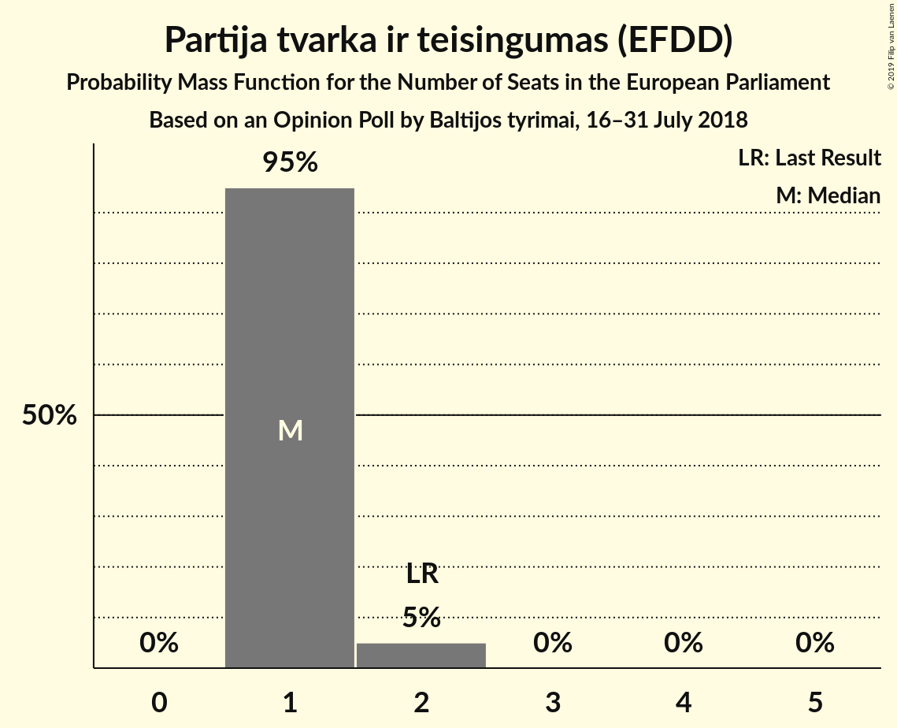
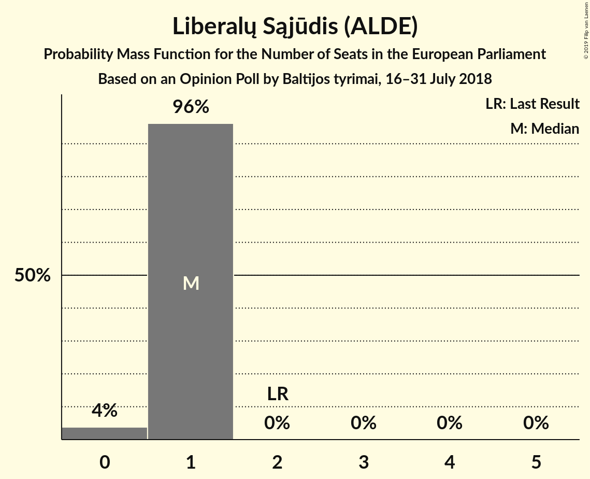
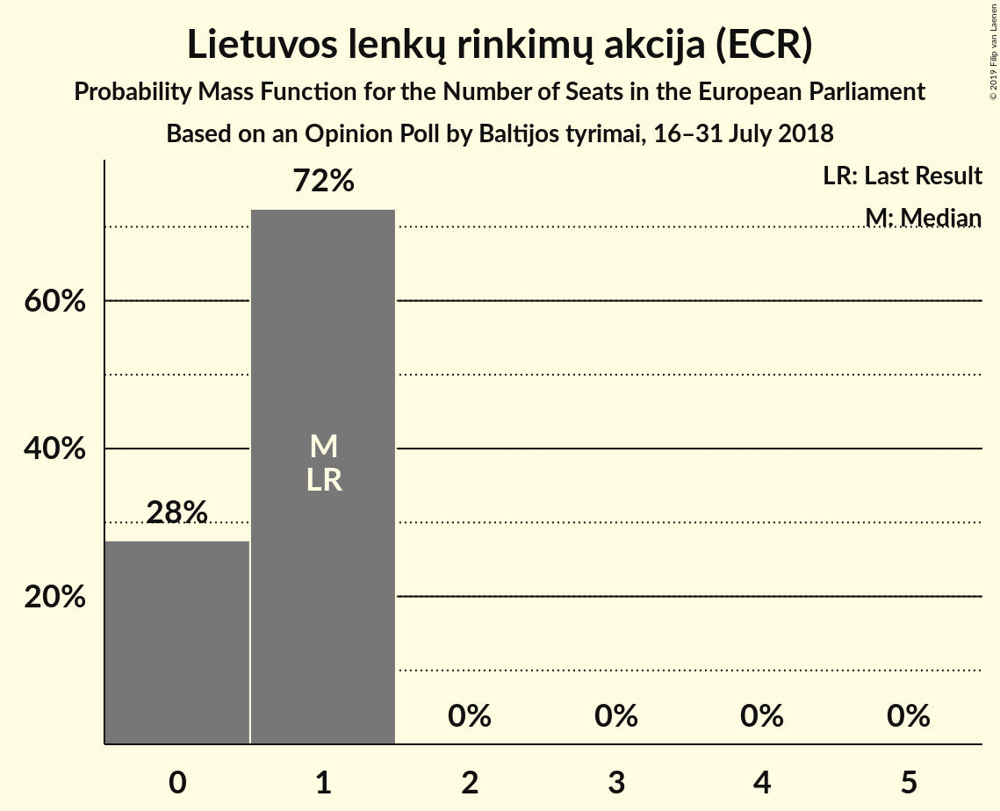

# Opinion Poll by Baltijos tyrimai, 16–31 July 2018

<a href="#voting-intentions">Voting Intentions</a> | <a href="#seats">Seats</a> | <a href="#coalitions">Coalitions</a> | <a href="#technical-information">Technical Information</a>

## Voting Intentions

### Confidence Intervals

| Party | Last Result | Poll Result | 80% Confidence Interval | 90% Confidence Interval | 95% Confidence Interval | 99% Confidence Interval |
|:-----:|:-----------:|:-----------:|:-----------------------:|:-----------------------:|:-----------------------:|:-----------------------:|
| Tėvynės sąjunga–Lietuvos krikščionys demokratai (EPP) | 17.4% | 19.0% | 17.5–20.6% |17.0–21.1% |16.7–21.5% |16.0–22.3% |
| Lietuvos valstiečių ir žaliųjų sąjunga (Greens/EFA) | 6.6% | 17.0% | 15.5–18.6% |15.1–19.0% |14.8–19.4% |14.1–20.2% |
| Partija tvarka ir teisingumas (EFDD) | 14.2% | 13.0% | 11.7–14.5% |11.4–14.9% |11.1–15.2% |10.5–16.0% |
| Lietuvos socialdemokratų partija (S&D) | 17.3% | 10.0% | 8.9–11.4% |8.6–11.7% |8.3–12.0% |7.8–12.7% |
| Darbo Partija (ALDE) | 12.4% | 9.0% | 8.0–10.3% |7.7–10.7% |7.4–11.0% |6.9–11.6% |
| Liberalų Sąjūdis (ALDE) | 16.6% | 7.0% | 6.0–8.1% |5.8–8.4% |5.5–8.7% |5.1–9.3% |
| Lietuvos Centro Partija (*) | 0.0% | 7.0% | 6.0–8.1% |5.8–8.4% |5.5–8.7% |5.1–9.3% |
| Lietuvos lenkų rinkimų akcija (ECR) | 8.0% | 6.0% | 5.1–7.0% |4.9–7.3% |4.6–7.6% |4.3–8.1% |
| Lietuvos socialdemokratų darbo partija (S&D) | 0.0% | 6.0% | 5.1–7.0% |4.9–7.3% |4.6–7.6% |4.3–8.1% |

*Note:* The poll result column reflects the actual value used in the calculations. Published results may vary slightly, and in addition be rounded to fewer digits.

## Seats

### Confidence Intervals

| Party | Last Result | Median | 80% Confidence Interval | 90% Confidence Interval | 95% Confidence Interval | 99% Confidence Interval |
|:-----:|:-----------:|:------:|:-----------------------:|:-----------------------:|:-----------------------:|:-----------------------:|
| <a href="#tėvynės-sąjunga–lietuvos-krikščionys-demokratai-(epp)">Tėvynės sąjunga–Lietuvos krikščionys demokratai (EPP)</a> | 2 | 2 | 2 |2 |1–2 |1–2 |
| <a href="#lietuvos-valstiečių-ir-žaliųjų-sąjunga-(greens/efa)">Lietuvos valstiečių ir žaliųjų sąjunga (Greens/EFA)</a> | 1 | 2 | 2 |2 |1–2 |1–2 |
| <a href="#partija-tvarka-ir-teisingumas-(efdd)">Partija tvarka ir teisingumas (EFDD)</a> | 2 | 1 | 1–2 |1–2 |1–2 |1–2 |
| <a href="#lietuvos-socialdemokratų-partija-(s&d)">Lietuvos socialdemokratų partija (S&D)</a> | 2 | 1 | 1 |1 |1 |1–2 |
| <a href="#darbo-partija-(alde)">Darbo Partija (ALDE)</a> | 1 | 1 | 1 |1 |1 |1 |
| <a href="#liberalų-sąjūdis-(alde)">Liberalų Sąjūdis (ALDE)</a> | 2 | 1 | 0–1 |0–1 |0–1 |0–1 |
| <a href="#lietuvos-centro-partija-(*)">Lietuvos Centro Partija (*)</a> | 0 | 1 | 0–1 |0–1 |0–1 |0–1 |
| <a href="#lietuvos-lenkų-rinkimų-akcija-(ecr)">Lietuvos lenkų rinkimų akcija (ECR)</a> | 1 | 1 | 0–1 |0–1 |0–1 |0–1 |
| <a href="#lietuvos-socialdemokratų-darbo-partija-(s&d)">Lietuvos socialdemokratų darbo partija (S&D)</a> | 0 | 1 | 1 |0–1 |0–1 |0–1 |

### Tėvynės sąjunga–Lietuvos krikščionys demokratai (EPP)

*For a full overview of the results for this party, see the [Tėvynės sąjunga–Lietuvos krikščionys demokratai (EPP)](party-tėvynėssąjunga–lietuvoskrikščionysdemokrataiepp.html) page.*

| Number of Seats | Probability | Accumulated | Special Marks |
|:---------------:|:-----------:|:-----------:|:-------------:|
| 1 | 4% | 100% |  |
| 2 | 95% | 96% | Last Result, Median |
| 3 | 0.5% | 0.5% |  |
| 4 | 0% | 0% |  |

### Lietuvos valstiečių ir žaliųjų sąjunga (Greens/EFA)

*For a full overview of the results for this party, see the [Lietuvos valstiečių ir žaliųjų sąjunga (Greens/EFA)](party-lietuvosvalstiečiųiržaliųjųsąjungagreensefa.html) page.*

| Number of Seats | Probability | Accumulated | Special Marks |
|:---------------:|:-----------:|:-----------:|:-------------:|
| 1 | 4% | 100% | Last Result |
| 2 | 96% | 96% | Median |
| 3 | 0% | 0% |  |

### Partija tvarka ir teisingumas (EFDD)

*For a full overview of the results for this party, see the [Partija tvarka ir teisingumas (EFDD)](party-partijatvarkairteisingumasefdd.html) page.*

| Number of Seats | Probability | Accumulated | Special Marks |
|:---------------:|:-----------:|:-----------:|:-------------:|
| 1 | 63% | 100% | Median |
| 2 | 37% | 37% | Last Result |
| 3 | 0% | 0% |  |

### Lietuvos socialdemokratų partija (S&D)

*For a full overview of the results for this party, see the [Lietuvos socialdemokratų partija (S&D)](party-lietuvossocialdemokratųpartijasd.html) page.*

| Number of Seats | Probability | Accumulated | Special Marks |
|:---------------:|:-----------:|:-----------:|:-------------:|
| 1 | 99.4% | 100% | Median |
| 2 | 0.6% | 0.6% | Last Result |
| 3 | 0% | 0% |  |

### Darbo Partija (ALDE)

*For a full overview of the results for this party, see the [Darbo Partija (ALDE)](party-darbopartijaalde.html) page.*

| Number of Seats | Probability | Accumulated | Special Marks |
|:---------------:|:-----------:|:-----------:|:-------------:|
| 1 | 100% | 100% | Last Result, Median |

### Liberalų Sąjūdis (ALDE)

*For a full overview of the results for this party, see the [Liberalų Sąjūdis (ALDE)](party-liberalųsąjūdisalde.html) page.*

| Number of Seats | Probability | Accumulated | Special Marks |
|:---------------:|:-----------:|:-----------:|:-------------:|
| 0 | 11% | 100% |  |
| 1 | 89% | 89% | Median |
| 2 | 0% | 0% | Last Result |

### Lietuvos Centro Partija (*)

*For a full overview of the results for this party, see the [Lietuvos Centro Partija (*)](party-lietuvoscentropartija.html) page.*

| Number of Seats | Probability | Accumulated | Special Marks |
|:---------------:|:-----------:|:-----------:|:-------------:|
| 0 | 31% | 100% | Last Result |
| 1 | 69% | 69% | Median |
| 2 | 0% | 0% |  |

### Lietuvos lenkų rinkimų akcija (ECR)

*For a full overview of the results for this party, see the [Lietuvos lenkų rinkimų akcija (ECR)](party-lietuvoslenkųrinkimųakcijaecr.html) page.*

| Number of Seats | Probability | Accumulated | Special Marks |
|:---------------:|:-----------:|:-----------:|:-------------:|
| 0 | 37% | 100% |  |
| 1 | 63% | 63% | Last Result, Median |
| 2 | 0% | 0% |  |

### Lietuvos socialdemokratų darbo partija (S&D)

*For a full overview of the results for this party, see the [Lietuvos socialdemokratų darbo partija (S&D)](party-lietuvossocialdemokratųdarbopartijasd.html) page.*

| Number of Seats | Probability | Accumulated | Special Marks |
|:---------------:|:-----------:|:-----------:|:-------------:|
| 0 | 8% | 100% | Last Result |
| 1 | 92% | 92% | Median |
| 2 | 0% | 0% |  |

## Coalitions

### Confidence Intervals

| Coalition | Last Result | Median | Majority? | 80% Confidence Interval | 90% Confidence Interval | 95% Confidence Interval | 99% Confidence Interval |
|:---------:|:-----------:|:------:|:---------:|:-----------------------:|:-----------------------:|:-----------------------:|:-----------------------:|
| Darbo Partija (ALDE) – Liberalų Sąjūdis (ALDE) | 3 | 2 | 0% | 1–2 | 1–2 | 1–2 | 1–2 |
| Lietuvos socialdemokratų partija (S&D) – Lietuvos socialdemokratų darbo partija (S&D) | 2 | 2 | 0% | 2 | 1–2 | 1–2 | 1–2 |
| Lietuvos valstiečių ir žaliųjų sąjunga (Greens/EFA) | 1 | 2 | 0% | 2 | 2 | 1–2 | 1–2 |
| Partija tvarka ir teisingumas (EFDD) | 2 | 1 | 0% | 1–2 | 1–2 | 1–2 | 1–2 |
| Tėvynės sąjunga–Lietuvos krikščionys demokratai (EPP) | 2 | 2 | 0% | 2 | 2 | 1–2 | 1–2 |
| Lietuvos lenkų rinkimų akcija (ECR) | 1 | 1 | 0% | 0–1 | 0–1 | 0–1 | 0–1 |

### Darbo Partija (ALDE) – Liberalų Sąjūdis (ALDE)

| Number of Seats | Probability | Accumulated | Special Marks |
|:---------------:|:-----------:|:-----------:|:-------------:|
| 1 | 11% | 100% |  |
| 2 | 89% | 89% | Median |
| 3 | 0% | 0% | Last Result |

### Lietuvos socialdemokratų partija (S&D) – Lietuvos socialdemokratų darbo partija (S&D)

| Number of Seats | Probability | Accumulated | Special Marks |
|:---------------:|:-----------:|:-----------:|:-------------:|
| 1 | 7% | 100% |  |
| 2 | 93% | 93% | Last Result, Median |
| 3 | 0% | 0% |  |

### Lietuvos valstiečių ir žaliųjų sąjunga (Greens/EFA)

| Number of Seats | Probability | Accumulated | Special Marks |
|:---------------:|:-----------:|:-----------:|:-------------:|
| 1 | 4% | 100% | Last Result |
| 2 | 96% | 96% | Median |
| 3 | 0% | 0% |  |

### Partija tvarka ir teisingumas (EFDD)

| Number of Seats | Probability | Accumulated | Special Marks |
|:---------------:|:-----------:|:-----------:|:-------------:|
| 1 | 63% | 100% | Median |
| 2 | 37% | 37% | Last Result |
| 3 | 0% | 0% |  |

### Tėvynės sąjunga–Lietuvos krikščionys demokratai (EPP)

| Number of Seats | Probability | Accumulated | Special Marks |
|:---------------:|:-----------:|:-----------:|:-------------:|
| 1 | 4% | 100% |  |
| 2 | 95% | 96% | Last Result, Median |
| 3 | 0.5% | 0.5% |  |
| 4 | 0% | 0% |  |

### Lietuvos lenkų rinkimų akcija (ECR)

| Number of Seats | Probability | Accumulated | Special Marks |
|:---------------:|:-----------:|:-----------:|:-------------:|
| 0 | 37% | 100% |  |
| 1 | 63% | 63% | Last Result, Median |
| 2 | 0% | 0% |  |

## Technical Information

### Opinion Poll

+ **Polling firm:** Baltijos tyrimai
+ **Commissioner(s):** —
+ **Fieldwork period:** 16–31 July 2018

### Calculations

+ **Sample size:** 1007
+ **Simulations done:** 1,024
+ **Error estimate:** 4.54%

