# Opinion Poll by Baltijos tyrimai, 24 September–7 October 2018

<a href="#voting-intentions">Voting Intentions</a> | <a href="#seats">Seats</a> | <a href="#coalitions">Coalitions</a> | <a href="#technical-information">Technical Information</a>

## Voting Intentions

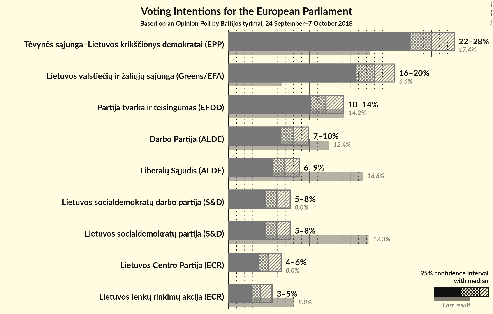

### Confidence Intervals

| Party | Last Result | Poll Result | 80% Confidence Interval | 90% Confidence Interval | 95% Confidence Interval | 99% Confidence Interval |
|:-----:|:-----------:|:-----------:|:-----------------------:|:-----------------------:|:-----------------------:|:-----------------------:|
| Tėvynės sąjunga–Lietuvos krikščionys demokratai (EPP) | 17.4% | 25.0% | 23.3–26.8% |22.8–27.4% |22.4–27.8% |21.7–28.7% |
| Lietuvos valstiečių ir žaliųjų sąjunga (Greens/EFA) | 6.6% | 18.0% | 16.5–19.6% |16.1–20.1% |15.7–20.5% |15.0–21.3% |
| Partija tvarka ir teisingumas (EFDD) | 14.2% | 12.0% | 10.8–13.4% |10.4–13.8% |10.2–14.2% |9.6–14.9% |
| Darbo Partija (ALDE) | 12.4% | 8.0% | 7.0–9.3% |6.8–9.6% |6.5–9.9% |6.1–10.5% |
| Liberalų Sąjūdis (ALDE) | 16.6% | 7.0% | 6.0–8.1% |5.8–8.4% |5.5–8.7% |5.1–9.3% |
| Lietuvos socialdemokratų partija (S&D) | 17.3% | 6.0% | 5.1–7.0% |4.9–7.3% |4.6–7.6% |4.3–8.1% |
| Lietuvos socialdemokratų darbo partija (S&D) | 0.0% | 6.0% | 5.1–7.0% |4.9–7.3% |4.6–7.6% |4.3–8.1% |
| Lietuvos Centro Partija (ECR) | 0.0% | 5.0% | 4.2–6.0% |4.0–6.2% |3.8–6.5% |3.4–7.0% |
| Lietuvos lenkų rinkimų akcija (ECR) | 8.0% | 4.0% | 3.3–4.9% |3.1–5.1% |2.9–5.4% |2.6–5.8% |

*Note:* The poll result column reflects the actual value used in the calculations. Published results may vary slightly, and in addition be rounded to fewer digits.

## Seats

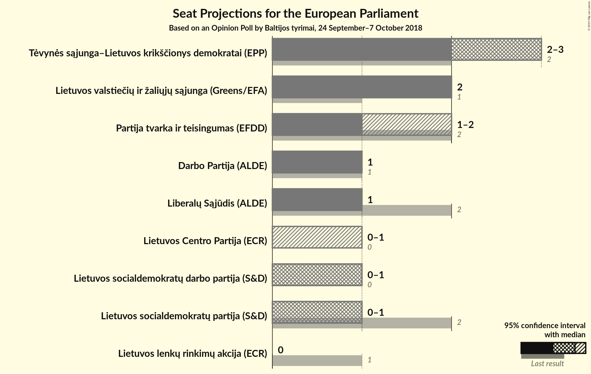

### Confidence Intervals

| Party | Last Result | Median | 80% Confidence Interval | 90% Confidence Interval | 95% Confidence Interval | 99% Confidence Interval |
|:-----:|:-----------:|:------:|:-----------------------:|:-----------------------:|:-----------------------:|:-----------------------:|
| <a href="#tėvynės-sąjunga–lietuvos-krikščionys-demokratai-(epp)">Tėvynės sąjunga–Lietuvos krikščionys demokratai (EPP)</a> | 2 | 3 | 3 |3 |2–3 |2–3 |
| <a href="#lietuvos-valstiečių-ir-žaliųjų-sąjunga-(greens/efa)">Lietuvos valstiečių ir žaliųjų sąjunga (Greens/EFA)</a> | 1 | 2 | 2 |2 |2 |2–3 |
| <a href="#partija-tvarka-ir-teisingumas-(efdd)">Partija tvarka ir teisingumas (EFDD)</a> | 2 | 1 | 1 |1–2 |1–2 |1–2 |
| <a href="#darbo-partija-(alde)">Darbo Partija (ALDE)</a> | 1 | 1 | 1 |1 |1 |1 |
| <a href="#liberalų-sąjūdis-(alde)">Liberalų Sąjūdis (ALDE)</a> | 2 | 1 | 1 |1 |1 |0–1 |
| <a href="#lietuvos-socialdemokratų-partija-(s&d)">Lietuvos socialdemokratų partija (S&D)</a> | 2 | 1 | 0–1 |0–1 |0–1 |0–1 |
| <a href="#lietuvos-socialdemokratų-darbo-partija-(s&d)">Lietuvos socialdemokratų darbo partija (S&D)</a> | 0 | 1 | 0–1 |0–1 |0–1 |0–1 |
| <a href="#lietuvos-centro-partija-(ecr)">Lietuvos Centro Partija (ECR)</a> | 0 | 0 | 0–1 |0–1 |0–1 |0–1 |
| <a href="#lietuvos-lenkų-rinkimų-akcija-(ecr)">Lietuvos lenkų rinkimų akcija (ECR)</a> | 1 | 0 | 0 |0 |0 |0–1 |

### Tėvynės sąjunga–Lietuvos krikščionys demokratai (EPP)

*For a full overview of the results for this party, see the [Tėvynės sąjunga–Lietuvos krikščionys demokratai (EPP)](party-tėvynėssąjunga–lietuvoskrikščionysdemokrataiepp.html) page.*

| Number of Seats | Probability | Accumulated | Special Marks |
|:---------------:|:-----------:|:-----------:|:-------------:|
| 2 | 4% | 100% | Last Result |
| 3 | 96% | 96% | Median |
| 4 | 0.4% | 0.4% |  |
| 5 | 0% | 0% |  |

### Lietuvos valstiečių ir žaliųjų sąjunga (Greens/EFA)

*For a full overview of the results for this party, see the [Lietuvos valstiečių ir žaliųjų sąjunga (Greens/EFA)](party-lietuvosvalstiečiųiržaliųjųsąjungagreensefa.html) page.*

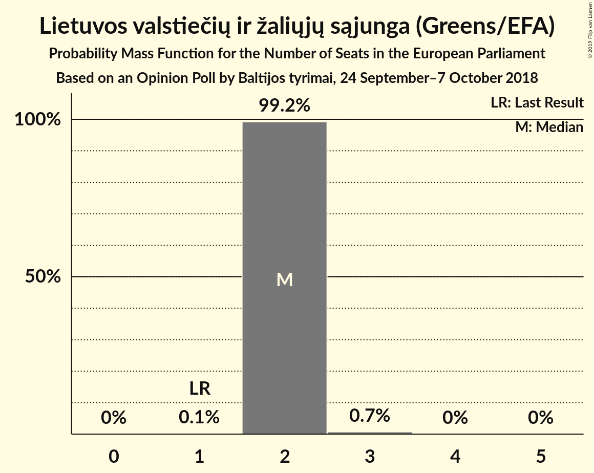

| Number of Seats | Probability | Accumulated | Special Marks |
|:---------------:|:-----------:|:-----------:|:-------------:|
| 1 | 0.1% | 100% | Last Result |
| 2 | 99.2% | 99.9% | Median |
| 3 | 0.7% | 0.7% |  |
| 4 | 0% | 0% |  |

### Partija tvarka ir teisingumas (EFDD)

*For a full overview of the results for this party, see the [Partija tvarka ir teisingumas (EFDD)](party-partijatvarkairteisingumasefdd.html) page.*

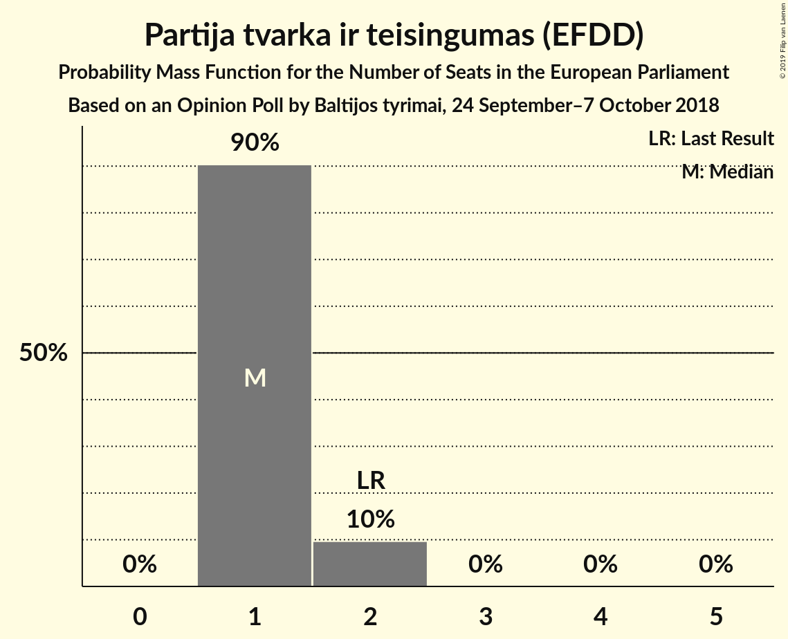

| Number of Seats | Probability | Accumulated | Special Marks |
|:---------------:|:-----------:|:-----------:|:-------------:|
| 1 | 90% | 100% | Median |
| 2 | 10% | 10% | Last Result |
| 3 | 0% | 0% |  |

### Darbo Partija (ALDE)

*For a full overview of the results for this party, see the [Darbo Partija (ALDE)](party-darbopartijaalde.html) page.*

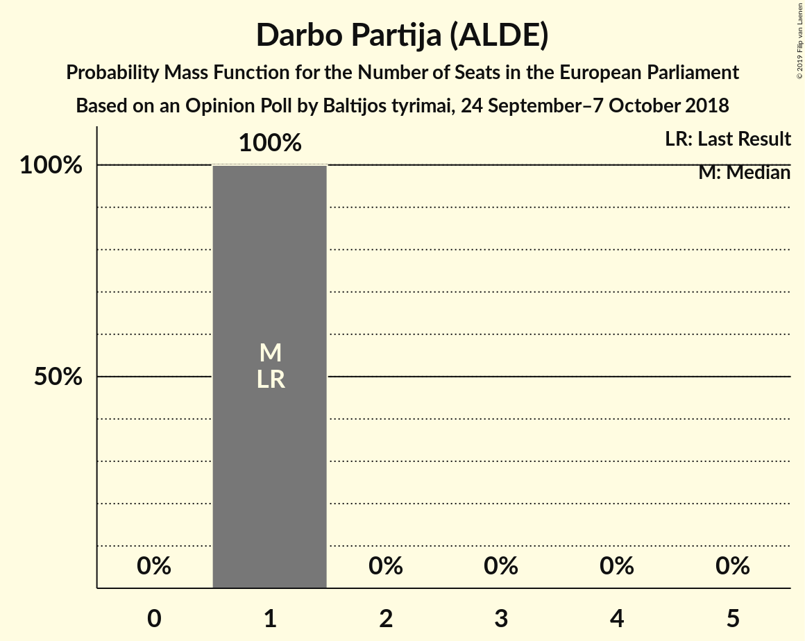

| Number of Seats | Probability | Accumulated | Special Marks |
|:---------------:|:-----------:|:-----------:|:-------------:|
| 1 | 100% | 100% | Last Result, Median |

### Liberalų Sąjūdis (ALDE)

*For a full overview of the results for this party, see the [Liberalų Sąjūdis (ALDE)](party-liberalųsąjūdisalde.html) page.*

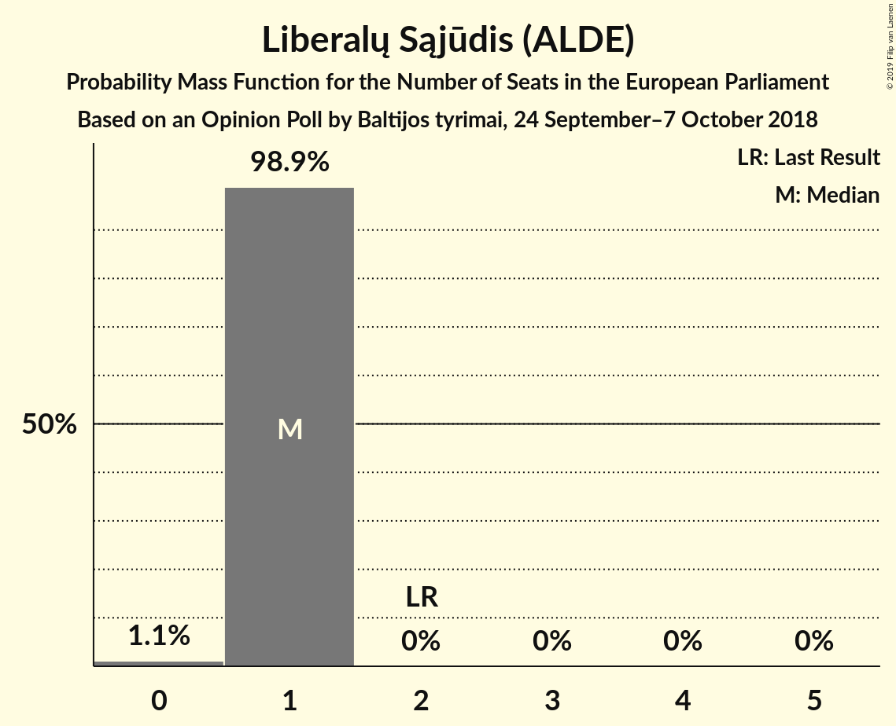

| Number of Seats | Probability | Accumulated | Special Marks |
|:---------------:|:-----------:|:-----------:|:-------------:|
| 0 | 1.1% | 100% |  |
| 1 | 98.9% | 98.9% | Median |
| 2 | 0% | 0% | Last Result |

### Lietuvos socialdemokratų partija (S&D)

*For a full overview of the results for this party, see the [Lietuvos socialdemokratų partija (S&D)](party-lietuvossocialdemokratųpartijasd.html) page.*

| Number of Seats | Probability | Accumulated | Special Marks |
|:---------------:|:-----------:|:-----------:|:-------------:|
| 0 | 14% | 100% |  |
| 1 | 86% | 86% | Median |
| 2 | 0% | 0% | Last Result |

### Lietuvos socialdemokratų darbo partija (S&D)

*For a full overview of the results for this party, see the [Lietuvos socialdemokratų darbo partija (S&D)](party-lietuvossocialdemokratųdarbopartijasd.html) page.*

| Number of Seats | Probability | Accumulated | Special Marks |
|:---------------:|:-----------:|:-----------:|:-------------:|
| 0 | 16% | 100% | Last Result |
| 1 | 84% | 84% | Median |
| 2 | 0% | 0% |  |

### Lietuvos Centro Partija (ECR)

*For a full overview of the results for this party, see the [Lietuvos Centro Partija (ECR)](party-lietuvoscentropartijaecr.html) page.*

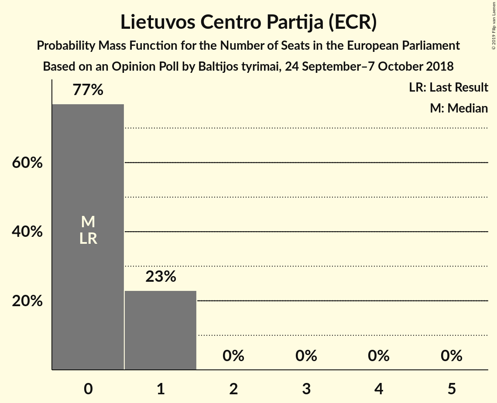

| Number of Seats | Probability | Accumulated | Special Marks |
|:---------------:|:-----------:|:-----------:|:-------------:|
| 0 | 77% | 100% | Last Result, Median |
| 1 | 23% | 23% |  |
| 2 | 0% | 0% |  |

### Lietuvos lenkų rinkimų akcija (ECR)

*For a full overview of the results for this party, see the [Lietuvos lenkų rinkimų akcija (ECR)](party-lietuvoslenkųrinkimųakcijaecr.html) page.*

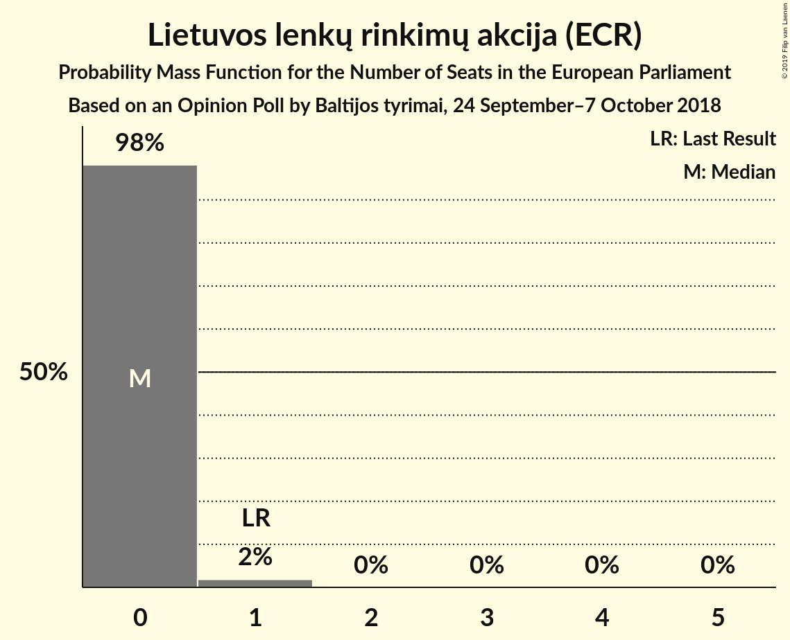

| Number of Seats | Probability | Accumulated | Special Marks |
|:---------------:|:-----------:|:-----------:|:-------------:|
| 0 | 98% | 100% | Median |
| 1 | 2% | 2% | Last Result |
| 2 | 0% | 0% |  |

## Coalitions

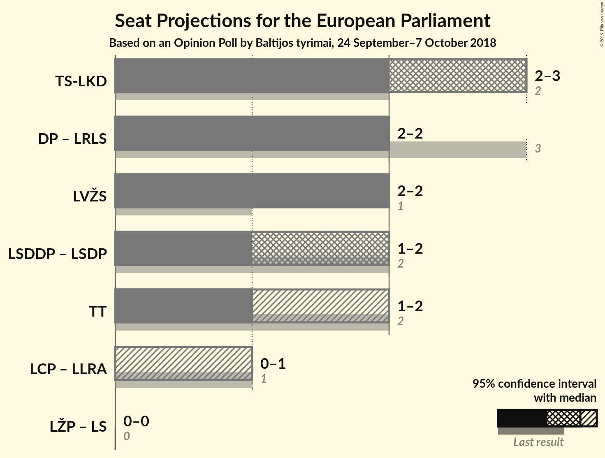

### Confidence Intervals

| Coalition | Last Result | Median | Majority? | 80% Confidence Interval | 90% Confidence Interval | 95% Confidence Interval | 99% Confidence Interval |
|:---------:|:-----------:|:------:|:---------:|:-----------------------:|:-----------------------:|:-----------------------:|:-----------------------:|
| Tėvynės sąjunga–Lietuvos krikščionys demokratai (EPP) | 2 | 3 | 0% | 3 | 3 | 2–3 | 2–3 |
| Darbo Partija (ALDE) – Liberalų Sąjūdis (ALDE) | 3 | 2 | 0% | 2 | 2 | 2 | 1–2 |
| Lietuvos valstiečių ir žaliųjų sąjunga (Greens/EFA) | 1 | 2 | 0% | 2 | 2 | 2 | 2–3 |
| Lietuvos socialdemokratų darbo partija (S&D) – Lietuvos socialdemokratų partija (S&D) | 2 | 2 | 0% | 1–2 | 1–2 | 1–2 | 1–2 |
| Partija tvarka ir teisingumas (EFDD) | 2 | 1 | 0% | 1 | 1–2 | 1–2 | 1–2 |
| Lietuvos Centro Partija (ECR) – Lietuvos lenkų rinkimų akcija (ECR) | 1 | 0 | 0% | 0–1 | 0–1 | 0–1 | 0–1 |

### Tėvynės sąjunga–Lietuvos krikščionys demokratai (EPP)

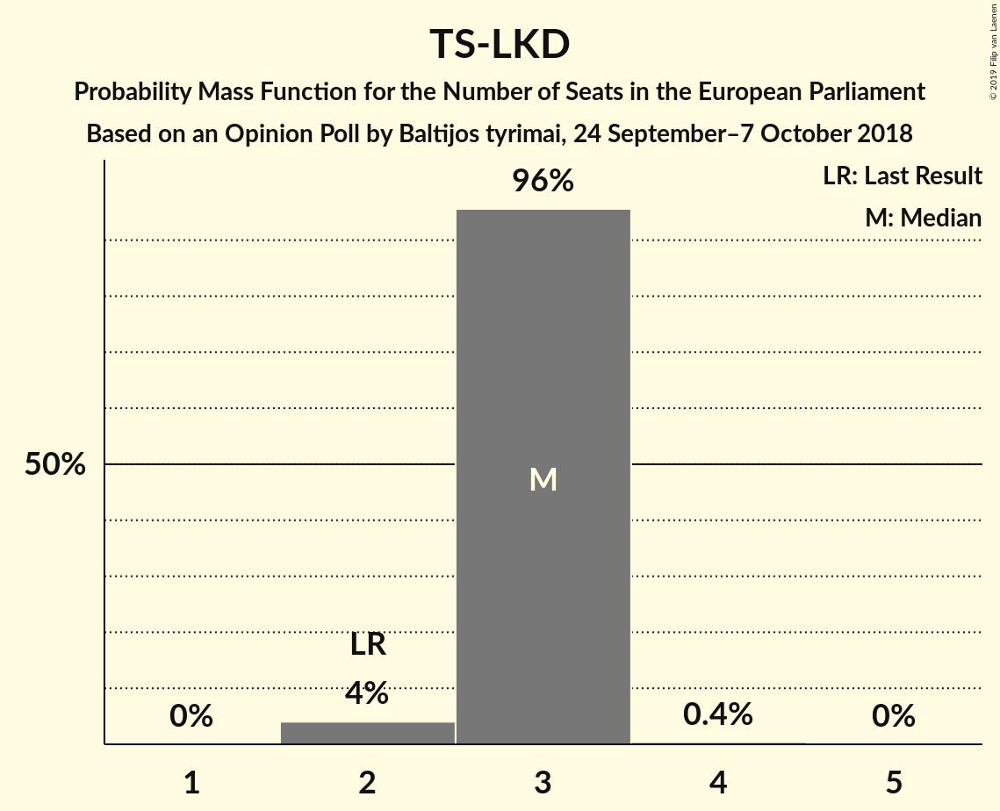

| Number of Seats | Probability | Accumulated | Special Marks |
|:---------------:|:-----------:|:-----------:|:-------------:|
| 2 | 4% | 100% | Last Result |
| 3 | 96% | 96% | Median |
| 4 | 0.4% | 0.4% |  |
| 5 | 0% | 0% |  |

### Darbo Partija (ALDE) – Liberalų Sąjūdis (ALDE)

| Number of Seats | Probability | Accumulated | Special Marks |
|:---------------:|:-----------:|:-----------:|:-------------:|
| 1 | 1.2% | 100% |  |
| 2 | 98.8% | 98.8% | Median |
| 3 | 0% | 0% | Last Result |

### Lietuvos valstiečių ir žaliųjų sąjunga (Greens/EFA)

| Number of Seats | Probability | Accumulated | Special Marks |
|:---------------:|:-----------:|:-----------:|:-------------:|
| 1 | 0.1% | 100% | Last Result |
| 2 | 99.2% | 99.9% | Median |
| 3 | 0.7% | 0.7% |  |
| 4 | 0% | 0% |  |

### Lietuvos socialdemokratų darbo partija (S&D) – Lietuvos socialdemokratų partija (S&D)

| Number of Seats | Probability | Accumulated | Special Marks |
|:---------------:|:-----------:|:-----------:|:-------------:|
| 0 | 0.4% | 100% |  |
| 1 | 30% | 99.6% |  |
| 2 | 70% | 70% | Last Result, Median |
| 3 | 0% | 0% |  |

### Partija tvarka ir teisingumas (EFDD)

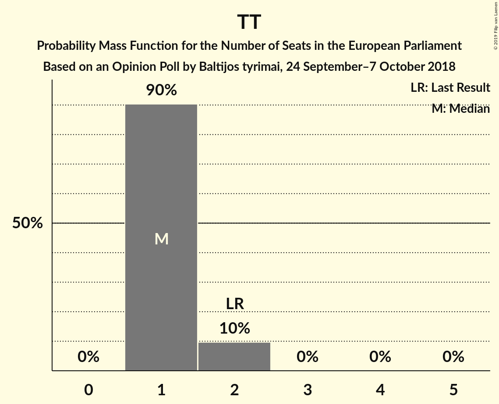

| Number of Seats | Probability | Accumulated | Special Marks |
|:---------------:|:-----------:|:-----------:|:-------------:|
| 1 | 90% | 100% | Median |
| 2 | 10% | 10% | Last Result |
| 3 | 0% | 0% |  |

### Lietuvos Centro Partija (ECR) – Lietuvos lenkų rinkimų akcija (ECR)

| Number of Seats | Probability | Accumulated | Special Marks |
|:---------------:|:-----------:|:-----------:|:-------------:|
| 0 | 75% | 100% | Median |
| 1 | 24% | 25% | Last Result |
| 2 | 0.2% | 0.2% |  |
| 3 | 0% | 0% |  |

## Technical Information

### Opinion Poll

+ **Polling firm:** Baltijos tyrimai
+ **Commissioner(s):** —
+ **Fieldwork period:** 24 September–7 October 2018

### Calculations

+ **Sample size:** 1007
+ **Simulations done:** 1,048,576
+ **Error estimate:** 1.42%

