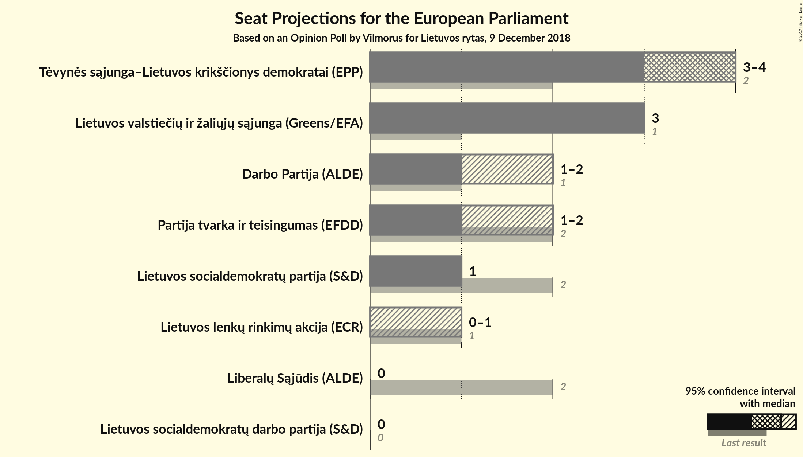
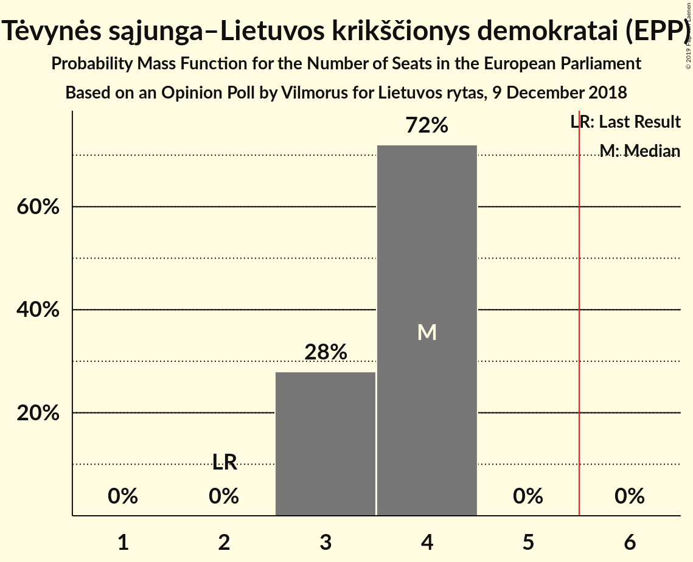
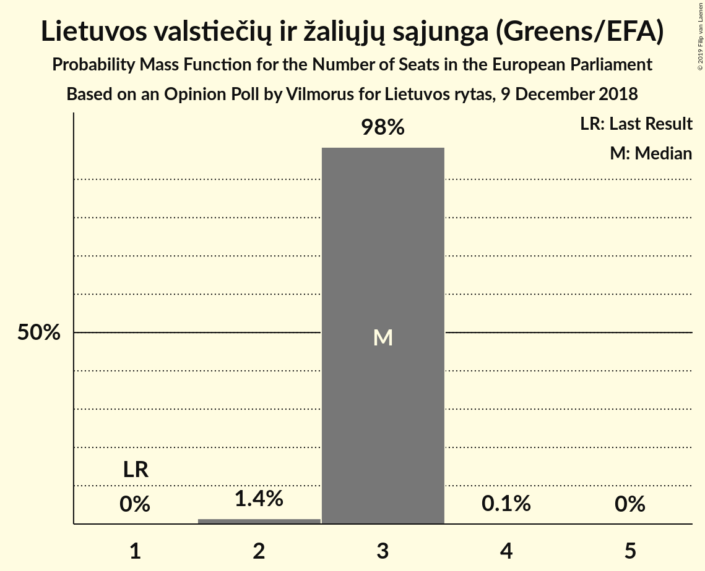
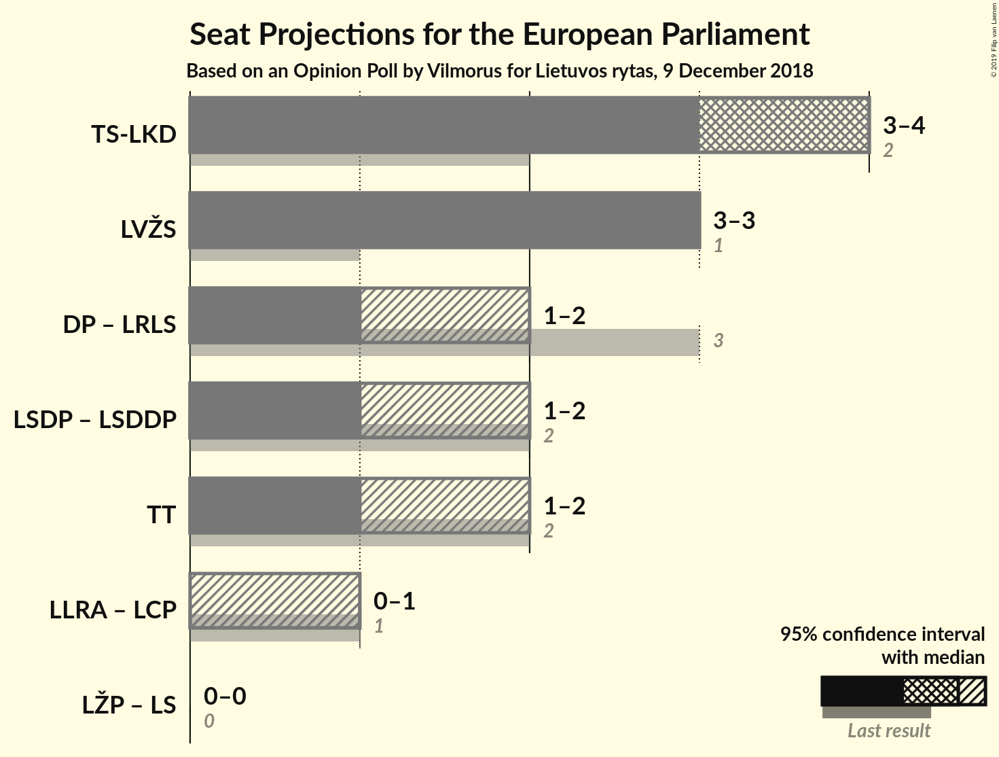
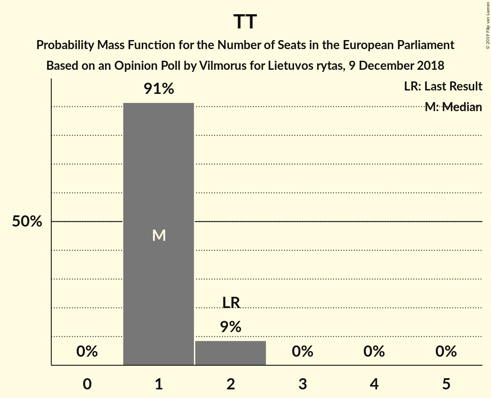

# Opinion Poll by Vilmorus for Lietuvos rytas, 9 December 2018

<a href="#voting-intentions">Voting Intentions</a> | <a href="#seats">Seats</a> | <a href="#coalitions">Coalitions</a> | <a href="#technical-information">Technical Information</a>

## Voting Intentions

### Confidence Intervals

| Party | Last Result | Poll Result | 80% Confidence Interval | 90% Confidence Interval | 95% Confidence Interval | 99% Confidence Interval |
|:-----:|:-----------:|:-----------:|:-----------------------:|:-----------------------:|:-----------------------:|:-----------------------:|
| Tėvynės sąjunga–Lietuvos krikščionys demokratai (EPP) | 17.4% | 28.6% | 26.9–30.5% |26.4–31.0% |25.9–31.5% |25.1–32.4% |
| Lietuvos valstiečių ir žaliųjų sąjunga (Greens/EFA) | 6.6% | 23.1% | 21.5–24.9% |21.0–25.4% |20.7–25.8% |19.9–26.7% |
| Darbo Partija (ALDE) | 12.4% | 10.7% | 9.6–12.1% |9.3–12.5% |9.0–12.8% |8.5–13.5% |
| Partija tvarka ir teisingumas (EFDD) | 14.2% | 10.4% | 9.2–11.7% |8.9–12.0% |8.6–12.4% |8.1–13.0% |
| Lietuvos socialdemokratų partija (S&D) | 17.3% | 8.9% | 7.8–10.1% |7.5–10.5% |7.3–10.8% |6.8–11.4% |
| Lietuvos lenkų rinkimų akcija (ECR) | 8.0% | 3.9% | 3.2–4.8% |3.0–5.1% |2.9–5.3% |2.6–5.7% |
| Liberalų Sąjūdis (ALDE) | 16.6% | 3.7% | 3.0–4.6% |2.9–4.8% |2.7–5.1% |2.4–5.5% |
| Lietuvos socialdemokratų darbo partija (S&D) | 0.0% | 3.7% | 3.0–4.6% |2.9–4.8% |2.7–5.1% |2.4–5.5% |

*Note:* The poll result column reflects the actual value used in the calculations. Published results may vary slightly, and in addition be rounded to fewer digits.

## Seats

### Confidence Intervals

| Party | Last Result | Median | 80% Confidence Interval | 90% Confidence Interval | 95% Confidence Interval | 99% Confidence Interval |
|:-----:|:-----------:|:------:|:-----------------------:|:-----------------------:|:-----------------------:|:-----------------------:|
| <a href="#tėvynės-sąjunga–lietuvos-krikščionys-demokratai-(epp)">Tėvynės sąjunga–Lietuvos krikščionys demokratai (EPP)</a> | 2 | 4 | 3–4 |3–4 |3–4 |3–4 |
| <a href="#lietuvos-valstiečių-ir-žaliųjų-sąjunga-(greens/efa)">Lietuvos valstiečių ir žaliųjų sąjunga (Greens/EFA)</a> | 1 | 3 | 3 |3 |3 |2–3 |
| <a href="#darbo-partija-(alde)">Darbo Partija (ALDE)</a> | 1 | 1 | 1–2 |1–2 |1–2 |1–2 |
| <a href="#partija-tvarka-ir-teisingumas-(efdd)">Partija tvarka ir teisingumas (EFDD)</a> | 2 | 1 | 1 |1–2 |1–2 |1–2 |
| <a href="#lietuvos-socialdemokratų-partija-(s&d)">Lietuvos socialdemokratų partija (S&D)</a> | 2 | 1 | 1 |1 |1 |1–2 |
| <a href="#lietuvos-lenkų-rinkimų-akcija-(ecr)">Lietuvos lenkų rinkimų akcija (ECR)</a> | 1 | 0 | 0 |0–1 |0–1 |0–1 |
| <a href="#liberalų-sąjūdis-(alde)">Liberalų Sąjūdis (ALDE)</a> | 2 | 0 | 0 |0 |0 |0 |
| <a href="#lietuvos-socialdemokratų-darbo-partija-(s&d)">Lietuvos socialdemokratų darbo partija (S&D)</a> | 0 | 0 | 0 |0 |0 |0–1 |

### Tėvynės sąjunga–Lietuvos krikščionys demokratai (EPP)

*For a full overview of the results for this party, see the [Tėvynės sąjunga–Lietuvos krikščionys demokratai (EPP)](party-tėvynėssąjunga–lietuvoskrikščionysdemokrataiepp.html) page.*

| Number of Seats | Probability | Accumulated | Special Marks |
|:---------------:|:-----------:|:-----------:|:-------------:|
| 2 | 0% | 100% | Last Result |
| 3 | 28% | 100% |  |
| 4 | 72% | 72% | Median |
| 5 | 0% | 0% |  |

### Lietuvos valstiečių ir žaliųjų sąjunga (Greens/EFA)

*For a full overview of the results for this party, see the [Lietuvos valstiečių ir žaliųjų sąjunga (Greens/EFA)](party-lietuvosvalstiečiųiržaliųjųsąjungagreensefa.html) page.*

| Number of Seats | Probability | Accumulated | Special Marks |
|:---------------:|:-----------:|:-----------:|:-------------:|
| 1 | 0% | 100% | Last Result |
| 2 | 1.4% | 100% |  |
| 3 | 98% | 98.6% | Median |
| 4 | 0.1% | 0.1% |  |
| 5 | 0% | 0% |  |

### Darbo Partija (ALDE)

*For a full overview of the results for this party, see the [Darbo Partija (ALDE)](party-darbopartijaalde.html) page.*

| Number of Seats | Probability | Accumulated | Special Marks |
|:---------------:|:-----------:|:-----------:|:-------------:|
| 1 | 87% | 100% | Last Result, Median |
| 2 | 13% | 13% |  |
| 3 | 0% | 0% |  |

### Partija tvarka ir teisingumas (EFDD)

*For a full overview of the results for this party, see the [Partija tvarka ir teisingumas (EFDD)](party-partijatvarkairteisingumasefdd.html) page.*

| Number of Seats | Probability | Accumulated | Special Marks |
|:---------------:|:-----------:|:-----------:|:-------------:|
| 1 | 91% | 100% | Median |
| 2 | 9% | 9% | Last Result |
| 3 | 0% | 0% |  |

### Lietuvos socialdemokratų partija (S&D)

*For a full overview of the results for this party, see the [Lietuvos socialdemokratų partija (S&D)](party-lietuvossocialdemokratųpartijasd.html) page.*

| Number of Seats | Probability | Accumulated | Special Marks |
|:---------------:|:-----------:|:-----------:|:-------------:|
| 1 | 99.1% | 100% | Median |
| 2 | 0.9% | 0.9% | Last Result |
| 3 | 0% | 0% |  |

### Lietuvos lenkų rinkimų akcija (ECR)

*For a full overview of the results for this party, see the [Lietuvos lenkų rinkimų akcija (ECR)](party-lietuvoslenkųrinkimųakcijaecr.html) page.*

| Number of Seats | Probability | Accumulated | Special Marks |
|:---------------:|:-----------:|:-----------:|:-------------:|
| 0 | 95% | 100% | Median |
| 1 | 5% | 5% | Last Result |
| 2 | 0% | 0% |  |

### Liberalų Sąjūdis (ALDE)

*For a full overview of the results for this party, see the [Liberalų Sąjūdis (ALDE)](party-liberalųsąjūdisalde.html) page.*

| Number of Seats | Probability | Accumulated | Special Marks |
|:---------------:|:-----------:|:-----------:|:-------------:|
| 0 | 99.7% | 100% | Median |
| 1 | 0.3% | 0.3% |  |
| 2 | 0% | 0% | Last Result |

### Lietuvos socialdemokratų darbo partija (S&D)

*For a full overview of the results for this party, see the [Lietuvos socialdemokratų darbo partija (S&D)](party-lietuvossocialdemokratųdarbopartijasd.html) page.*

| Number of Seats | Probability | Accumulated | Special Marks |
|:---------------:|:-----------:|:-----------:|:-------------:|
| 0 | 98% | 100% | Last Result, Median |
| 1 | 2% | 2% |  |
| 2 | 0% | 0% |  |

## Coalitions

### Confidence Intervals

| Coalition | Last Result | Median | Majority? | 80% Confidence Interval | 90% Confidence Interval | 95% Confidence Interval | 99% Confidence Interval |
|:---------:|:-----------:|:------:|:---------:|:-----------------------:|:-----------------------:|:-----------------------:|:-----------------------:|
| Tėvynės sąjunga–Lietuvos krikščionys demokratai (EPP) | 2 | 4 | 0% | 3–4 | 3–4 | 3–4 | 3–4 |
| Lietuvos valstiečių ir žaliųjų sąjunga (Greens/EFA) | 1 | 3 | 0% | 3 | 3 | 3 | 2–3 |
| Darbo Partija (ALDE) – Liberalų Sąjūdis (ALDE) | 3 | 1 | 0% | 1–2 | 1–2 | 1–2 | 1–2 |
| Lietuvos socialdemokratų partija (S&D) – Lietuvos socialdemokratų darbo partija (S&D) | 2 | 1 | 0% | 1 | 1 | 1–2 | 1–2 |
| Partija tvarka ir teisingumas (EFDD) | 2 | 1 | 0% | 1 | 1–2 | 1–2 | 1–2 |

### Tėvynės sąjunga–Lietuvos krikščionys demokratai (EPP)

| Number of Seats | Probability | Accumulated | Special Marks |
|:---------------:|:-----------:|:-----------:|:-------------:|
| 2 | 0% | 100% | Last Result |
| 3 | 28% | 100% |  |
| 4 | 72% | 72% | Median |
| 5 | 0% | 0% |  |

### Lietuvos valstiečių ir žaliųjų sąjunga (Greens/EFA)

| Number of Seats | Probability | Accumulated | Special Marks |
|:---------------:|:-----------:|:-----------:|:-------------:|
| 1 | 0% | 100% | Last Result |
| 2 | 1.4% | 100% |  |
| 3 | 98% | 98.6% | Median |
| 4 | 0.1% | 0.1% |  |
| 5 | 0% | 0% |  |

### Darbo Partija (ALDE) – Liberalų Sąjūdis (ALDE)

| Number of Seats | Probability | Accumulated | Special Marks |
|:---------------:|:-----------:|:-----------:|:-------------:|
| 1 | 87% | 100% | Median |
| 2 | 13% | 13% |  |
| 3 | 0% | 0% | Last Result |

### Lietuvos socialdemokratų partija (S&D) – Lietuvos socialdemokratų darbo partija (S&D)

| Number of Seats | Probability | Accumulated | Special Marks |
|:---------------:|:-----------:|:-----------:|:-------------:|
| 1 | 97% | 100% | Median |
| 2 | 3% | 3% | Last Result |
| 3 | 0% | 0% |  |

### Partija tvarka ir teisingumas (EFDD)

| Number of Seats | Probability | Accumulated | Special Marks |
|:---------------:|:-----------:|:-----------:|:-------------:|
| 1 | 91% | 100% | Median |
| 2 | 9% | 9% | Last Result |
| 3 | 0% | 0% |  |

## Technical Information

### Opinion Poll

+ **Polling firm:** Vilmorus
+ **Commissioner(s):** Lietuvos rytas
+ **Fieldwork period:** 9 December 2018

### Calculations

+ **Sample size:** 1024
+ **Simulations done:** 1,048,576
+ **Error estimate:** 1.45%

