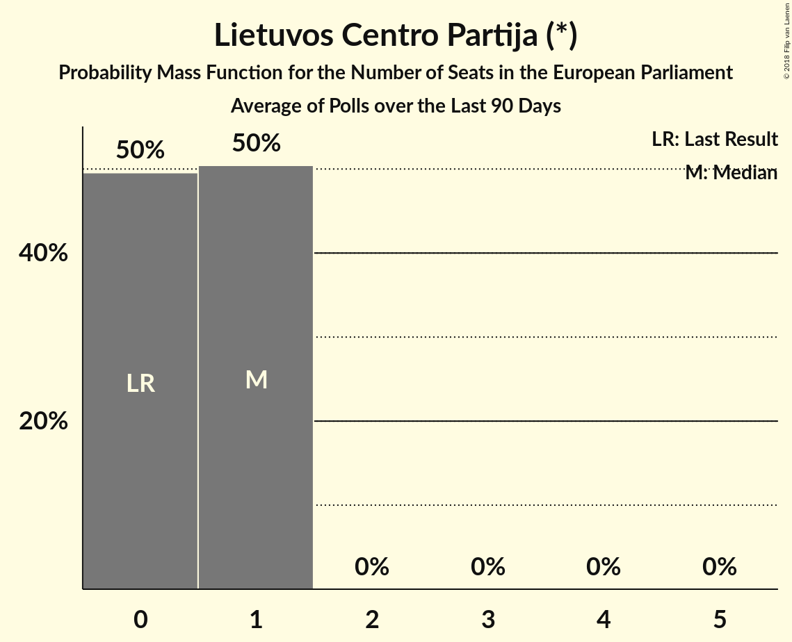

# Lietuvos Centro Partija (*)

<a href="#voting-intentions">Voting Intentions</a> | <a href="#seats">Seats</a>

## Voting Intentions

Last result: **0.0%** (General Election of 25 May 2014)

### Confidence Intervals

| Period     | Polling firm/Commissioner(s) | Median | 80% Confidence Interval | 90% Confidence Interval | 95% Confidence Interval | 99% Confidence Interval |
|:----------:|:----------------:|:-----------:|:-----------------------:|:-----------------------:|:-----------------------:|:-----------------------:|
| N/A | [Poll Average](average.html) | 5.1% | 4.3–6.0% | 4.0–6.3% | 3.8–6.6% | 3.5–7.1% |
| [19–30 November 2018](2018-11-30-Spintertyrimai.html) | Spinter tyrimai | 5.0% | 4.3–6.0% | 4.0–6.3% | 3.8–6.6% | 3.5–7.1% |
| [16–30 October 2018](2018-10-30-Spintertyrimai.html) | Spinter tyrimai | 4.0% | 3.3–4.9% | 3.1–5.2% | 2.9–5.4% | 2.6–5.9% |
| [19–26 September 2018](2018-09-26-Spintertyrimai.html) | Spinter tyrimai | 4.0% | 3.3–4.9% | 3.1–5.1% | 2.9–5.3% | 2.6–5.8% |
| [24–31 August 2018](2018-08-31-Spintertyrimai.html) | Spinter tyrimai | 6.0% | 5.1–7.0% | 4.9–7.3% | 4.6–7.6% | 4.3–8.1% |
| [16–31 July 2018](2018-07-31-Baltijostyrimai.html) | Baltijos tyrimai | 7.0% | 6.0–8.1% | 5.8–8.4% | 5.5–8.7% | 5.1–9.3% |
| [19–27 June 2018](2018-06-27-Spintertyrimai.html) | Spinter tyrimai | 4.0% | 3.3–4.9% | 3.1–5.2% | 2.9–5.4% | 2.6–5.9% |
| [8–17 June 2018](2018-06-17-Vilmorus.html) | Vilmorus   Lietuvos rytas | 5.0% | 4.3–6.0% | 4.0–6.3% | 3.9–6.5% | 3.5–7.0% |
| [4–12 May 2018](2018-05-12-Vilmorus.html) | Vilmorus   Lietuvos rytas | 6.0% | 5.2–7.1% | 4.9–7.4% | 4.7–7.7% | 4.3–8.2% |
| [12–21 January 2018](2018-01-21-Vilmorus.html) | Vilmorus   Lietuvos rytas | 3.0% | 2.4–3.8% | 2.3–4.0% | 2.1–4.2% | 1.9–4.6% |

### Probability Mass Function

The following table shows the probability mass function per percentage block of voting intentions for the [poll average](average.html) for Lietuvos Centro Partija (*).

| Voting Intentions | Probability | Accumulated | Special Marks |
|:-----------------:|:-----------:|:-----------:|:-------------:|
| 0.0–0.5% | 0% | 100% | Last Result |
| 0.5–1.5% | 0% | 100% |  |
| 1.5–2.5% | 0% | 100% |  |
| 2.5–3.5% | 0.6% | 100% |  |
| 3.5–4.5% | 20% | 99.4% |  |
| 4.5–5.5% | 53% | 79% | Median |
| 5.5–6.5% | 24% | 26% |  |
| 6.5–7.5% | 2% | 3% |  |
| 7.5–8.5% | 0.1% | 0.1% |  |
| 8.5–9.5% | 0% | 0% |  |

## Seats

Last result: **0** seats (General Election of 25 May 2014)

### Confidence Intervals

| Period     | Polling firm/Commissioner(s) | Median | 80% Confidence Interval | 90% Confidence Interval | 95% Confidence Interval | 99% Confidence Interval |
|:----------:|:----------------:|:------:|:-----------------------:|:-----------------------:|:-----------------------:|:-----------------------:|
| N/A | [Poll Average](average.html) | 1 | 0–1 | 0–1 | 0–1 | 0–1 |
| [19–30 November 2018](2018-11-30-Spintertyrimai.html) | Spinter tyrimai | 1 | 0–1 | 0–1 | 0–1 | 0–1 |
| [16–30 October 2018](2018-10-30-Spintertyrimai.html) | Spinter tyrimai | 0 | 0 | 0 | 0–1 | 0–1 |
| [19–26 September 2018](2018-09-26-Spintertyrimai.html) | Spinter tyrimai | 0 | 0 | 0 | 0 | 0–1 |
| [24–31 August 2018](2018-08-31-Spintertyrimai.html) | Spinter tyrimai | 1 | 0–1 | 0–1 | 0–1 | 0–1 |
| [16–31 July 2018](2018-07-31-Baltijostyrimai.html) | Baltijos tyrimai | 1 | 1 | 0–1 | 0–1 | 0–1 |
| [19–27 June 2018](2018-06-27-Spintertyrimai.html) | Spinter tyrimai | 0 | 0 | 0–1 | 0–1 | 0–1 |
| [8–17 June 2018](2018-06-17-Vilmorus.html) | Vilmorus   Lietuvos rytas | 0 | 0–1 | 0–1 | 0–1 | 0–1 |
| [4–12 May 2018](2018-05-12-Vilmorus.html) | Vilmorus   Lietuvos rytas | 1 | 1 | 0–1 | 0–1 | 0–1 |
| [12–21 January 2018](2018-01-21-Vilmorus.html) | Vilmorus   Lietuvos rytas | 0 | 0 | 0 | 0 | 0 |

### Probability Mass Function

The following table shows the probability mass function per seat for the [poll average](average.html) for Lietuvos Centro Partija (*).

| Number of Seats | Probability | Accumulated | Special Marks |
|:---------------:|:-----------:|:-----------:|:-------------:|
| 0 | 50% | 100% | Last Result |
| 1 | 50% | 50% | Median |
| 2 | 0% | 0% |  |

