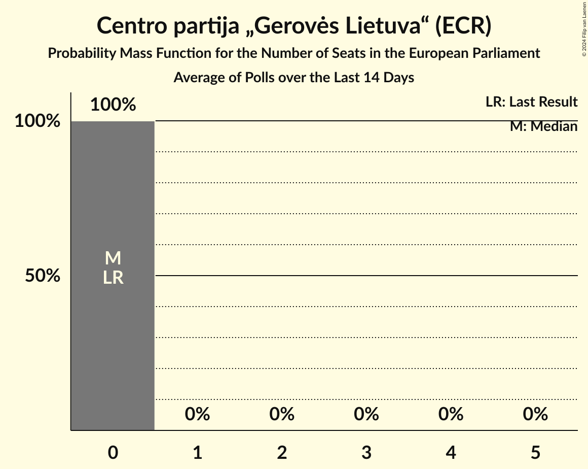

# Centro partija „Gerovės Lietuva“ (ECR)

<a href="#voting-intentions">Voting Intentions</a> | <a href="#seats">Seats</a>

## Voting Intentions

Last result: **0.0%** (General Election of 26 May 2019)

### Confidence Intervals

| Period     | Polling firm/Commissioner(s) | Median | 80% Confidence Interval | 90% Confidence Interval | 95% Confidence Interval | 99% Confidence Interval |
|:----------:|:----------------:|:-----------:|:-----------------------:|:-----------------------:|:-----------------------:|:-----------------------:|
| N/A | [Poll Average](average.html) | 2.6% | 2.0–3.3% | 1.9–3.6% | 1.8–3.8% | 1.5–4.2% |
| [20–30 April 2020](2020-04-30-Spintertyrimai.html) | Spinter tyrimai   Delfi | 0.0% | N/A | N/A | N/A | N/A |
| [17–30 March 2020](2020-03-30-Spintertyrimai.html) | Spinter tyrimai   Delfi | 0.0% | N/A | N/A | N/A | N/A |
| [6–13 March 2020](2020-03-13-Vilmorus.html) | Vilmorus   Lietuvos rytas | 2.5% | 2.0–3.3% | 1.9–3.6% | 1.7–3.7% | 1.5–4.1% |
| [13–26 February 2020](2020-02-26-Baltijostyrimai.html) | Baltijos tyrimai   ELTA | 2.6% | 2.1–3.4% | 1.9–3.6% | 1.8–3.8% | 1.6–4.2% |
| [18–25 February 2020](2020-02-25-Spintertyrimai.html) | Spinter tyrimai   Delfi | 3.0% | 2.4–3.8% | 2.2–4.0% | 2.1–4.2% | 1.8–4.6% |
| [7–13 February 2020](2020-02-13-Vilmorus.html) | Vilmorus   Lietuvos rytas | 1.8% | 1.4–2.5% | 1.2–2.7% | 1.2–2.9% | 1.0–3.2% |
| [20–28 January 2020](2020-01-28-Spintertyrimai.html) | Spinter tyrimai   Delfi | 3.7% | 3.1–4.6% | 2.9–4.9% | 2.7–5.1% | 2.5–5.6% |
| [10–18 January 2020](2020-01-18-Vilmorus.html) | Vilmorus   Lietuvos rytas | 4.8% | 4.1–5.8% | 3.8–6.1% | 3.7–6.3% | 3.3–6.9% |
| [10–21 December 2019](2019-12-21-Baltijostyrimai.html) | Baltijos tyrimai   ELTA | 4.4% | 3.7–5.3% | 3.5–5.6% | 3.3–5.9% | 3.0–6.3% |
| [29 November–7 December 2019](2019-12-07-Vilmorus.html) | Vilmorus   Lietuvos rytas | 3.9% | 3.2–4.9% | 3.0–5.1% | 2.9–5.3% | 2.6–5.8% |
| [19–29 November 2019](2019-11-29-Spintertyrimai.html) | Spinter tyrimai   Delfi | 4.0% | 3.3–4.9% | 3.1–5.1% | 2.9–5.3% | 2.6–5.8% |
| [14–27 November 2019](2019-11-27-Baltijostyrimai.html) | Baltijos tyrimai   ELTA | 3.2% | 2.6–4.0% | 2.4–4.3% | 2.3–4.5% | 2.0–4.9% |
| [8–16 November 2019](2019-11-16-Vilmorus.html) | Vilmorus   Lietuvos rytas | 4.4% | 3.7–5.4% | 3.5–5.6% | 3.3–5.9% | 3.0–6.4% |
| [15–29 October 2019](2019-10-29-Baltijostyrimai.html) | Baltijos tyrimai   ELTA | 4.1% | 3.4–5.0% | 3.2–5.3% | 3.0–5.5% | 2.7–6.0% |
| [17–28 October 2019](2019-10-28-Spintertyrimai.html) | Spinter tyrimai   Delfi | 4.2% | 3.5–5.1% | 3.3–5.4% | 3.1–5.6% | 2.8–6.1% |
| [4–13 October 2019](2019-10-13-Vilmorus.html) | Vilmorus   Lietuvos rytas | 4.6% | 3.9–5.6% | 3.7–5.9% | 3.5–6.1% | 3.1–6.6% |
| [21 September–5 October 2019](2019-10-05-Baltijostyrimai.html) | Baltijos tyrimai   ELTA | 3.4% | 2.8–4.3% | 2.6–4.5% | 2.4–4.7% | 2.2–5.2% |
| [18–27 September 2019](2019-09-27-Spintertyrimai.html) | Spinter tyrimai   Delfi | 3.2% | 2.6–4.0% | 2.4–4.2% | 2.2–4.4% | 2.0–4.9% |
| [6–14 September 2019](2019-09-14-Vilmorus.html) | Vilmorus   Lietuvos rytas | 3.9% | 3.2–4.8% | 3.0–5.0% | 2.8–5.3% | 2.5–5.7% |
| [26 August–8 September 2019](2019-09-08-Baltijostyrimai.html) | Baltijos tyrimai   ELTA | 4.6% | 3.9–5.6% | 3.7–5.9% | 3.5–6.1% | 3.2–6.6% |
| [15–29 July 2019](2019-07-29-Baltijostyrimai.html) | Baltijos tyrimai   ELTA | 4.0% | 3.3–4.9% | 3.1–5.2% | 2.9–5.4% | 2.7–5.9% |
| [17–26 July 2019](2019-07-26-Spintertyrimai.html) | Spinter tyrimai   Delfi | 3.0% | 2.4–3.8% | 2.2–4.0% | 2.1–4.2% | 1.8–4.6% |
| [5–13 July 2019](2019-07-13-Vilmorus.html) | Vilmorus   Lietuvos rytas | 2.0% | 1.6–2.8% | 1.4–3.0% | 1.3–3.1% | 1.1–3.5% |
| [14–28 June 2019](2019-06-28-Baltijostyrimai.html) | Baltijos tyrimai   ELTA | 3.2% | 2.6–4.1% | 2.5–4.3% | 2.3–4.5% | 2.0–4.9% |
| [18–27 June 2019](2019-06-27-Spintertyrimai.html) | Spinter tyrimai   Delfi | 2.9% | 2.3–3.7% | 2.1–3.9% | 2.0–4.1% | 1.8–4.5% |
| [7–15 June 2019](2019-06-15-Vilmorus.html) | Vilmorus   Lietuvos rytas | 2.1% | 1.6–2.9% | 1.5–3.1% | 1.4–3.3% | 1.2–3.6% |
| [27 May–9 June 2019](2019-06-09-Baltijostyrimai.html) | Baltijos tyrimai   ELTA | 3.0% | 2.4–3.8% | 2.2–4.0% | 2.1–4.2% | 1.8–4.6% |

### Probability Mass Function

The following table shows the probability mass function per percentage block of voting intentions for the [poll average](average.html) for Centro partija „Gerovės Lietuva“ (ECR).

| Voting Intentions | Probability | Accumulated | Special Marks |
|:-----------------:|:-----------:|:-----------:|:-------------:|
| 0.0–0.5% | 0% | 100% | Last Result |
| 0.5–1.5% | 0.6% | 100% |  |
| 1.5–2.5% | 41% | 99.4% |  |
| 2.5–3.5% | 53% | 58% | Median |
| 3.5–4.5% | 5% | 5% |  |
| 4.5–5.5% | 0.1% | 0.1% |  |
| 5.5–6.5% | 0% | 0% |  |

## Seats

Last result: **0** seats (General Election of 26 May 2019)

### Confidence Intervals

| Period     | Polling firm/Commissioner(s) | Median | 80% Confidence Interval | 90% Confidence Interval | 95% Confidence Interval | 99% Confidence Interval |
|:----------:|:----------------:|:------:|:-----------------------:|:-----------------------:|:-----------------------:|:-----------------------:|
| N/A | [Poll Average](average.html) | 0 | 0 | 0 | 0 | 0 |
| [20–30 April 2020](2020-04-30-Spintertyrimai.html) | Spinter tyrimai   Delfi |  |  |  |  |  |
| [17–30 March 2020](2020-03-30-Spintertyrimai.html) | Spinter tyrimai   Delfi |  |  |  |  |  |
| [6–13 March 2020](2020-03-13-Vilmorus.html) | Vilmorus   Lietuvos rytas | 0 | 0 | 0 | 0 | 0 |
| [13–26 February 2020](2020-02-26-Baltijostyrimai.html) | Baltijos tyrimai   ELTA | 0 | 0 | 0 | 0 | 0 |
| [18–25 February 2020](2020-02-25-Spintertyrimai.html) | Spinter tyrimai   Delfi | 0 | 0 | 0 | 0 | 0 |
| [7–13 February 2020](2020-02-13-Vilmorus.html) | Vilmorus   Lietuvos rytas | 0 | 0 | 0 | 0 | 0 |
| [20–28 January 2020](2020-01-28-Spintertyrimai.html) | Spinter tyrimai   Delfi | 0 | 0 | 0 | 0 | 0–1 |
| [10–18 January 2020](2020-01-18-Vilmorus.html) | Vilmorus   Lietuvos rytas | 0 | 0–1 | 0–1 | 0–1 | 0–1 |
| [10–21 December 2019](2019-12-21-Baltijostyrimai.html) | Baltijos tyrimai   ELTA | 0 | 0–1 | 0–1 | 0–1 | 0–1 |
| [29 November–7 December 2019](2019-12-07-Vilmorus.html) | Vilmorus   Lietuvos rytas | 0 | 0 | 0–1 | 0–1 | 0–1 |
| [19–29 November 2019](2019-11-29-Spintertyrimai.html) | Spinter tyrimai   Delfi | 0 | 0 | 0–1 | 0–1 | 0–1 |
| [14–27 November 2019](2019-11-27-Baltijostyrimai.html) | Baltijos tyrimai   ELTA | 0 | 0 | 0 | 0 | 0 |
| [8–16 November 2019](2019-11-16-Vilmorus.html) | Vilmorus   Lietuvos rytas | 0 | 0–1 | 0–1 | 0–1 | 0–1 |
| [15–29 October 2019](2019-10-29-Baltijostyrimai.html) | Baltijos tyrimai   ELTA | 0 | 0 | 0 | 0–1 | 0–1 |
| [17–28 October 2019](2019-10-28-Spintertyrimai.html) | Spinter tyrimai   Delfi | 0 | 0 | 0–1 | 0–1 | 0–1 |
| [4–13 October 2019](2019-10-13-Vilmorus.html) | Vilmorus   Lietuvos rytas | 0 | 0–1 | 0–1 | 0–1 | 0–1 |
| [21 September–5 October 2019](2019-10-05-Baltijostyrimai.html) | Baltijos tyrimai   ELTA | 0 | 0 | 0 | 0 | 0–1 |
| [18–27 September 2019](2019-09-27-Spintertyrimai.html) | Spinter tyrimai   Delfi | 0 | 0 | 0 | 0 | 0 |
| [6–14 September 2019](2019-09-14-Vilmorus.html) | Vilmorus   Lietuvos rytas | 0 | 0 | 0 | 0–1 | 0–1 |
| [26 August–8 September 2019](2019-09-08-Baltijostyrimai.html) | Baltijos tyrimai   ELTA | 0 | 0–1 | 0–1 | 0–1 | 0–1 |
| [15–29 July 2019](2019-07-29-Baltijostyrimai.html) | Baltijos tyrimai   ELTA | 0 | 0 | 0 | 0–1 | 0–1 |
| [17–26 July 2019](2019-07-26-Spintertyrimai.html) | Spinter tyrimai   Delfi | 0 | 0 | 0 | 0 | 0 |
| [5–13 July 2019](2019-07-13-Vilmorus.html) | Vilmorus   Lietuvos rytas | 0 | 0 | 0 | 0 | 0 |
| [14–28 June 2019](2019-06-28-Baltijostyrimai.html) | Baltijos tyrimai   ELTA | 0 | 0 | 0 | 0 | 0 |
| [18–27 June 2019](2019-06-27-Spintertyrimai.html) | Spinter tyrimai   Delfi | 0 | 0 | 0 | 0 | 0 |
| [7–15 June 2019](2019-06-15-Vilmorus.html) | Vilmorus   Lietuvos rytas | 0 | 0 | 0 | 0 | 0 |
| [27 May–9 June 2019](2019-06-09-Baltijostyrimai.html) | Baltijos tyrimai   ELTA | 0 | 0 | 0 | 0 | 0 |

### Probability Mass Function

The following table shows the probability mass function per seat for the [poll average](average.html) for Centro partija „Gerovės Lietuva“ (ECR).

| Number of Seats | Probability | Accumulated | Special Marks |
|:---------------:|:-----------:|:-----------:|:-------------:|
| 0 | 100% | 100% | Last Result, Median |

