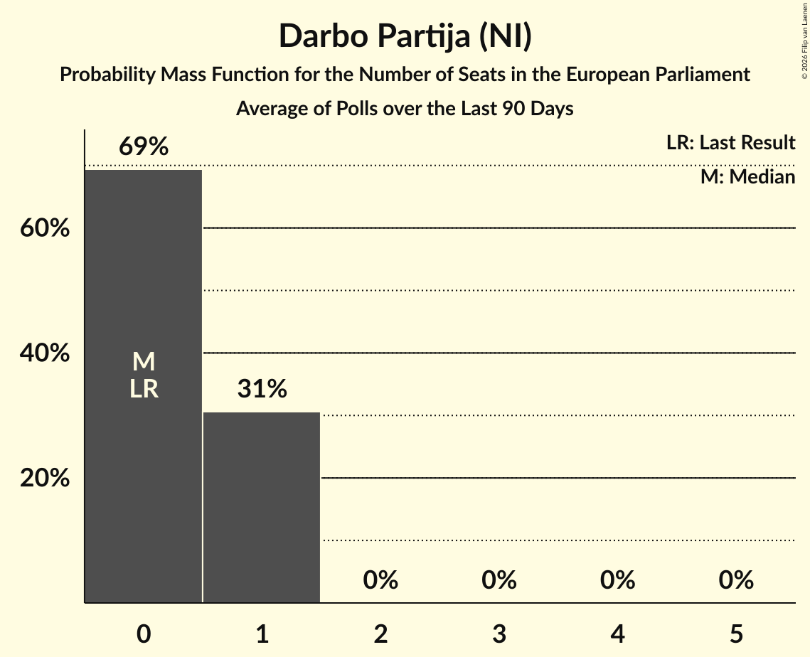

# Darbo Partija (NI)

<a href="#voting-intentions">Voting Intentions</a> | <a href="#seats">Seats</a>

## Voting Intentions

Last result: **0.0%** (General Election of 9 June 2024)

### Confidence Intervals

| Period     | Polling firm/Commissioner(s) | Median | 80% Confidence Interval | 90% Confidence Interval | 95% Confidence Interval | 99% Confidence Interval |
|:----------:|:----------------:|:-----------:|:-----------------------:|:-----------------------:|:-----------------------:|:-----------------------:|
| N/A | [Poll Average](average.html) | 3.4% | 2.7–4.2% | 2.6–4.4% | 2.4–4.6% | 2.1–5.1% |
| [12 November–1 December 2024](2024-12-01-Baltijostyrimai.html) | Baltijos tyrimai | 3.3% | 2.7–4.2% | 2.5–4.4% | 2.4–4.6% | 2.1–5.1% |
| [7–16 November 2024](2024-11-16-Vilmorus.html) | Vilmorus | 0.0% | N/A | N/A | N/A | N/A |
| [30 October–12 November 2024](2024-11-12-Baltijostyrimai.html) | Baltijos tyrimai | 3.4% | 2.8–4.3% | 2.6–4.5% | 2.5–4.7% | 2.2–5.2% |
| [16–25 September 2024](2024-09-25-Spintertyrimai.html) | Spinter tyrimai   Delfi | 0.0% | N/A | N/A | N/A | N/A |
| [13–21 September 2024](2024-09-21-Vilmorus.html) | Vilmorus | 2.7% | 2.1–3.7% | 1.9–4.0% | 1.8–4.3% | 1.5–4.8% |
| [6–20 September 2024](2024-09-20-Baltijostyrimai.html) | Baltijos tyrimai | 2.0% | 1.5–2.7% | 1.4–2.9% | 1.2–3.1% | 1.1–3.5% |
| [7–9 August 2024](2024-08-09-Baltijostyrimai.html) | Baltijos tyrimai   Delfi | 7.7% | 6.7–8.9% | 6.4–9.2% | 6.2–9.5% | 5.7–10.1% |
| [19–29 July 2024](2024-07-29-Spintertyrimai.html) | Spinter tyrimai   Delfi | 3.5% | 2.8–4.3% | 2.7–4.6% | 2.5–4.8% | 2.2–5.2% |
| [11–21 July 2024](2024-07-21-Vilmorus.html) | Vilmorus | 4.3% | 3.6–5.2% | 3.4–5.5% | 3.2–5.7% | 2.9–6.2% |
| [21 June–7 July 2024](2024-07-07-Baltijostyrimai.html) | Baltijos tyrimai   LRT | 4.6% | 3.8–5.5% | 3.6–5.8% | 3.4–6.1% | 3.1–6.6% |
| [18–28 June 2024](2024-06-28-Spintertyrimai.html) | Spinter tyrimai   Delfi | 3.2% | 2.6–4.0% | 2.4–4.2% | 2.2–4.4% | 2.0–4.9% |

### Probability Mass Function

The following table shows the probability mass function per percentage block of voting intentions for the [poll average](average.html) for Darbo Partija (NI).

| Voting Intentions | Probability | Accumulated | Special Marks |
|:-----------------:|:-----------:|:-----------:|:-------------:|
| 0.0–0.5% | 0% | 100% | Last Result |
| 0.5–1.5% | 0% | 100% |  |
| 1.5–2.5% | 5% | 100% |  |
| 2.5–3.5% | 55% | 95% | Median |
| 3.5–4.5% | 36% | 40% |  |
| 4.5–5.5% | 3% | 3% |  |
| 5.5–6.5% | 0.1% | 0.1% |  |
| 6.5–7.5% | 0% | 0% |  |

## Seats

Last result: **0** seats (General Election of 9 June 2024)

### Confidence Intervals

| Period     | Polling firm/Commissioner(s) | Median | 80% Confidence Interval | 90% Confidence Interval | 95% Confidence Interval | 99% Confidence Interval |
|:----------:|:----------------:|:------:|:-----------------------:|:-----------------------:|:-----------------------:|:-----------------------:|
| N/A | [Poll Average](average.html) | 0 | 0 | 0 | 0 | 0 |
| [12 November–1 December 2024](2024-12-01-Baltijostyrimai.html) | Baltijos tyrimai | 0 | 0 | 0 | 0 | 0 |
| [7–16 November 2024](2024-11-16-Vilmorus.html) | Vilmorus |  |  |  |  |  |
| [30 October–12 November 2024](2024-11-12-Baltijostyrimai.html) | Baltijos tyrimai | 0 | 0–1 | 0–1 | 0–1 | 0–1 |
| [16–25 September 2024](2024-09-25-Spintertyrimai.html) | Spinter tyrimai   Delfi |  |  |  |  |  |
| [13–21 September 2024](2024-09-21-Vilmorus.html) | Vilmorus | 0 | 0 | 0 | 0 | 0 |
| [6–20 September 2024](2024-09-20-Baltijostyrimai.html) | Baltijos tyrimai | 0 | 0 | 0 | 0 | 0 |
| [7–9 August 2024](2024-08-09-Baltijostyrimai.html) | Baltijos tyrimai   Delfi | 1 | 1 | 1 | 1 | 1 |
| [19–29 July 2024](2024-07-29-Spintertyrimai.html) | Spinter tyrimai   Delfi | 0 | 0 | 0 | 0 | 0–1 |
| [11–21 July 2024](2024-07-21-Vilmorus.html) | Vilmorus | 0 | 0–1 | 0–1 | 0–1 | 0–1 |
| [21 June–7 July 2024](2024-07-07-Baltijostyrimai.html) | Baltijos tyrimai   LRT | 0 | 0–1 | 0–1 | 0–1 | 0–1 |
| [18–28 June 2024](2024-06-28-Spintertyrimai.html) | Spinter tyrimai   Delfi | 0 | 0 | 0 | 0 | 0 |

### Probability Mass Function

The following table shows the probability mass function per seat for the [poll average](average.html) for Darbo Partija (NI).

| Number of Seats | Probability | Accumulated | Special Marks |
|:---------------:|:-----------:|:-----------:|:-------------:|
| 0 | 99.7% | 100% | Last Result, Median |
| 1 | 0.3% | 0.3% |  |
| 2 | 0% | 0% |  |

