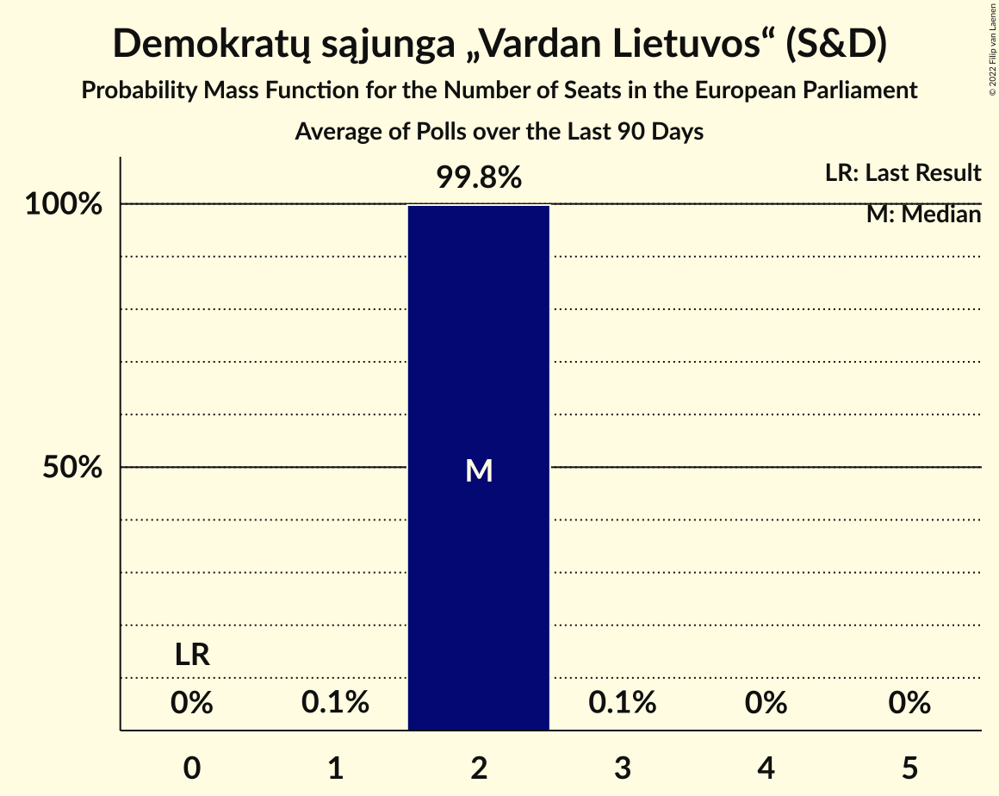

# Demokratų sąjunga „Vardan Lietuvos“ (S&D)

<a href="#voting-intentions">Voting Intentions</a> | <a href="#seats">Seats</a>

## Voting Intentions

Last result: **0.0%** (General Election of 26 May 2019)

### Confidence Intervals

| Period     | Polling firm/Commissioner(s) | Median | 80% Confidence Interval | 90% Confidence Interval | 95% Confidence Interval | 99% Confidence Interval |
|:----------:|:----------------:|:-----------:|:-----------------------:|:-----------------------:|:-----------------------:|:-----------------------:|
| N/A | [Poll Average](average.html) | 17.6% | 15.5–20.6% | 15.0–21.2% | 14.6–21.7% | 13.8–22.7% |
| [9–18 February 2023](2023-02-18-Vilmorus.html) | Vilmorus | 16.2% | 14.8–17.8% | 14.4–18.2% | 14.0–18.6% | 13.4–19.4% |
| [19–31 January 2023](2023-01-31-Baltijostyrimai.html) | Baltijos tyrimai   LRT | 19.8% | 18.3–21.5% | 17.9–22.0% | 17.5–22.4% | 16.8–23.2% |
| [18–27 January 2023](2023-01-27-Spintertyrimai.html) | Spinter tyrimai   Delfi | 17.3% | 15.9–18.9% | 15.5–19.4% | 15.1–19.8% | 14.4–20.6% |
| [15–24 December 2022](2022-12-24-Spintertyrimai.html) | Spinter tyrimai   Delfi | 14.5% | 13.1–16.0% | 12.7–16.4% | 12.4–16.8% | 11.8–17.5% |
| [8–15 December 2022](2022-12-15-Vilmorus.html) | Vilmorus | 15.3% | 13.9–16.9% | 13.5–17.3% | 13.2–17.7% | 12.6–18.4% |
| [17 November–2 December 2022](2022-12-02-Baltijostyrimai.html) | Baltijos tyrimai   LRT | 18.9% | N/A | N/A | N/A | N/A |
| [18–29 November 2022](2022-11-29-Spintertyrimai.html) | Spinter tyrimai   Delfi | 12.1% | 10.9–13.5% | 10.6–14.0% | 10.3–14.3% | 9.7–15.0% |
| [10–19 November 2022](2022-11-19-Vilmorus.html) | Vilmorus | 13.1% | 11.8–14.6% | 11.4–15.0% | 11.1–15.3% | 10.6–16.1% |
| [26 October–8 November 2022](2022-11-08-Baltijostyrimai.html) | Baltijos tyrimai | 16.1% | 14.7–17.6% | 14.3–18.1% | 14.0–18.5% | 13.3–19.2% |
| [18–28 October 2022](2022-10-28-Spintertyrimai.html) | Spinter tyrimai   Delfi | 11.2% | 10.0–12.5% | 9.7–12.9% | 9.4–13.3% | 8.8–14.0% |
| [11–16 October 2022](2022-10-16-Vilmorus.html) | Vilmorus   Lietuvos rytas | 11.4% | 10.2–12.8% | 9.8–13.2% | 9.6–13.5% | 9.0–14.2% |
| [20–30 September 2022](2022-09-30-Spintertyrimai.html) | Spinter tyrimai   Delfi | 10.1% | N/A | N/A | N/A | N/A |
| [27 September 2022](2022-09-27-Baltijostyrimai.html) | Baltijos tyrimai   LRT | 15.7% | N/A | N/A | N/A | N/A |
| [15–24 September 2022](2022-09-24-Vilmorus.html) | Vilmorus   Lietuvos rytas | 12.3% | 11.1–13.7% | 10.7–14.1% | 10.4–14.5% | 9.8–15.2% |
| [25 August–2 September 2022](2022-09-02-Spintertyrimai.html) | Spinter tyrimai   Delfi | 14.5% | 13.2–16.0% | 12.8–16.5% | 12.5–16.8% | 11.8–17.6% |
| [1–31 August 2022](2022-08-31-Baltijostyrimai.html) | Baltijos tyrimai   LRT | 20.1% | N/A | N/A | N/A | N/A |
| [18–28 July 2022](2022-07-28-Spintertyrimai.html) | Spinter tyrimai   Delfi | 16.5% | 15.1–18.1% | 14.7–18.5% | 14.3–18.9% | 13.7–19.7% |
| [12–28 July 2022](2022-07-28-Baltijostyrimai.html) | Baltijos tyrimai   ELTA | 16.9% | 15.5–18.5% | 15.1–19.0% | 14.8–19.4% | 14.1–20.2% |
| [15–23 July 2022](2022-07-23-Vilmorus.html) | Vilmorus   Lietuvos rytas | 16.2% | 14.7–17.7% | 14.3–18.2% | 14.0–18.6% | 13.4–19.3% |
| [18–28 June 2022](2022-06-28-Spintertyrimai.html) | Spinter tyrimai   Delfi | 17.0% | 15.6–18.6% | 15.2–19.1% | 14.8–19.5% | 14.2–20.3% |
| [9–18 June 2022](2022-06-18-Vilmorus.html) | Vilmorus   Lietuvos rytas | 14.7% | 13.3–16.2% | 12.9–16.6% | 12.6–17.0% | 12.0–17.7% |
| [16–28 May 2022](2022-05-28-Baltijostyrimai.html) | Baltijos tyrimai   ELTA | 20.9% | 19.3–22.6% | 18.9–23.0% | 18.5–23.5% | 17.7–24.3% |
| [18–27 May 2022](2022-05-27-Spintertyrimai.html) | Spinter tyrimai   Delfi | 12.8% | N/A | N/A | N/A | N/A |
| [12–18 May 2022](2022-05-18-Vilmorus.html) | Vilmorus   Lietuvos rytas | 19.1% | N/A | N/A | N/A | N/A |
| [20–28 April 2022](2022-04-28-Spintertyrimai.html) | Spinter tyrimai   Delfi | 14.8% | N/A | N/A | N/A | N/A |
| [13–27 April 2022](2022-04-27-Baltijostyrimai.html) | Baltijos tyrimai   ELTA | 22.0% | N/A | N/A | N/A | N/A |
| [15–22 April 2022](2022-04-22-Norstat.html) | Norstat   Delfi | 12.4% | 11.1–13.8% | 10.8–14.2% | 10.5–14.6% | 9.9–15.3% |
| [17–25 March 2022](2022-03-25-Spintertyrimai.html) | Spinter tyrimai   Delfi | 15.8% | N/A | N/A | N/A | N/A |
| [10–24 March 2022](2022-03-24-Baltijostyrimai.html) | Baltijos tyrimai   ELTA | 18.8% | N/A | N/A | N/A | N/A |
| [10–19 March 2022](2022-03-19-Vilmorus.html) | Vilmorus   Lietuvos rytas | 19.8% | N/A | N/A | N/A | N/A |
| [22 February–3 March 2022](2022-03-03-Baltijostyrimai.html) | Baltijos tyrimai   ELTA | 19.5% | N/A | N/A | N/A | N/A |
| [17–25 February 2022](2022-02-25-Spintertyrimai.html) | Spinter tyrimai   Delfi | 12.5% | N/A | N/A | N/A | N/A |
| [3–8 February 2022](2022-02-08-Vilmorus.html) | Vilmorus   Lietuvos rytas | 17.8% | N/A | N/A | N/A | N/A |
| [24 January–4 February 2022](2022-02-04-Baltijostyrimai.html) | Baltijos tyrimai   ELTA | 0.0% | N/A | N/A | N/A | N/A |
| [17–29 January 2022](2022-01-29-Spintertyrimai.html) | Spinter tyrimai   Delfi | 11.9% | N/A | N/A | N/A | N/A |
| [13–25 December 2021](2021-12-25-Spintertyrimai.html) | Spinter tyrimai   Delfi | 11.3% | N/A | N/A | N/A | N/A |
| [10–18 December 2021](2021-12-18-Vilmorus.html) | Vilmorus   Lietuvos rytas | 0.0% | N/A | N/A | N/A | N/A |
| [10–18 December 2021](2021-12-18-Norstat.html) | Norstat   Delfi | 10.5% | N/A | N/A | N/A | N/A |
| [16 November–2 December 2021](2021-12-02-Baltijostyrimai.html) | Baltijos tyrimai   ELTA | 0.0% | N/A | N/A | N/A | N/A |
| [11–28 November 2021](2021-11-28-Spintertyrimai.html) | Spinter tyrimai   Delfi | 0.0% | N/A | N/A | N/A | N/A |
| [18–27 November 2021](2021-11-27-Vilmorus.html) | Vilmorus   Lietuvos rytas | 0.0% | N/A | N/A | N/A | N/A |
| [15 October–5 November 2021](2021-11-05-Baltijostyrimai.html) | Baltijos tyrimai   ELTA | 0.0% | N/A | N/A | N/A | N/A |
| [18–28 October 2021](2021-10-28-Spintertyrimai.html) | Spinter tyrimai   Delfi | 0.0% | N/A | N/A | N/A | N/A |
| [15–22 October 2021](2021-10-22-Vilmorus.html) | Vilmorus   Lietuvos rytas | 0.0% | N/A | N/A | N/A | N/A |
| [17 September–3 October 2021](2021-10-03-Baltijostyrimai.html) | Baltijos tyrimai   ELTA | 0.0% | N/A | N/A | N/A | N/A |
| [17–26 September 2021](2021-09-26-Spintertyrimai.html) | Spinter tyrimai   Delfi | 0.0% | N/A | N/A | N/A | N/A |
| [9–16 September 2021](2021-09-16-Vilmorus.html) | Vilmorus   Lietuvos rytas | 0.0% | N/A | N/A | N/A | N/A |
| [24–31 August 2021](2021-08-31-Spintertyrimai.html) | Spinter tyrimai   Delfi | 0.0% | N/A | N/A | N/A | N/A |
| [20–31 August 2021](2021-08-31-Baltijostyrimai.html) | Baltijos tyrimai   ELTA | 0.0% | N/A | N/A | N/A | N/A |
| [29 July–5 August 2021](2021-08-05-Vilmorus.html) | Vilmorus   Lietuvos rytas | 0.0% | N/A | N/A | N/A | N/A |
| [17–28 June 2021](2021-06-28-Spintertyrimai.html) | Spinter tyrimai   Delfi | 0.0% | N/A | N/A | N/A | N/A |
| [9–18 June 2021](2021-06-18-Vilmorus.html) | Vilmorus   Lietuvos rytas | 0.0% | N/A | N/A | N/A | N/A |
| [20 May–2 June 2021](2021-06-02-Baltijostyrimai.html) | Baltijos tyrimai   ELTA | 0.0% | N/A | N/A | N/A | N/A |
| [18–28 May 2021](2021-05-28-Spintertyrimai.html) | Spinter tyrimai   Delfi | 0.0% | N/A | N/A | N/A | N/A |
| [11–21 May 2021](2021-05-21-Vilmorus.html) | Vilmorus   Lietuvos rytas | 0.0% | N/A | N/A | N/A | N/A |
| [19–28 April 2021](2021-04-28-Spintertyrimai.html) | Spinter tyrimai   Delfi | 0.0% | N/A | N/A | N/A | N/A |
| [8–17 April 2021](2021-04-17-Vilmorus.html) | Vilmorus   Lietuvos rytas | 0.0% | N/A | N/A | N/A | N/A |
| [17–23 March 2021](2021-03-23-Spintertyrimai.html) | Spinter tyrimai   Delfi | 0.0% | N/A | N/A | N/A | N/A |
| [17–26 February 2021](2021-02-26-Spintertyrimai.html) | Spinter tyrimai   Delfi | 0.0% | N/A | N/A | N/A | N/A |
| [18–27 January 2021](2021-01-27-Spintertyrimai.html) | Spinter tyrimai   Delfi | 0.0% | N/A | N/A | N/A | N/A |
| [10–20 December 2020](2020-12-20-Spintertyrimai.html) | Spinter tyrimai   Delfi | 0.0% | N/A | N/A | N/A | N/A |
| [6–30 November 2020](2020-11-30-Baltijostyrimai.html) | Baltijos tyrimai   ELTA | 0.0% | N/A | N/A | N/A | N/A |
| [17–27 September 2020](2020-09-27-Baltijostyrimai.html) | Baltijos tyrimai   ELTA | 0.0% | N/A | N/A | N/A | N/A |
| [16–26 September 2020](2020-09-26-Spintertyrimai.html) | Spinter tyrimai   Delfi | 0.0% | N/A | N/A | N/A | N/A |
| [4–12 September 2020](2020-09-12-Vilmorus.html) | Vilmorus   Lietuvos rytas | 0.0% | N/A | N/A | N/A | N/A |
| [26 August–4 September 2020](2020-09-04-Spintertyrimai.html) | Spinter tyrimai   Delfi | 0.0% | N/A | N/A | N/A | N/A |
| [22 August–4 September 2020](2020-09-04-Baltijostyrimai.html) | Baltijos tyrimai   ELTA | 0.0% | N/A | N/A | N/A | N/A |
| [29 July–31 August 2020](2020-08-31-Norstat.html) | Norstat   LRT | 0.0% | N/A | N/A | N/A | N/A |
| [16–30 July 2020](2020-07-30-Baltijostyrimai.html) | Baltijos tyrimai   ELTA | 0.0% | N/A | N/A | N/A | N/A |
| [16–26 July 2020](2020-07-26-Spintertyrimai.html) | Spinter tyrimai   Delfi | 0.0% | N/A | N/A | N/A | N/A |
| [10–18 July 2020](2020-07-18-Vilmorus.html) | Vilmorus   Lietuvos rytas | 0.0% | N/A | N/A | N/A | N/A |
| [18–26 June 2020](2020-06-26-Spintertyrimai.html) | Spinter tyrimai   Delfi | 0.0% | N/A | N/A | N/A | N/A |
| [15–25 June 2020](2020-06-25-Baltijostyrimai.html) | Baltijos tyrimai   ELTA | 0.0% | N/A | N/A | N/A | N/A |
| [5–13 June 2020](2020-06-13-Vilmorus.html) | Vilmorus   Lietuvos rytas | 0.0% | N/A | N/A | N/A | N/A |
| [20–30 April 2020](2020-04-30-Spintertyrimai.html) | Spinter tyrimai   Delfi | 0.0% | N/A | N/A | N/A | N/A |
| [17–30 March 2020](2020-03-30-Spintertyrimai.html) | Spinter tyrimai   Delfi | 0.0% | N/A | N/A | N/A | N/A |
| [6–13 March 2020](2020-03-13-Vilmorus.html) | Vilmorus   Lietuvos rytas | 0.0% | N/A | N/A | N/A | N/A |
| [13–26 February 2020](2020-02-26-Baltijostyrimai.html) | Baltijos tyrimai   ELTA | 0.0% | N/A | N/A | N/A | N/A |
| [18–25 February 2020](2020-02-25-Spintertyrimai.html) | Spinter tyrimai   Delfi | 0.0% | N/A | N/A | N/A | N/A |
| [7–13 February 2020](2020-02-13-Vilmorus.html) | Vilmorus   Lietuvos rytas | 0.0% | N/A | N/A | N/A | N/A |
| [20–28 January 2020](2020-01-28-Spintertyrimai.html) | Spinter tyrimai   Delfi | 0.0% | N/A | N/A | N/A | N/A |
| [10–18 January 2020](2020-01-18-Vilmorus.html) | Vilmorus   Lietuvos rytas | 0.0% | N/A | N/A | N/A | N/A |
| [10–21 December 2019](2019-12-21-Baltijostyrimai.html) | Baltijos tyrimai   ELTA | 0.0% | N/A | N/A | N/A | N/A |
| [29 November–7 December 2019](2019-12-07-Vilmorus.html) | Vilmorus   Lietuvos rytas | 0.0% | N/A | N/A | N/A | N/A |
| [19–29 November 2019](2019-11-29-Spintertyrimai.html) | Spinter tyrimai   Delfi | 0.0% | N/A | N/A | N/A | N/A |
| [14–27 November 2019](2019-11-27-Baltijostyrimai.html) | Baltijos tyrimai   ELTA | 0.0% | N/A | N/A | N/A | N/A |
| [8–16 November 2019](2019-11-16-Vilmorus.html) | Vilmorus   Lietuvos rytas | 0.0% | N/A | N/A | N/A | N/A |
| [15–29 October 2019](2019-10-29-Baltijostyrimai.html) | Baltijos tyrimai   ELTA | 0.0% | N/A | N/A | N/A | N/A |
| [17–28 October 2019](2019-10-28-Spintertyrimai.html) | Spinter tyrimai   Delfi | 0.0% | N/A | N/A | N/A | N/A |
| [4–13 October 2019](2019-10-13-Vilmorus.html) | Vilmorus   Lietuvos rytas | 0.0% | N/A | N/A | N/A | N/A |
| [21 September–5 October 2019](2019-10-05-Baltijostyrimai.html) | Baltijos tyrimai   ELTA | 0.0% | N/A | N/A | N/A | N/A |
| [18–27 September 2019](2019-09-27-Spintertyrimai.html) | Spinter tyrimai   Delfi | 0.0% | N/A | N/A | N/A | N/A |
| [6–14 September 2019](2019-09-14-Vilmorus.html) | Vilmorus   Lietuvos rytas | 0.0% | N/A | N/A | N/A | N/A |
| [26 August–8 September 2019](2019-09-08-Baltijostyrimai.html) | Baltijos tyrimai   ELTA | 0.0% | N/A | N/A | N/A | N/A |
| [15–29 July 2019](2019-07-29-Baltijostyrimai.html) | Baltijos tyrimai   ELTA | 0.0% | N/A | N/A | N/A | N/A |
| [17–26 July 2019](2019-07-26-Spintertyrimai.html) | Spinter tyrimai   Delfi | 0.0% | N/A | N/A | N/A | N/A |
| [5–13 July 2019](2019-07-13-Vilmorus.html) | Vilmorus   Lietuvos rytas | 0.0% | N/A | N/A | N/A | N/A |
| [14–28 June 2019](2019-06-28-Baltijostyrimai.html) | Baltijos tyrimai   ELTA | 0.0% | N/A | N/A | N/A | N/A |
| [18–27 June 2019](2019-06-27-Spintertyrimai.html) | Spinter tyrimai   Delfi | 0.0% | N/A | N/A | N/A | N/A |
| [7–15 June 2019](2019-06-15-Vilmorus.html) | Vilmorus   Lietuvos rytas | 0.0% | N/A | N/A | N/A | N/A |
| [27 May–9 June 2019](2019-06-09-Baltijostyrimai.html) | Baltijos tyrimai   ELTA | 0.0% | N/A | N/A | N/A | N/A |

### Probability Mass Function

The following table shows the probability mass function per percentage block of voting intentions for the [poll average](average.html) for Demokratų sąjunga „Vardan Lietuvos“ (S&D).

| Voting Intentions | Probability | Accumulated | Special Marks |
|:-----------------:|:-----------:|:-----------:|:-------------:|
| 0.0–0.5% | 0% | 100% | Last Result |
| 0.5–1.5% | 0% | 100% |  |
| 1.5–2.5% | 0% | 100% |  |
| 2.5–3.5% | 0% | 100% |  |
| 3.5–4.5% | 0% | 100% |  |
| 4.5–5.5% | 0% | 100% |  |
| 5.5–6.5% | 0% | 100% |  |
| 6.5–7.5% | 0% | 100% |  |
| 7.5–8.5% | 0% | 100% |  |
| 8.5–9.5% | 0% | 100% |  |
| 9.5–10.5% | 0% | 100% |  |
| 10.5–11.5% | 0% | 100% |  |
| 11.5–12.5% | 0% | 100% |  |
| 12.5–13.5% | 0.3% | 100% |  |
| 13.5–14.5% | 2% | 99.7% |  |
| 14.5–15.5% | 9% | 98% |  |
| 15.5–16.5% | 17% | 89% |  |
| 16.5–17.5% | 20% | 72% |  |
| 17.5–18.5% | 17% | 52% | Median |
| 18.5–19.5% | 14% | 35% |  |
| 19.5–20.5% | 11% | 22% |  |
| 20.5–21.5% | 7% | 10% |  |
| 21.5–22.5% | 3% | 3% |  |
| 22.5–23.5% | 0.5% | 0.6% |  |
| 23.5–24.5% | 0.1% | 0.1% |  |
| 24.5–25.5% | 0% | 0% |  |

## Seats

Last result: **0** seats (General Election of 26 May 2019)

### Confidence Intervals

| Period     | Polling firm/Commissioner(s) | Median | 80% Confidence Interval | 90% Confidence Interval | 95% Confidence Interval | 99% Confidence Interval |
|:----------:|:----------------:|:------:|:-----------------------:|:-----------------------:|:-----------------------:|:-----------------------:|
| N/A | [Poll Average](average.html) | 2 | 2–3 | 2–3 | 2–3 | 2–3 |
| [9–18 February 2023](2023-02-18-Vilmorus.html) | Vilmorus | 2 | 2 | 2 | 2–3 | 2–3 |
| [19–31 January 2023](2023-01-31-Baltijostyrimai.html) | Baltijos tyrimai   LRT | 3 | 3 | 3 | 3 | 2–3 |
| [18–27 January 2023](2023-01-27-Spintertyrimai.html) | Spinter tyrimai   Delfi | 2 | 2 | 2 | 2 | 2 |
| [15–24 December 2022](2022-12-24-Spintertyrimai.html) | Spinter tyrimai   Delfi | 2 | 2 | 2 | 1–2 | 1–2 |
| [8–15 December 2022](2022-12-15-Vilmorus.html) | Vilmorus | 2 | 2 | 2 | 2 | 2 |
| [17 November–2 December 2022](2022-12-02-Baltijostyrimai.html) | Baltijos tyrimai   LRT |  |  |  |  |  |
| [18–29 November 2022](2022-11-29-Spintertyrimai.html) | Spinter tyrimai   Delfi | 2 | 1–2 | 1–2 | 1–2 | 1–2 |
| [10–19 November 2022](2022-11-19-Vilmorus.html) | Vilmorus | 2 | 2 | 1–2 | 1–2 | 1–2 |
| [26 October–8 November 2022](2022-11-08-Baltijostyrimai.html) | Baltijos tyrimai | 2 | 2 | 2 | 2 | 2 |
| [18–28 October 2022](2022-10-28-Spintertyrimai.html) | Spinter tyrimai   Delfi | 1 | 1 | 1–2 | 1–2 | 1–2 |
| [11–16 October 2022](2022-10-16-Vilmorus.html) | Vilmorus   Lietuvos rytas | 1 | 1–2 | 1–2 | 1–2 | 1–2 |
| [20–30 September 2022](2022-09-30-Spintertyrimai.html) | Spinter tyrimai   Delfi |  |  |  |  |  |
| [27 September 2022](2022-09-27-Baltijostyrimai.html) | Baltijos tyrimai   LRT |  |  |  |  |  |
| [15–24 September 2022](2022-09-24-Vilmorus.html) | Vilmorus   Lietuvos rytas | 1 | 1–2 | 1–2 | 1–2 | 1–2 |
| [25 August–2 September 2022](2022-09-02-Spintertyrimai.html) | Spinter tyrimai   Delfi | 2 | 1–2 | 1–2 | 1–2 | 1–2 |
| [1–31 August 2022](2022-08-31-Baltijostyrimai.html) | Baltijos tyrimai   LRT |  |  |  |  |  |
| [18–28 July 2022](2022-07-28-Spintertyrimai.html) | Spinter tyrimai   Delfi | 2 | 2 | 2 | 1–2 | 1–2 |
| [12–28 July 2022](2022-07-28-Baltijostyrimai.html) | Baltijos tyrimai   ELTA | 2 | 2 | 2 | 2 | 2 |
| [15–23 July 2022](2022-07-23-Vilmorus.html) | Vilmorus   Lietuvos rytas | 2 | 2 | 2 | 2 | 2 |
| [18–28 June 2022](2022-06-28-Spintertyrimai.html) | Spinter tyrimai   Delfi | 2 | 2 | 2 | 2 | 2 |
| [9–18 June 2022](2022-06-18-Vilmorus.html) | Vilmorus   Lietuvos rytas | 2 | 2 | 2 | 2 | 1–2 |
| [16–28 May 2022](2022-05-28-Baltijostyrimai.html) | Baltijos tyrimai   ELTA | 3 | 2–3 | 2–3 | 2–3 | 2–3 |
| [18–27 May 2022](2022-05-27-Spintertyrimai.html) | Spinter tyrimai   Delfi |  |  |  |  |  |
| [12–18 May 2022](2022-05-18-Vilmorus.html) | Vilmorus   Lietuvos rytas |  |  |  |  |  |
| [20–28 April 2022](2022-04-28-Spintertyrimai.html) | Spinter tyrimai   Delfi |  |  |  |  |  |
| [13–27 April 2022](2022-04-27-Baltijostyrimai.html) | Baltijos tyrimai   ELTA |  |  |  |  |  |
| [15–22 April 2022](2022-04-22-Norstat.html) | Norstat   Delfi | 1 | 1–2 | 1–2 | 1–2 | 1–2 |
| [17–25 March 2022](2022-03-25-Spintertyrimai.html) | Spinter tyrimai   Delfi |  |  |  |  |  |
| [10–24 March 2022](2022-03-24-Baltijostyrimai.html) | Baltijos tyrimai   ELTA |  |  |  |  |  |
| [10–19 March 2022](2022-03-19-Vilmorus.html) | Vilmorus   Lietuvos rytas |  |  |  |  |  |
| [22 February–3 March 2022](2022-03-03-Baltijostyrimai.html) | Baltijos tyrimai   ELTA |  |  |  |  |  |
| [17–25 February 2022](2022-02-25-Spintertyrimai.html) | Spinter tyrimai   Delfi |  |  |  |  |  |
| [3–8 February 2022](2022-02-08-Vilmorus.html) | Vilmorus   Lietuvos rytas |  |  |  |  |  |
| [24 January–4 February 2022](2022-02-04-Baltijostyrimai.html) | Baltijos tyrimai   ELTA |  |  |  |  |  |
| [17–29 January 2022](2022-01-29-Spintertyrimai.html) | Spinter tyrimai   Delfi |  |  |  |  |  |
| [13–25 December 2021](2021-12-25-Spintertyrimai.html) | Spinter tyrimai   Delfi |  |  |  |  |  |
| [10–18 December 2021](2021-12-18-Vilmorus.html) | Vilmorus   Lietuvos rytas |  |  |  |  |  |
| [10–18 December 2021](2021-12-18-Norstat.html) | Norstat   Delfi |  |  |  |  |  |
| [16 November–2 December 2021](2021-12-02-Baltijostyrimai.html) | Baltijos tyrimai   ELTA |  |  |  |  |  |
| [11–28 November 2021](2021-11-28-Spintertyrimai.html) | Spinter tyrimai   Delfi |  |  |  |  |  |
| [18–27 November 2021](2021-11-27-Vilmorus.html) | Vilmorus   Lietuvos rytas |  |  |  |  |  |
| [15 October–5 November 2021](2021-11-05-Baltijostyrimai.html) | Baltijos tyrimai   ELTA |  |  |  |  |  |
| [18–28 October 2021](2021-10-28-Spintertyrimai.html) | Spinter tyrimai   Delfi |  |  |  |  |  |
| [15–22 October 2021](2021-10-22-Vilmorus.html) | Vilmorus   Lietuvos rytas |  |  |  |  |  |
| [17 September–3 October 2021](2021-10-03-Baltijostyrimai.html) | Baltijos tyrimai   ELTA |  |  |  |  |  |
| [17–26 September 2021](2021-09-26-Spintertyrimai.html) | Spinter tyrimai   Delfi |  |  |  |  |  |
| [9–16 September 2021](2021-09-16-Vilmorus.html) | Vilmorus   Lietuvos rytas |  |  |  |  |  |
| [24–31 August 2021](2021-08-31-Spintertyrimai.html) | Spinter tyrimai   Delfi |  |  |  |  |  |
| [20–31 August 2021](2021-08-31-Baltijostyrimai.html) | Baltijos tyrimai   ELTA |  |  |  |  |  |
| [29 July–5 August 2021](2021-08-05-Vilmorus.html) | Vilmorus   Lietuvos rytas |  |  |  |  |  |
| [17–28 June 2021](2021-06-28-Spintertyrimai.html) | Spinter tyrimai   Delfi |  |  |  |  |  |
| [9–18 June 2021](2021-06-18-Vilmorus.html) | Vilmorus   Lietuvos rytas |  |  |  |  |  |
| [20 May–2 June 2021](2021-06-02-Baltijostyrimai.html) | Baltijos tyrimai   ELTA |  |  |  |  |  |
| [18–28 May 2021](2021-05-28-Spintertyrimai.html) | Spinter tyrimai   Delfi |  |  |  |  |  |
| [11–21 May 2021](2021-05-21-Vilmorus.html) | Vilmorus   Lietuvos rytas |  |  |  |  |  |
| [19–28 April 2021](2021-04-28-Spintertyrimai.html) | Spinter tyrimai   Delfi |  |  |  |  |  |
| [8–17 April 2021](2021-04-17-Vilmorus.html) | Vilmorus   Lietuvos rytas |  |  |  |  |  |
| [17–23 March 2021](2021-03-23-Spintertyrimai.html) | Spinter tyrimai   Delfi |  |  |  |  |  |
| [17–26 February 2021](2021-02-26-Spintertyrimai.html) | Spinter tyrimai   Delfi |  |  |  |  |  |
| [18–27 January 2021](2021-01-27-Spintertyrimai.html) | Spinter tyrimai   Delfi |  |  |  |  |  |
| [10–20 December 2020](2020-12-20-Spintertyrimai.html) | Spinter tyrimai   Delfi |  |  |  |  |  |
| [6–30 November 2020](2020-11-30-Baltijostyrimai.html) | Baltijos tyrimai   ELTA |  |  |  |  |  |
| [17–27 September 2020](2020-09-27-Baltijostyrimai.html) | Baltijos tyrimai   ELTA |  |  |  |  |  |
| [16–26 September 2020](2020-09-26-Spintertyrimai.html) | Spinter tyrimai   Delfi |  |  |  |  |  |
| [4–12 September 2020](2020-09-12-Vilmorus.html) | Vilmorus   Lietuvos rytas |  |  |  |  |  |
| [26 August–4 September 2020](2020-09-04-Spintertyrimai.html) | Spinter tyrimai   Delfi |  |  |  |  |  |
| [22 August–4 September 2020](2020-09-04-Baltijostyrimai.html) | Baltijos tyrimai   ELTA |  |  |  |  |  |
| [29 July–31 August 2020](2020-08-31-Norstat.html) | Norstat   LRT |  |  |  |  |  |
| [16–30 July 2020](2020-07-30-Baltijostyrimai.html) | Baltijos tyrimai   ELTA |  |  |  |  |  |
| [16–26 July 2020](2020-07-26-Spintertyrimai.html) | Spinter tyrimai   Delfi |  |  |  |  |  |
| [10–18 July 2020](2020-07-18-Vilmorus.html) | Vilmorus   Lietuvos rytas |  |  |  |  |  |
| [18–26 June 2020](2020-06-26-Spintertyrimai.html) | Spinter tyrimai   Delfi |  |  |  |  |  |
| [15–25 June 2020](2020-06-25-Baltijostyrimai.html) | Baltijos tyrimai   ELTA |  |  |  |  |  |
| [5–13 June 2020](2020-06-13-Vilmorus.html) | Vilmorus   Lietuvos rytas |  |  |  |  |  |
| [20–30 April 2020](2020-04-30-Spintertyrimai.html) | Spinter tyrimai   Delfi |  |  |  |  |  |
| [17–30 March 2020](2020-03-30-Spintertyrimai.html) | Spinter tyrimai   Delfi |  |  |  |  |  |
| [6–13 March 2020](2020-03-13-Vilmorus.html) | Vilmorus   Lietuvos rytas |  |  |  |  |  |
| [13–26 February 2020](2020-02-26-Baltijostyrimai.html) | Baltijos tyrimai   ELTA |  |  |  |  |  |
| [18–25 February 2020](2020-02-25-Spintertyrimai.html) | Spinter tyrimai   Delfi |  |  |  |  |  |
| [7–13 February 2020](2020-02-13-Vilmorus.html) | Vilmorus   Lietuvos rytas |  |  |  |  |  |
| [20–28 January 2020](2020-01-28-Spintertyrimai.html) | Spinter tyrimai   Delfi |  |  |  |  |  |
| [10–18 January 2020](2020-01-18-Vilmorus.html) | Vilmorus   Lietuvos rytas |  |  |  |  |  |
| [10–21 December 2019](2019-12-21-Baltijostyrimai.html) | Baltijos tyrimai   ELTA |  |  |  |  |  |
| [29 November–7 December 2019](2019-12-07-Vilmorus.html) | Vilmorus   Lietuvos rytas |  |  |  |  |  |
| [19–29 November 2019](2019-11-29-Spintertyrimai.html) | Spinter tyrimai   Delfi |  |  |  |  |  |
| [14–27 November 2019](2019-11-27-Baltijostyrimai.html) | Baltijos tyrimai   ELTA |  |  |  |  |  |
| [8–16 November 2019](2019-11-16-Vilmorus.html) | Vilmorus   Lietuvos rytas |  |  |  |  |  |
| [15–29 October 2019](2019-10-29-Baltijostyrimai.html) | Baltijos tyrimai   ELTA |  |  |  |  |  |
| [17–28 October 2019](2019-10-28-Spintertyrimai.html) | Spinter tyrimai   Delfi |  |  |  |  |  |
| [4–13 October 2019](2019-10-13-Vilmorus.html) | Vilmorus   Lietuvos rytas |  |  |  |  |  |
| [21 September–5 October 2019](2019-10-05-Baltijostyrimai.html) | Baltijos tyrimai   ELTA |  |  |  |  |  |
| [18–27 September 2019](2019-09-27-Spintertyrimai.html) | Spinter tyrimai   Delfi |  |  |  |  |  |
| [6–14 September 2019](2019-09-14-Vilmorus.html) | Vilmorus   Lietuvos rytas |  |  |  |  |  |
| [26 August–8 September 2019](2019-09-08-Baltijostyrimai.html) | Baltijos tyrimai   ELTA |  |  |  |  |  |
| [15–29 July 2019](2019-07-29-Baltijostyrimai.html) | Baltijos tyrimai   ELTA |  |  |  |  |  |
| [17–26 July 2019](2019-07-26-Spintertyrimai.html) | Spinter tyrimai   Delfi |  |  |  |  |  |
| [5–13 July 2019](2019-07-13-Vilmorus.html) | Vilmorus   Lietuvos rytas |  |  |  |  |  |
| [14–28 June 2019](2019-06-28-Baltijostyrimai.html) | Baltijos tyrimai   ELTA |  |  |  |  |  |
| [18–27 June 2019](2019-06-27-Spintertyrimai.html) | Spinter tyrimai   Delfi |  |  |  |  |  |
| [7–15 June 2019](2019-06-15-Vilmorus.html) | Vilmorus   Lietuvos rytas |  |  |  |  |  |
| [27 May–9 June 2019](2019-06-09-Baltijostyrimai.html) | Baltijos tyrimai   ELTA |  |  |  |  |  |

### Probability Mass Function

The following table shows the probability mass function per seat for the [poll average](average.html) for Demokratų sąjunga „Vardan Lietuvos“ (S&D).

| Number of Seats | Probability | Accumulated | Special Marks |
|:---------------:|:-----------:|:-----------:|:-------------:|
| 0 | 0% | 100% | Last Result |
| 1 | 0.2% | 100% |  |
| 2 | 66% | 99.8% | Median |
| 3 | 34% | 34% |  |
| 4 | 0% | 0% |  |

