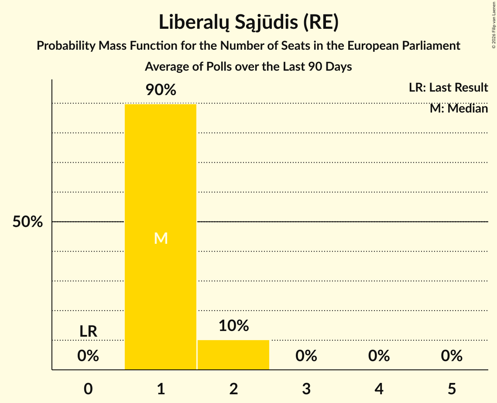

# Liberalų Sąjūdis (RE)

<a href="#voting-intentions">Voting Intentions</a> | <a href="#seats">Seats</a>

## Voting Intentions

Last result: **0.0%** (General Election of 9 June 2024)

### Confidence Intervals

| Period     | Polling firm/Commissioner(s) | Median | 80% Confidence Interval | 90% Confidence Interval | 95% Confidence Interval | 99% Confidence Interval |
|:----------:|:----------------:|:-----------:|:-----------------------:|:-----------------------:|:-----------------------:|:-----------------------:|
| N/A | [Poll Average](average.html) | 10.4% | 7.4–12.1% | 7.0–12.5% | 6.7–12.9% | 6.1–13.6% |
| [12–30 December 2025](2025-12-30-Vilmorus.html) | Vilmorus   Lietuvos Rytas | 11.1% | 9.9–12.5% | 9.6–12.9% | 9.3–13.2% | 8.8–13.9% |
| [11–29 December 2025](2025-12-29-Baltijostyrimai.html) | Baltijos tyrimai   ELTA | 7.8% | 6.8–9.0% | 6.5–9.3% | 6.3–9.6% | 5.8–10.2% |
| [13–22 December 2025](2025-12-22-Spintertyrimai.html) | Spinter tyrimai   Delfi | 10.9% | 9.7–12.3% | 9.4–12.7% | 9.1–13.0% | 8.6–13.7% |
| [11–29 November 2025](2025-11-29-Baltijostyrimai.html) | Baltijos tyrimai   ELTA | 7.7% | 6.7–8.8% | 6.4–9.2% | 6.2–9.5% | 5.7–10.0% |
| [17–28 November 2025](2025-11-28-Spintertyrimai.html) | Spinter tyrimai   Delfi | 9.0% | 7.9–10.2% | 7.6–10.6% | 7.4–10.9% | 6.9–11.5% |
| [6–16 November 2025](2025-11-16-Vilmorus.html) | Vilmorus   Lietuvos Rytas | 8.9% | 7.8–10.2% | 7.5–10.5% | 7.3–10.8% | 6.8–11.5% |
| [16–28 October 2025](2025-10-28-Baltijostyrimai.html) | Baltijos tyrimai   ELTA | 9.6% | 8.5–10.9% | 8.2–11.3% | 8.0–11.6% | 7.5–12.2% |
| [17–27 October 2025](2025-10-27-Spintertyrimai.html) | Spinter tyrimai   Delfi | 8.5% | 7.4–9.7% | 7.1–10.0% | 6.9–10.3% | 6.4–11.0% |
| [24 September–9 October 2025](2025-10-09-Baltijostyrimai.html) | Baltijos tyrimai   ELTA | 7.6% | 6.6–8.7% | 6.3–9.1% | 6.1–9.4% | 5.7–10.0% |
| [17–27 September 2025](2025-09-27-Spintertyrimai.html) | Spinter tyrimai   Delfi | 9.7% | 8.6–11.0% | 8.3–11.4% | 8.1–11.7% | 7.6–12.4% |
| [4–13 September 2025](2025-09-13-Vilmorus.html) | Vilmorus   Lietuvos Rytas | 8.7% | 7.4–10.3% | 7.1–10.8% | 6.8–11.2% | 6.2–12.0% |
| [21 August–2 September 2025](2025-09-02-Baltijostyrimai.html) | Baltijos tyrimai   ELTA | 9.5% | 8.4–10.8% | 8.1–11.2% | 7.9–11.5% | 7.4–12.2% |
| [18–25 July 2025](2025-07-25-Spintertyrimai.html) | Spinter tyrimai   Delfi | 10.5% | 9.4–11.8% | 9.0–12.2% | 8.8–12.6% | 8.2–13.2% |
| [19–29 June 2025](2025-06-29-Spintertyrimai.html) | Spinter tyrimai   Delfi | 13.7% | 12.4–15.2% | 12.1–15.6% | 11.8–16.0% | 11.2–16.7% |
| [11–22 June 2025](2025-06-22-Vilmorus.html) | Vilmorus   Lietuvos Rytas | 11.7% | 10.5–13.1% | 10.1–13.5% | 9.8–13.9% | 9.3–14.5% |
| [26 April–18 May 2025](2025-05-18-Spintertyrimai.html) | Spinter tyrimai | 9.0% | 7.9–10.2% | 7.6–10.6% | 7.4–10.9% | 6.9–11.5% |
| [2–12 May 2025](2025-05-12-Vilmorus.html) | Vilmorus   Lietuvos Rytas | 11.0% | 9.8–12.4% | 9.5–12.8% | 9.2–13.1% | 8.7–13.8% |
| [19–29 April 2025](2025-04-29-Spintertyrimai.html) | Spinter tyrimai   Delfi | 8.9% | 7.9–10.2% | 7.6–10.5% | 7.3–10.9% | 6.8–11.5% |
| [17–28 April 2025](2025-04-28-Vilmorus.html) | Vilmorus   Lietuvos Rytas | 8.1% | 7.1–9.3% | 6.8–9.7% | 6.6–10.0% | 6.1–10.6% |
| [5–19 April 2025](2025-04-19-Baltijostyrimai.html) | Baltijos tyrimai   ELTA | 6.9% | 6.0–8.0% | 5.7–8.4% | 5.5–8.6% | 5.1–9.2% |
| [18–28 March 2025](2025-03-28-Spintertyrimai.html) | Spinter tyrimai   Delfi | 9.9% | 8.6–11.5% | 8.2–11.9% | 7.9–12.3% | 7.3–13.1% |
| [8–24 March 2025](2025-03-24-Baltijostyrimai.html) | Baltijos tyrimai   Elta | 7.3% | 6.3–8.4% | 6.0–8.7% | 5.8–9.0% | 5.4–9.6% |
| [14–23 February 2025](2025-02-23-Vilmorus.html) | Vilmorus   Lietuvos Rytas | 9.0% | 7.9–10.3% | 7.6–10.6% | 7.4–10.9% | 6.9–11.6% |
| [25 January–8 February 2025](2025-02-08-Baltijostyrimai.html) | Baltijos tyrimai   Elta | 5.4% | N/A | N/A | N/A | N/A |
| [18–29 January 2025](2025-01-29-Spintertyrimai.html) | Spinter tyrimai   Delfi | 11.8% | N/A | N/A | N/A | N/A |
| [13–20 December 2024](2024-12-20-Spintertyrimai.html) | Spinter tyrimai   Delfi | 11.5% | N/A | N/A | N/A | N/A |
| [12 November–1 December 2024](2024-12-01-Baltijostyrimai.html) | Baltijos tyrimai | 4.8% | N/A | N/A | N/A | N/A |
| [7–16 November 2024](2024-11-16-Vilmorus.html) | Vilmorus | 13.5% | N/A | N/A | N/A | N/A |
| [30 October–12 November 2024](2024-11-12-Baltijostyrimai.html) | Baltijos tyrimai | 6.9% | N/A | N/A | N/A | N/A |
| [16–25 September 2024](2024-09-25-Spintertyrimai.html) | Spinter tyrimai   Delfi | 9.8% | N/A | N/A | N/A | N/A |
| [13–21 September 2024](2024-09-21-Vilmorus.html) | Vilmorus | 7.5% | N/A | N/A | N/A | N/A |
| [6–20 September 2024](2024-09-20-Baltijostyrimai.html) | Baltijos tyrimai | 5.6% | N/A | N/A | N/A | N/A |
| [7–9 August 2024](2024-08-09-Baltijostyrimai.html) | Baltijos tyrimai   Delfi | 5.7% | N/A | N/A | N/A | N/A |
| [19–29 July 2024](2024-07-29-Spintertyrimai.html) | Spinter tyrimai   Delfi | 10.7% | N/A | N/A | N/A | N/A |
| [11–21 July 2024](2024-07-21-Vilmorus.html) | Vilmorus | 7.1% | N/A | N/A | N/A | N/A |
| [21 June–7 July 2024](2024-07-07-Baltijostyrimai.html) | Baltijos tyrimai   LRT | 7.5% | N/A | N/A | N/A | N/A |
| [18–28 June 2024](2024-06-28-Spintertyrimai.html) | Spinter tyrimai   Delfi | 9.1% | N/A | N/A | N/A | N/A |

### Probability Mass Function

The following table shows the probability mass function per percentage block of voting intentions for the [poll average](average.html) for Liberalų Sąjūdis (RE).

| Voting Intentions | Probability | Accumulated | Special Marks |
|:-----------------:|:-----------:|:-----------:|:-------------:|
| 0.0–0.5% | 0% | 100% | Last Result |
| 0.5–1.5% | 0% | 100% |  |
| 1.5–2.5% | 0% | 100% |  |
| 2.5–3.5% | 0% | 100% |  |
| 3.5–4.5% | 0% | 100% |  |
| 4.5–5.5% | 0% | 100% |  |
| 5.5–6.5% | 2% | 100% |  |
| 6.5–7.5% | 10% | 98% |  |
| 7.5–8.5% | 15% | 88% |  |
| 8.5–9.5% | 10% | 73% |  |
| 9.5–10.5% | 17% | 64% | Median |
| 10.5–11.5% | 26% | 46% |  |
| 11.5–12.5% | 16% | 21% |  |
| 12.5–13.5% | 4% | 5% |  |
| 13.5–14.5% | 0.6% | 0.6% |  |
| 14.5–15.5% | 0% | 0% |  |

## Seats

Last result: **0** seats (General Election of 9 June 2024)

### Confidence Intervals

| Period     | Polling firm/Commissioner(s) | Median | 80% Confidence Interval | 90% Confidence Interval | 95% Confidence Interval | 99% Confidence Interval |
|:----------:|:----------------:|:------:|:-----------------------:|:-----------------------:|:-----------------------:|:-----------------------:|
| N/A | [Poll Average](average.html) | 1 | 1 | 1 | 1 | 1–2 |
| [12–30 December 2025](2025-12-30-Vilmorus.html) | Vilmorus   Lietuvos Rytas | 1 | 1 | 1 | 1–2 | 1–2 |
| [11–29 December 2025](2025-12-29-Baltijostyrimai.html) | Baltijos tyrimai   ELTA | 1 | 1 | 1 | 1 | 1 |
| [13–22 December 2025](2025-12-22-Spintertyrimai.html) | Spinter tyrimai   Delfi | 1 | 1 | 1 | 1–2 | 1–2 |
| [11–29 November 2025](2025-11-29-Baltijostyrimai.html) | Baltijos tyrimai   ELTA | 1 | 1 | 1 | 1 | 1 |
| [17–28 November 2025](2025-11-28-Spintertyrimai.html) | Spinter tyrimai   Delfi | 1 | 1 | 1 | 1 | 1 |
| [6–16 November 2025](2025-11-16-Vilmorus.html) | Vilmorus   Lietuvos Rytas | 1 | 1 | 1 | 1 | 1 |
| [16–28 October 2025](2025-10-28-Baltijostyrimai.html) | Baltijos tyrimai   ELTA | 1 | 1 | 1 | 1 | 1 |
| [17–27 October 2025](2025-10-27-Spintertyrimai.html) | Spinter tyrimai   Delfi | 1 | 1 | 1 | 1 | 1 |
| [24 September–9 October 2025](2025-10-09-Baltijostyrimai.html) | Baltijos tyrimai   ELTA | 1 | 1 | 1 | 1 | 1 |
| [17–27 September 2025](2025-09-27-Spintertyrimai.html) | Spinter tyrimai   Delfi | 1 | 1 | 1 | 1 | 1–2 |
| [4–13 September 2025](2025-09-13-Vilmorus.html) | Vilmorus   Lietuvos Rytas | 1 | 1 | 1 | 1 | 1 |
| [21 August–2 September 2025](2025-09-02-Baltijostyrimai.html) | Baltijos tyrimai   ELTA | 1 | 1 | 1 | 1 | 1–2 |
| [18–25 July 2025](2025-07-25-Spintertyrimai.html) | Spinter tyrimai   Delfi | 1 | 1 | 1 | 1 | 1–2 |
| [19–29 June 2025](2025-06-29-Spintertyrimai.html) | Spinter tyrimai   Delfi | 1 | 1–2 | 1–2 | 1–2 | 1–2 |
| [11–22 June 2025](2025-06-22-Vilmorus.html) | Vilmorus   Lietuvos Rytas | 1 | 1 | 1 | 1–2 | 1–2 |
| [26 April–18 May 2025](2025-05-18-Spintertyrimai.html) | Spinter tyrimai | 1 | 1 | 1 | 1 | 1 |
| [2–12 May 2025](2025-05-12-Vilmorus.html) | Vilmorus   Lietuvos Rytas | 1 | 1 | 1–2 | 1–2 | 1–2 |
| [19–29 April 2025](2025-04-29-Spintertyrimai.html) | Spinter tyrimai   Delfi | 1 | 1 | 1 | 1 | 1 |
| [17–28 April 2025](2025-04-28-Vilmorus.html) | Vilmorus   Lietuvos Rytas | 1 | 1 | 1 | 1 | 1 |
| [5–19 April 2025](2025-04-19-Baltijostyrimai.html) | Baltijos tyrimai   ELTA | 1 | 1 | 1 | 1 | 1 |
| [18–28 March 2025](2025-03-28-Spintertyrimai.html) | Spinter tyrimai   Delfi | 1 | 1 | 1 | 1–2 | 1–2 |
| [8–24 March 2025](2025-03-24-Baltijostyrimai.html) | Baltijos tyrimai   Elta | 1 | 1 | 1 | 1 | 1 |
| [14–23 February 2025](2025-02-23-Vilmorus.html) | Vilmorus   Lietuvos Rytas | 1 | 1 | 1 | 1 | 1 |
| [25 January–8 February 2025](2025-02-08-Baltijostyrimai.html) | Baltijos tyrimai   Elta |  |  |  |  |  |
| [18–29 January 2025](2025-01-29-Spintertyrimai.html) | Spinter tyrimai   Delfi |  |  |  |  |  |
| [13–20 December 2024](2024-12-20-Spintertyrimai.html) | Spinter tyrimai   Delfi |  |  |  |  |  |
| [12 November–1 December 2024](2024-12-01-Baltijostyrimai.html) | Baltijos tyrimai |  |  |  |  |  |
| [7–16 November 2024](2024-11-16-Vilmorus.html) | Vilmorus |  |  |  |  |  |
| [30 October–12 November 2024](2024-11-12-Baltijostyrimai.html) | Baltijos tyrimai |  |  |  |  |  |
| [16–25 September 2024](2024-09-25-Spintertyrimai.html) | Spinter tyrimai   Delfi |  |  |  |  |  |
| [13–21 September 2024](2024-09-21-Vilmorus.html) | Vilmorus |  |  |  |  |  |
| [6–20 September 2024](2024-09-20-Baltijostyrimai.html) | Baltijos tyrimai |  |  |  |  |  |
| [7–9 August 2024](2024-08-09-Baltijostyrimai.html) | Baltijos tyrimai   Delfi |  |  |  |  |  |
| [19–29 July 2024](2024-07-29-Spintertyrimai.html) | Spinter tyrimai   Delfi |  |  |  |  |  |
| [11–21 July 2024](2024-07-21-Vilmorus.html) | Vilmorus |  |  |  |  |  |
| [21 June–7 July 2024](2024-07-07-Baltijostyrimai.html) | Baltijos tyrimai   LRT |  |  |  |  |  |
| [18–28 June 2024](2024-06-28-Spintertyrimai.html) | Spinter tyrimai   Delfi |  |  |  |  |  |

### Probability Mass Function

The following table shows the probability mass function per seat for the [poll average](average.html) for Liberalų Sąjūdis (RE).

| Number of Seats | Probability | Accumulated | Special Marks |
|:---------------:|:-----------:|:-----------:|:-------------:|
| 0 | 0% | 100% | Last Result |
| 1 | 98% | 100% | Median |
| 2 | 2% | 2% |  |
| 3 | 0% | 0% |  |

