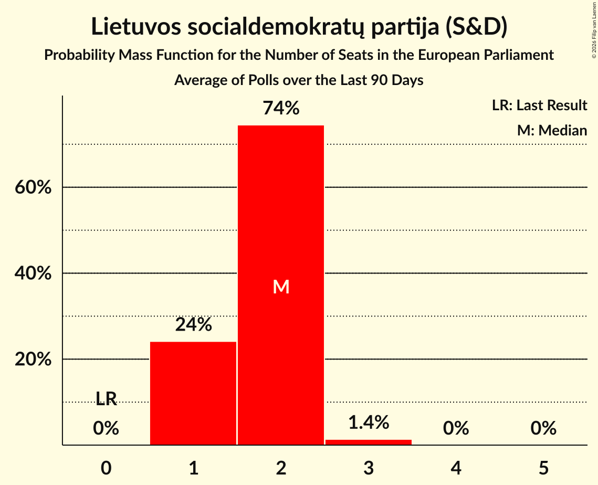

# Lietuvos socialdemokratų partija (S&D)

<a href="#voting-intentions">Voting Intentions</a> | <a href="#seats">Seats</a>

## Voting Intentions

Last result: **17.3%** (General Election of 26 May 2019)

### Confidence Intervals

| Period     | Polling firm/Commissioner(s) | Median | 80% Confidence Interval | 90% Confidence Interval | 95% Confidence Interval | 99% Confidence Interval |
|:----------:|:----------------:|:-----------:|:-----------------------:|:-----------------------:|:-----------------------:|:-----------------------:|
| N/A | [Poll Average](average.html) | 18.5% | 16.6–20.5% | 16.1–21.0% | 15.7–21.5% | 15.0–22.4% |
| [19–31 January 2023](2023-01-31-Baltijostyrimai.html) | Baltijos tyrimai   LRT | 19.4% | 17.8–21.0% | 17.4–21.5% | 17.0–21.9% | 16.3–22.7% |
| [18–27 January 2023](2023-01-27-Spintertyrimai.html) | Spinter tyrimai   Delfi | 17.6% | 16.2–19.3% | 15.7–19.7% | 15.4–20.1% | 14.7–20.9% |
| [15–24 December 2022](2022-12-24-Spintertyrimai.html) | Spinter tyrimai   Delfi | 17.8% | 16.4–19.4% | 15.9–19.9% | 15.6–20.3% | 14.9–21.1% |
| [8–15 December 2022](2022-12-15-Vilmorus.html) | Vilmorus | 25.0% | 23.3–26.8% | 22.8–27.3% | 22.4–27.8% | 21.6–28.7% |
| [17 November–2 December 2022](2022-12-02-Baltijostyrimai.html) | Baltijos tyrimai   LRT | 16.2% | N/A | N/A | N/A | N/A |
| [18–29 November 2022](2022-11-29-Spintertyrimai.html) | Spinter tyrimai   Delfi | 16.9% | 15.4–18.5% | 15.0–18.9% | 14.7–19.3% | 14.0–20.1% |
| [10–19 November 2022](2022-11-19-Vilmorus.html) | Vilmorus | 24.3% | 22.6–26.1% | 22.1–26.6% | 21.7–27.1% | 21.0–27.9% |
| [26 October–8 November 2022](2022-11-08-Baltijostyrimai.html) | Baltijos tyrimai | 17.7% | 16.3–19.4% | 15.9–19.8% | 15.5–20.2% | 14.8–21.0% |
| [18–28 October 2022](2022-10-28-Spintertyrimai.html) | Spinter tyrimai   Delfi | 17.8% | 16.3–19.4% | 15.9–19.9% | 15.6–20.3% | 14.9–21.1% |
| [11–16 October 2022](2022-10-16-Vilmorus.html) | Vilmorus   Lietuvos rytas | 23.7% | 22.0–25.4% | 21.5–25.9% | 21.1–26.4% | 20.3–27.3% |
| [20–30 September 2022](2022-09-30-Spintertyrimai.html) | Spinter tyrimai   Delfi | 17.6% | N/A | N/A | N/A | N/A |
| [27 September 2022](2022-09-27-Baltijostyrimai.html) | Baltijos tyrimai   LRT | 20.0% | N/A | N/A | N/A | N/A |
| [15–24 September 2022](2022-09-24-Vilmorus.html) | Vilmorus   Lietuvos rytas | 22.4% | 20.8–24.2% | 20.3–24.7% | 19.9–25.1% | 19.2–26.0% |
| [25 August–2 September 2022](2022-09-02-Spintertyrimai.html) | Spinter tyrimai   Delfi | 12.7% | 11.5–14.2% | 11.1–14.6% | 10.8–14.9% | 10.2–15.7% |
| [1–31 August 2022](2022-08-31-Baltijostyrimai.html) | Baltijos tyrimai   LRT | 18.3% | N/A | N/A | N/A | N/A |
| [18–28 July 2022](2022-07-28-Spintertyrimai.html) | Spinter tyrimai   Delfi | 14.8% | 13.5–16.3% | 13.1–16.8% | 12.7–17.1% | 12.1–17.9% |
| [12–28 July 2022](2022-07-28-Baltijostyrimai.html) | Baltijos tyrimai   ELTA | 20.0% | 18.4–21.7% | 18.0–22.1% | 17.6–22.6% | 16.9–23.4% |
| [15–23 July 2022](2022-07-23-Vilmorus.html) | Vilmorus   Lietuvos rytas | 20.8% | 19.3–22.6% | 18.8–23.0% | 18.4–23.5% | 17.7–24.3% |
| [18–28 June 2022](2022-06-28-Spintertyrimai.html) | Spinter tyrimai   Delfi | 16.4% | 14.9–17.9% | 14.5–18.4% | 14.2–18.8% | 13.5–19.5% |
| [9–18 June 2022](2022-06-18-Vilmorus.html) | Vilmorus   Lietuvos rytas | 22.5% | 20.9–24.3% | 20.4–24.8% | 20.0–25.2% | 19.3–26.1% |
| [16–28 May 2022](2022-05-28-Baltijostyrimai.html) | Baltijos tyrimai   ELTA | 17.1% | 15.7–18.7% | 15.3–19.2% | 15.0–19.6% | 14.3–20.4% |
| [18–27 May 2022](2022-05-27-Spintertyrimai.html) | Spinter tyrimai   Delfi | 18.7% | N/A | N/A | N/A | N/A |
| [12–18 May 2022](2022-05-18-Vilmorus.html) | Vilmorus   Lietuvos rytas | 25.8% | N/A | N/A | N/A | N/A |
| [20–28 April 2022](2022-04-28-Spintertyrimai.html) | Spinter tyrimai   Delfi | 13.9% | N/A | N/A | N/A | N/A |
| [13–27 April 2022](2022-04-27-Baltijostyrimai.html) | Baltijos tyrimai   ELTA | 19.0% | N/A | N/A | N/A | N/A |
| [15–22 April 2022](2022-04-22-Norstat.html) | Norstat   Delfi | 16.6% | 15.2–18.2% | 14.8–18.6% | 14.4–19.0% | 13.8–19.8% |
| [17–25 March 2022](2022-03-25-Spintertyrimai.html) | Spinter tyrimai   Delfi | 15.1% | N/A | N/A | N/A | N/A |
| [10–24 March 2022](2022-03-24-Baltijostyrimai.html) | Baltijos tyrimai   ELTA | 18.0% | N/A | N/A | N/A | N/A |
| [10–19 March 2022](2022-03-19-Vilmorus.html) | Vilmorus   Lietuvos rytas | 23.0% | N/A | N/A | N/A | N/A |
| [22 February–3 March 2022](2022-03-03-Baltijostyrimai.html) | Baltijos tyrimai   ELTA | 17.1% | N/A | N/A | N/A | N/A |
| [17–25 February 2022](2022-02-25-Spintertyrimai.html) | Spinter tyrimai   Delfi | 17.6% | N/A | N/A | N/A | N/A |
| [3–8 February 2022](2022-02-08-Vilmorus.html) | Vilmorus   Lietuvos rytas | 27.0% | N/A | N/A | N/A | N/A |
| [24 January–4 February 2022](2022-02-04-Baltijostyrimai.html) | Baltijos tyrimai   ELTA | 23.9% | N/A | N/A | N/A | N/A |
| [17–29 January 2022](2022-01-29-Spintertyrimai.html) | Spinter tyrimai   Delfi | 14.8% | N/A | N/A | N/A | N/A |
| [13–25 December 2021](2021-12-25-Spintertyrimai.html) | Spinter tyrimai   Delfi | 17.0% | N/A | N/A | N/A | N/A |
| [10–18 December 2021](2021-12-18-Vilmorus.html) | Vilmorus   Lietuvos rytas | 32.0% | N/A | N/A | N/A | N/A |
| [10–18 December 2021](2021-12-18-Norstat.html) | Norstat   Delfi | 17.8% | N/A | N/A | N/A | N/A |
| [16 November–2 December 2021](2021-12-02-Baltijostyrimai.html) | Baltijos tyrimai   ELTA | 23.8% | 22.1–25.6% | 21.7–26.1% | 21.3–26.5% | 20.5–27.4% |
| [11–28 November 2021](2021-11-28-Spintertyrimai.html) | Spinter tyrimai   Delfi | 19.4% | 17.9–21.1% | 17.5–21.6% | 17.1–22.0% | 16.4–22.8% |
| [18–27 November 2021](2021-11-27-Vilmorus.html) | Vilmorus   Lietuvos rytas | 27.3% | 25.5–29.2% | 25.0–29.7% | 24.6–30.1% | 23.8–31.1% |
| [15 October–5 November 2021](2021-11-05-Baltijostyrimai.html) | Baltijos tyrimai   ELTA | 26.7% | 24.9–28.5% | 24.4–29.0% | 24.0–29.5% | 23.2–30.4% |
| [18–28 October 2021](2021-10-28-Spintertyrimai.html) | Spinter tyrimai   Delfi | 19.5% | N/A | N/A | N/A | N/A |
| [15–22 October 2021](2021-10-22-Vilmorus.html) | Vilmorus   Lietuvos rytas | 28.9% | 27.1–30.8% | 26.6–31.3% | 26.2–31.8% | 25.3–32.7% |
| [17 September–3 October 2021](2021-10-03-Baltijostyrimai.html) | Baltijos tyrimai   ELTA | 25.7% | N/A | N/A | N/A | N/A |
| [17–26 September 2021](2021-09-26-Spintertyrimai.html) | Spinter tyrimai   Delfi | 21.2% | 19.6–22.9% | 19.2–23.4% | 18.8–23.9% | 18.1–24.7% |
| [9–16 September 2021](2021-09-16-Vilmorus.html) | Vilmorus   Lietuvos rytas | 29.6% | 27.7–31.5% | 27.2–32.0% | 26.8–32.5% | 25.9–33.4% |
| [24–31 August 2021](2021-08-31-Spintertyrimai.html) | Spinter tyrimai   Delfi | 18.6% | 17.1–20.3% | 16.7–20.8% | 16.4–21.2% | 15.7–22.0% |
| [20–31 August 2021](2021-08-31-Baltijostyrimai.html) | Baltijos tyrimai   ELTA | 25.8% | 24.1–27.7% | 23.6–28.2% | 23.2–28.7% | 22.4–29.5% |
| [29 July–5 August 2021](2021-08-05-Vilmorus.html) | Vilmorus   Lietuvos rytas | 23.7% | 22.1–25.5% | 21.6–26.0% | 21.2–26.5% | 20.4–27.4% |
| [17–28 June 2021](2021-06-28-Spintertyrimai.html) | Spinter tyrimai   Delfi | 15.3% | 13.9–16.8% | 13.5–17.2% | 13.2–17.6% | 12.5–18.4% |
| [9–18 June 2021](2021-06-18-Vilmorus.html) | Vilmorus   Lietuvos rytas | 22.8% | 21.1–24.6% | 20.7–25.1% | 20.2–25.5% | 19.5–26.4% |
| [20 May–2 June 2021](2021-06-02-Baltijostyrimai.html) | Baltijos tyrimai   ELTA | 20.1% | N/A | N/A | N/A | N/A |
| [18–28 May 2021](2021-05-28-Spintertyrimai.html) | Spinter tyrimai   Delfi | 11.2% | 10.0–12.5% | 9.7–12.9% | 9.4–13.3% | 8.8–14.0% |
| [11–21 May 2021](2021-05-21-Vilmorus.html) | Vilmorus   Lietuvos rytas | 16.9% | 15.4–18.5% | 15.0–19.0% | 14.6–19.4% | 14.0–20.1% |
| [19–28 April 2021](2021-04-28-Spintertyrimai.html) | Spinter tyrimai   Delfi | 8.2% | 7.1–9.4% | 6.9–9.7% | 6.6–10.0% | 6.2–10.6% |
| [8–17 April 2021](2021-04-17-Vilmorus.html) | Vilmorus   Lietuvos rytas | 11.7% | 10.5–13.1% | 10.1–13.5% | 9.8–13.9% | 9.3–14.6% |
| [17–23 March 2021](2021-03-23-Spintertyrimai.html) | Spinter tyrimai   Delfi | 8.6% | 7.6–9.8% | 7.3–10.2% | 7.0–10.5% | 6.6–11.1% |
| [17–26 February 2021](2021-02-26-Spintertyrimai.html) | Spinter tyrimai   Delfi | 6.5% | 5.6–7.6% | 5.4–7.9% | 5.2–8.2% | 4.7–8.8% |
| [18–27 January 2021](2021-01-27-Spintertyrimai.html) | Spinter tyrimai   Delfi | 8.5% | 7.5–9.7% | 7.2–10.1% | 6.9–10.4% | 6.5–11.0% |
| [10–20 December 2020](2020-12-20-Spintertyrimai.html) | Spinter tyrimai   Delfi | 7.7% | 6.8–8.9% | 6.5–9.3% | 6.2–9.6% | 5.8–10.2% |
| [6–30 November 2020](2020-11-30-Baltijostyrimai.html) | Baltijos tyrimai   ELTA | 9.4% | 8.3–10.7% | 8.0–11.1% | 7.7–11.4% | 7.2–12.0% |
| [17–27 September 2020](2020-09-27-Baltijostyrimai.html) | Baltijos tyrimai   ELTA | 13.9% | 12.6–15.4% | 12.2–15.8% | 11.9–16.2% | 11.3–16.9% |
| [16–26 September 2020](2020-09-26-Spintertyrimai.html) | Spinter tyrimai   Delfi | 11.4% | N/A | N/A | N/A | N/A |
| [4–12 September 2020](2020-09-12-Vilmorus.html) | Vilmorus   Lietuvos rytas | 11.7% | 10.6–13.2% | 10.2–13.6% | 10.0–13.9% | 9.4–14.6% |
| [26 August–4 September 2020](2020-09-04-Spintertyrimai.html) | Spinter tyrimai   Delfi | 12.6% | 11.3–14.0% | 11.0–14.4% | 10.7–14.8% | 10.1–15.5% |
| [22 August–4 September 2020](2020-09-04-Baltijostyrimai.html) | Baltijos tyrimai   ELTA | 18.5% | 17.0–20.1% | 16.6–20.6% | 16.2–21.0% | 15.5–21.8% |
| [29 July–31 August 2020](2020-08-31-Norstat.html) | Norstat   LRT | 13.0% | 11.7–14.5% | 11.4–14.9% | 11.1–15.2% | 10.5–16.0% |
| [16–30 July 2020](2020-07-30-Baltijostyrimai.html) | Baltijos tyrimai   ELTA | 14.0% | 12.7–15.5% | 12.3–15.9% | 12.0–16.3% | 11.4–17.0% |
| [16–26 July 2020](2020-07-26-Spintertyrimai.html) | Spinter tyrimai   Delfi | 13.9% | 12.6–15.4% | 12.2–15.8% | 11.9–16.2% | 11.3–16.9% |
| [10–18 July 2020](2020-07-18-Vilmorus.html) | Vilmorus   Lietuvos rytas | 10.8% | 9.3–11.7% | 8.9–12.1% | 8.7–12.4% | 8.1–13.1% |
| [18–26 June 2020](2020-06-26-Spintertyrimai.html) | Spinter tyrimai   Delfi | 13.5% | 12.2–15.0% | 11.8–15.4% | 11.5–15.8% | 10.9–16.5% |
| [15–25 June 2020](2020-06-25-Baltijostyrimai.html) | Baltijos tyrimai   ELTA | 17.0% | 15.5–18.6% | 15.2–19.1% | 14.8–19.5% | 14.1–20.3% |
| [5–13 June 2020](2020-06-13-Vilmorus.html) | Vilmorus   Lietuvos rytas | 16.0% | 14.6–17.6% | 14.2–18.1% | 13.9–18.5% | 13.2–19.2% |
| [20–30 April 2020](2020-04-30-Spintertyrimai.html) | Spinter tyrimai   Delfi | 13.7% | 12.4–15.2% | 12.1–15.7% | 11.8–16.0% | 11.2–16.8% |
| [17–30 March 2020](2020-03-30-Spintertyrimai.html) | Spinter tyrimai   Delfi | 12.2% | 11.0–13.6% | 10.6–14.0% | 10.3–14.4% | 9.7–15.1% |
| [6–13 March 2020](2020-03-13-Vilmorus.html) | Vilmorus   Lietuvos rytas | 14.2% | 12.8–15.7% | 12.5–16.1% | 12.1–16.5% | 11.5–17.3% |
| [13–26 February 2020](2020-02-26-Baltijostyrimai.html) | Baltijos tyrimai   ELTA | 15.6% | 14.3–17.2% | 13.9–17.6% | 13.5–18.0% | 12.9–18.7% |
| [18–25 February 2020](2020-02-25-Spintertyrimai.html) | Spinter tyrimai   Delfi | 12.4% | 11.1–13.8% | 10.8–14.2% | 10.5–14.5% | 9.9–15.2% |
| [7–13 February 2020](2020-02-13-Vilmorus.html) | Vilmorus   Lietuvos rytas | 16.0% | 14.7–17.7% | 14.3–18.1% | 13.9–18.5% | 13.3–19.3% |
| [20–28 January 2020](2020-01-28-Spintertyrimai.html) | Spinter tyrimai   Delfi | 11.3% | 10.1–12.7% | 9.8–13.1% | 9.5–13.4% | 9.0–14.1% |
| [10–18 January 2020](2020-01-18-Vilmorus.html) | Vilmorus   Lietuvos rytas | 15.2% | 13.8–16.7% | 13.4–17.2% | 13.1–17.5% | 12.4–18.3% |
| [10–21 December 2019](2019-12-21-Baltijostyrimai.html) | Baltijos tyrimai   ELTA | 17.5% | 16.0–19.1% | 15.6–19.5% | 15.2–19.9% | 14.6–20.7% |
| [29 November–7 December 2019](2019-12-07-Vilmorus.html) | Vilmorus   Lietuvos rytas | 14.2% | 12.9–15.8% | 12.5–16.2% | 12.2–16.6% | 11.6–17.3% |
| [19–29 November 2019](2019-11-29-Spintertyrimai.html) | Spinter tyrimai   Delfi | 11.5% | 10.3–12.9% | 10.0–13.3% | 9.7–13.6% | 9.1–14.3% |
| [14–27 November 2019](2019-11-27-Baltijostyrimai.html) | Baltijos tyrimai   ELTA | 19.8% | 18.3–21.5% | 17.8–22.0% | 17.4–22.4% | 16.7–23.2% |
| [8–16 November 2019](2019-11-16-Vilmorus.html) | Vilmorus   Lietuvos rytas | 13.0% | 11.7–14.5% | 11.4–14.9% | 11.1–15.3% | 10.5–16.0% |
| [15–29 October 2019](2019-10-29-Baltijostyrimai.html) | Baltijos tyrimai   ELTA | 19.4% | 17.9–21.1% | 17.4–21.6% | 17.1–22.0% | 16.4–22.8% |
| [17–28 October 2019](2019-10-28-Spintertyrimai.html) | Spinter tyrimai   Delfi | 10.0% | 8.9–11.3% | 8.6–11.7% | 8.3–12.0% | 7.8–12.7% |
| [4–13 October 2019](2019-10-13-Vilmorus.html) | Vilmorus   Lietuvos rytas | 11.6% | 10.4–13.0% | 10.0–13.4% | 9.8–13.8% | 9.2–14.5% |
| [21 September–5 October 2019](2019-10-05-Baltijostyrimai.html) | Baltijos tyrimai   ELTA | 17.6% | 16.1–19.2% | 15.7–19.6% | 15.3–20.1% | 14.6–20.9% |
| [18–27 September 2019](2019-09-27-Spintertyrimai.html) | Spinter tyrimai   Delfi | 12.3% | 11.0–13.7% | 10.7–14.1% | 10.4–14.4% | 9.8–15.1% |
| [6–14 September 2019](2019-09-14-Vilmorus.html) | Vilmorus   Lietuvos rytas | 13.5% | 12.2–15.0% | 11.8–15.4% | 11.5–15.8% | 10.9–16.5% |
| [26 August–8 September 2019](2019-09-08-Baltijostyrimai.html) | Baltijos tyrimai   ELTA | 18.5% | 17.1–20.2% | 16.6–20.7% | 16.3–21.1% | 15.6–21.9% |
| [15–29 July 2019](2019-07-29-Baltijostyrimai.html) | Baltijos tyrimai   ELTA | 19.2% | 17.7–20.9% | 17.2–21.4% | 16.9–21.8% | 16.2–22.6% |
| [17–26 July 2019](2019-07-26-Spintertyrimai.html) | Spinter tyrimai   Delfi | 13.7% | 12.4–15.2% | 12.0–15.6% | 11.7–16.0% | 11.1–16.7% |
| [5–13 July 2019](2019-07-13-Vilmorus.html) | Vilmorus   Lietuvos rytas | 11.7% | 10.5–13.2% | 10.2–13.6% | 9.9–13.9% | 9.3–14.6% |
| [14–28 June 2019](2019-06-28-Baltijostyrimai.html) | Baltijos tyrimai   ELTA | 18.7% | 17.2–20.3% | 16.8–20.8% | 16.4–21.2% | 15.7–22.0% |
| [18–27 June 2019](2019-06-27-Spintertyrimai.html) | Spinter tyrimai   Delfi | 14.0% | 12.7–15.5% | 12.3–15.9% | 12.0–16.3% | 11.4–17.0% |
| [7–15 June 2019](2019-06-15-Vilmorus.html) | Vilmorus   Lietuvos rytas | 12.4% | 11.2–13.9% | 10.8–14.3% | 10.5–14.6% | 9.9–15.4% |
| [27 May–9 June 2019](2019-06-09-Baltijostyrimai.html) | Baltijos tyrimai   ELTA | 17.7% | 16.3–19.4% | 15.9–19.9% | 15.5–20.3% | 14.8–21.1% |

### Probability Mass Function

The following table shows the probability mass function per percentage block of voting intentions for the [poll average](average.html) for Lietuvos socialdemokratų partija (S&D).

| Voting Intentions | Probability | Accumulated | Special Marks |
|:-----------------:|:-----------:|:-----------:|:-------------:|
| 12.5–13.5% | 0% | 100% |  |
| 13.5–14.5% | 0.2% | 100% |  |
| 14.5–15.5% | 2% | 99.8% |  |
| 15.5–16.5% | 7% | 98% |  |
| 16.5–17.5% | 17% | 91% | Last Result |
| 17.5–18.5% | 24% | 74% |  |
| 18.5–19.5% | 24% | 49% | Median |
| 19.5–20.5% | 16% | 26% |  |
| 20.5–21.5% | 7% | 9% |  |
| 21.5–22.5% | 2% | 2% |  |
| 22.5–23.5% | 0.3% | 0.3% |  |
| 23.5–24.5% | 0% | 0% |  |

## Seats

Last result: **2** seats (General Election of 26 May 2019)

### Confidence Intervals

| Period     | Polling firm/Commissioner(s) | Median | 80% Confidence Interval | 90% Confidence Interval | 95% Confidence Interval | 99% Confidence Interval |
|:----------:|:----------------:|:------:|:-----------------------:|:-----------------------:|:-----------------------:|:-----------------------:|
| N/A | [Poll Average](average.html) | 2 | 2–3 | 2–3 | 2–3 | 2–3 |
| [19–31 January 2023](2023-01-31-Baltijostyrimai.html) | Baltijos tyrimai   LRT | 3 | 3 | 3 | 2–3 | 2–3 |
| [18–27 January 2023](2023-01-27-Spintertyrimai.html) | Spinter tyrimai   Delfi | 2 | 2 | 2 | 2 | 2 |
| [15–24 December 2022](2022-12-24-Spintertyrimai.html) | Spinter tyrimai   Delfi | 2 | 2 | 2–3 | 2–3 | 2–3 |
| [8–15 December 2022](2022-12-15-Vilmorus.html) | Vilmorus | 3 | 3 | 3–4 | 3–4 | 3–4 |
| [17 November–2 December 2022](2022-12-02-Baltijostyrimai.html) | Baltijos tyrimai   LRT |  |  |  |  |  |
| [18–29 November 2022](2022-11-29-Spintertyrimai.html) | Spinter tyrimai   Delfi | 2 | 2 | 2 | 2 | 2–3 |
| [10–19 November 2022](2022-11-19-Vilmorus.html) | Vilmorus | 3 | 3 | 3 | 3–4 | 3–4 |
| [26 October–8 November 2022](2022-11-08-Baltijostyrimai.html) | Baltijos tyrimai | 2 | 2 | 2 | 2–3 | 2–3 |
| [18–28 October 2022](2022-10-28-Spintertyrimai.html) | Spinter tyrimai   Delfi | 2 | 2 | 2 | 2 | 2–3 |
| [11–16 October 2022](2022-10-16-Vilmorus.html) | Vilmorus   Lietuvos rytas | 3 | 3 | 2–3 | 2–3 | 2–3 |
| [20–30 September 2022](2022-09-30-Spintertyrimai.html) | Spinter tyrimai   Delfi |  |  |  |  |  |
| [27 September 2022](2022-09-27-Baltijostyrimai.html) | Baltijos tyrimai   LRT |  |  |  |  |  |
| [15–24 September 2022](2022-09-24-Vilmorus.html) | Vilmorus   Lietuvos rytas | 3 | 2–3 | 2–3 | 2–3 | 2–3 |
| [25 August–2 September 2022](2022-09-02-Spintertyrimai.html) | Spinter tyrimai   Delfi | 1 | 1–2 | 1–2 | 1–2 | 1–2 |
| [1–31 August 2022](2022-08-31-Baltijostyrimai.html) | Baltijos tyrimai   LRT |  |  |  |  |  |
| [18–28 July 2022](2022-07-28-Spintertyrimai.html) | Spinter tyrimai   Delfi | 2 | 1–2 | 1–2 | 1–2 | 1–2 |
| [12–28 July 2022](2022-07-28-Baltijostyrimai.html) | Baltijos tyrimai   ELTA | 2 | 2–3 | 2–3 | 2–3 | 2–3 |
| [15–23 July 2022](2022-07-23-Vilmorus.html) | Vilmorus   Lietuvos rytas | 3 | 2–3 | 2–3 | 2–3 | 2–3 |
| [18–28 June 2022](2022-06-28-Spintertyrimai.html) | Spinter tyrimai   Delfi | 2 | 2 | 2 | 2 | 1–2 |
| [9–18 June 2022](2022-06-18-Vilmorus.html) | Vilmorus   Lietuvos rytas | 3 | 3 | 2–3 | 2–3 | 2–3 |
| [16–28 May 2022](2022-05-28-Baltijostyrimai.html) | Baltijos tyrimai   ELTA | 2 | 2 | 2 | 2 | 2–3 |
| [18–27 May 2022](2022-05-27-Spintertyrimai.html) | Spinter tyrimai   Delfi |  |  |  |  |  |
| [12–18 May 2022](2022-05-18-Vilmorus.html) | Vilmorus   Lietuvos rytas |  |  |  |  |  |
| [20–28 April 2022](2022-04-28-Spintertyrimai.html) | Spinter tyrimai   Delfi |  |  |  |  |  |
| [13–27 April 2022](2022-04-27-Baltijostyrimai.html) | Baltijos tyrimai   ELTA |  |  |  |  |  |
| [15–22 April 2022](2022-04-22-Norstat.html) | Norstat   Delfi | 2 | 2 | 2 | 2 | 2 |
| [17–25 March 2022](2022-03-25-Spintertyrimai.html) | Spinter tyrimai   Delfi |  |  |  |  |  |
| [10–24 March 2022](2022-03-24-Baltijostyrimai.html) | Baltijos tyrimai   ELTA |  |  |  |  |  |
| [10–19 March 2022](2022-03-19-Vilmorus.html) | Vilmorus   Lietuvos rytas |  |  |  |  |  |
| [22 February–3 March 2022](2022-03-03-Baltijostyrimai.html) | Baltijos tyrimai   ELTA |  |  |  |  |  |
| [17–25 February 2022](2022-02-25-Spintertyrimai.html) | Spinter tyrimai   Delfi |  |  |  |  |  |
| [3–8 February 2022](2022-02-08-Vilmorus.html) | Vilmorus   Lietuvos rytas |  |  |  |  |  |
| [24 January–4 February 2022](2022-02-04-Baltijostyrimai.html) | Baltijos tyrimai   ELTA |  |  |  |  |  |
| [17–29 January 2022](2022-01-29-Spintertyrimai.html) | Spinter tyrimai   Delfi |  |  |  |  |  |
| [13–25 December 2021](2021-12-25-Spintertyrimai.html) | Spinter tyrimai   Delfi |  |  |  |  |  |
| [10–18 December 2021](2021-12-18-Vilmorus.html) | Vilmorus   Lietuvos rytas |  |  |  |  |  |
| [10–18 December 2021](2021-12-18-Norstat.html) | Norstat   Delfi |  |  |  |  |  |
| [16 November–2 December 2021](2021-12-02-Baltijostyrimai.html) | Baltijos tyrimai   ELTA | 3 | 3 | 3 | 3 | 2–4 |
| [11–28 November 2021](2021-11-28-Spintertyrimai.html) | Spinter tyrimai   Delfi | 2 | 2–3 | 2–3 | 2–3 | 2–3 |
| [18–27 November 2021](2021-11-27-Vilmorus.html) | Vilmorus   Lietuvos rytas | 3 | 3–4 | 3–4 | 3–4 | 3–4 |
| [15 October–5 November 2021](2021-11-05-Baltijostyrimai.html) | Baltijos tyrimai   ELTA | 3 | 3–4 | 3–4 | 3–4 | 3–4 |
| [18–28 October 2021](2021-10-28-Spintertyrimai.html) | Spinter tyrimai   Delfi |  |  |  |  |  |
| [15–22 October 2021](2021-10-22-Vilmorus.html) | Vilmorus   Lietuvos rytas | 3 | 3–4 | 3–4 | 3–4 | 3–4 |
| [17 September–3 October 2021](2021-10-03-Baltijostyrimai.html) | Baltijos tyrimai   ELTA |  |  |  |  |  |
| [17–26 September 2021](2021-09-26-Spintertyrimai.html) | Spinter tyrimai   Delfi | 2 | 2–3 | 2–3 | 2–3 | 2–3 |
| [9–16 September 2021](2021-09-16-Vilmorus.html) | Vilmorus   Lietuvos rytas | 4 | 3–4 | 3–4 | 3–4 | 3–4 |
| [24–31 August 2021](2021-08-31-Spintertyrimai.html) | Spinter tyrimai   Delfi | 2 | 2 | 2 | 2 | 2–3 |
| [20–31 August 2021](2021-08-31-Baltijostyrimai.html) | Baltijos tyrimai   ELTA | 3 | 3 | 3 | 3–4 | 2–4 |
| [29 July–5 August 2021](2021-08-05-Vilmorus.html) | Vilmorus   Lietuvos rytas | 3 | 3 | 3 | 2–3 | 2–4 |
| [17–28 June 2021](2021-06-28-Spintertyrimai.html) | Spinter tyrimai   Delfi | 2 | 2 | 1–2 | 1–2 | 1–2 |
| [9–18 June 2021](2021-06-18-Vilmorus.html) | Vilmorus   Lietuvos rytas | 3 | 3 | 2–3 | 2–3 | 2–3 |
| [20 May–2 June 2021](2021-06-02-Baltijostyrimai.html) | Baltijos tyrimai   ELTA |  |  |  |  |  |
| [18–28 May 2021](2021-05-28-Spintertyrimai.html) | Spinter tyrimai   Delfi | 1 | 1 | 1 | 1–2 | 1–2 |
| [11–21 May 2021](2021-05-21-Vilmorus.html) | Vilmorus   Lietuvos rytas | 2 | 2 | 2 | 2 | 1–2 |
| [19–28 April 2021](2021-04-28-Spintertyrimai.html) | Spinter tyrimai   Delfi | 1 | 1 | 1 | 1 | 1 |
| [8–17 April 2021](2021-04-17-Vilmorus.html) | Vilmorus   Lietuvos rytas | 1 | 1 | 1 | 1 | 1–2 |
| [17–23 March 2021](2021-03-23-Spintertyrimai.html) | Spinter tyrimai   Delfi | 1 | 1 | 1 | 1 | 1 |
| [17–26 February 2021](2021-02-26-Spintertyrimai.html) | Spinter tyrimai   Delfi | 1 | 1 | 1 | 1 | 0–1 |
| [18–27 January 2021](2021-01-27-Spintertyrimai.html) | Spinter tyrimai   Delfi | 1 | 1 | 1 | 1 | 1 |
| [10–20 December 2020](2020-12-20-Spintertyrimai.html) | Spinter tyrimai   Delfi | 1 | 1 | 1 | 1 | 1 |
| [6–30 November 2020](2020-11-30-Baltijostyrimai.html) | Baltijos tyrimai   ELTA | 1 | 1 | 1 | 1–2 | 1–2 |
| [17–27 September 2020](2020-09-27-Baltijostyrimai.html) | Baltijos tyrimai   ELTA | 2 | 2 | 2 | 2 | 1–2 |
| [16–26 September 2020](2020-09-26-Spintertyrimai.html) | Spinter tyrimai   Delfi |  |  |  |  |  |
| [4–12 September 2020](2020-09-12-Vilmorus.html) | Vilmorus   Lietuvos rytas | 1 | 1–2 | 1–2 | 1–2 | 1–2 |
| [26 August–4 September 2020](2020-09-04-Spintertyrimai.html) | Spinter tyrimai   Delfi | 2 | 1–2 | 1–2 | 1–2 | 1–2 |
| [22 August–4 September 2020](2020-09-04-Baltijostyrimai.html) | Baltijos tyrimai   ELTA | 2 | 2–3 | 2–3 | 2–3 | 2–3 |
| [29 July–31 August 2020](2020-08-31-Norstat.html) | Norstat   LRT | 2 | 1–2 | 1–2 | 1–2 | 1–2 |
| [16–30 July 2020](2020-07-30-Baltijostyrimai.html) | Baltijos tyrimai   ELTA | 2 | 2 | 2 | 1–2 | 1–2 |
| [16–26 July 2020](2020-07-26-Spintertyrimai.html) | Spinter tyrimai   Delfi | 2 | 1–2 | 1–2 | 1–2 | 1–2 |
| [10–18 July 2020](2020-07-18-Vilmorus.html) | Vilmorus   Lietuvos rytas | 1 | 1–2 | 1–2 | 1–2 | 1–2 |
| [18–26 June 2020](2020-06-26-Spintertyrimai.html) | Spinter tyrimai   Delfi | 1 | 1–2 | 1–2 | 1–2 | 1–2 |
| [15–25 June 2020](2020-06-25-Baltijostyrimai.html) | Baltijos tyrimai   ELTA | 2 | 2 | 2 | 2 | 2 |
| [5–13 June 2020](2020-06-13-Vilmorus.html) | Vilmorus   Lietuvos rytas | 2 | 2 | 2 | 2 | 2–3 |
| [20–30 April 2020](2020-04-30-Spintertyrimai.html) | Spinter tyrimai   Delfi | 2 | 1–2 | 1–2 | 1–2 | 1–2 |
| [17–30 March 2020](2020-03-30-Spintertyrimai.html) | Spinter tyrimai   Delfi | 1 | 1 | 1–2 | 1–2 | 1–2 |
| [6–13 March 2020](2020-03-13-Vilmorus.html) | Vilmorus   Lietuvos rytas | 2 | 1–2 | 1–2 | 1–2 | 1–2 |
| [13–26 February 2020](2020-02-26-Baltijostyrimai.html) | Baltijos tyrimai   ELTA | 2 | 2 | 2 | 2 | 2–3 |
| [18–25 February 2020](2020-02-25-Spintertyrimai.html) | Spinter tyrimai   Delfi | 1 | 1–2 | 1–2 | 1–2 | 1–2 |
| [7–13 February 2020](2020-02-13-Vilmorus.html) | Vilmorus   Lietuvos rytas | 2 | 2 | 2–3 | 2–3 | 2–3 |
| [20–28 January 2020](2020-01-28-Spintertyrimai.html) | Spinter tyrimai   Delfi | 1 | 1–2 | 1–2 | 1–2 | 1–2 |
| [10–18 January 2020](2020-01-18-Vilmorus.html) | Vilmorus   Lietuvos rytas | 2 | 2 | 2 | 2 | 1–2 |
| [10–21 December 2019](2019-12-21-Baltijostyrimai.html) | Baltijos tyrimai   ELTA | 2 | 2 | 2–3 | 2–3 | 2–3 |
| [29 November–7 December 2019](2019-12-07-Vilmorus.html) | Vilmorus   Lietuvos rytas | 2 | 2 | 2 | 1–2 | 1–2 |
| [19–29 November 2019](2019-11-29-Spintertyrimai.html) | Spinter tyrimai   Delfi | 2 | 1–2 | 1–2 | 1–2 | 1–2 |
| [14–27 November 2019](2019-11-27-Baltijostyrimai.html) | Baltijos tyrimai   ELTA | 2 | 2–3 | 2–3 | 2–3 | 2–3 |
| [8–16 November 2019](2019-11-16-Vilmorus.html) | Vilmorus   Lietuvos rytas | 2 | 1–2 | 1–2 | 1–2 | 1–2 |
| [15–29 October 2019](2019-10-29-Baltijostyrimai.html) | Baltijos tyrimai   ELTA | 2 | 2 | 2–3 | 2–3 | 2–3 |
| [17–28 October 2019](2019-10-28-Spintertyrimai.html) | Spinter tyrimai   Delfi | 1 | 1–2 | 1–2 | 1–2 | 1–2 |
| [4–13 October 2019](2019-10-13-Vilmorus.html) | Vilmorus   Lietuvos rytas | 1 | 1–2 | 1–2 | 1–2 | 1–2 |
| [21 September–5 October 2019](2019-10-05-Baltijostyrimai.html) | Baltijos tyrimai   ELTA | 2 | 2–3 | 2–3 | 2–3 | 2–3 |
| [18–27 September 2019](2019-09-27-Spintertyrimai.html) | Spinter tyrimai   Delfi | 1 | 1–2 | 1–2 | 1–2 | 1–2 |
| [6–14 September 2019](2019-09-14-Vilmorus.html) | Vilmorus   Lietuvos rytas | 2 | 1–2 | 1–2 | 1–2 | 1–2 |
| [26 August–8 September 2019](2019-09-08-Baltijostyrimai.html) | Baltijos tyrimai   ELTA | 2 | 2–3 | 2–3 | 2–3 | 2–3 |
| [15–29 July 2019](2019-07-29-Baltijostyrimai.html) | Baltijos tyrimai   ELTA | 2 | 2–3 | 2–3 | 2–3 | 2–3 |
| [17–26 July 2019](2019-07-26-Spintertyrimai.html) | Spinter tyrimai   Delfi | 2 | 1–2 | 1–2 | 1–2 | 1–2 |
| [5–13 July 2019](2019-07-13-Vilmorus.html) | Vilmorus   Lietuvos rytas | 2 | 1–2 | 1–2 | 1–2 | 1–2 |
| [14–28 June 2019](2019-06-28-Baltijostyrimai.html) | Baltijos tyrimai   ELTA | 2 | 2 | 2–3 | 2–3 | 2–3 |
| [18–27 June 2019](2019-06-27-Spintertyrimai.html) | Spinter tyrimai   Delfi | 2 | 1–2 | 1–2 | 1–2 | 1–2 |
| [7–15 June 2019](2019-06-15-Vilmorus.html) | Vilmorus   Lietuvos rytas | 2 | 1–2 | 1–2 | 1–2 | 1–2 |
| [27 May–9 June 2019](2019-06-09-Baltijostyrimai.html) | Baltijos tyrimai   ELTA | 2 | 2 | 2 | 2 | 2–3 |

### Probability Mass Function

The following table shows the probability mass function per seat for the [poll average](average.html) for Lietuvos socialdemokratų partija (S&D).

| Number of Seats | Probability | Accumulated | Special Marks |
|:---------------:|:-----------:|:-----------:|:-------------:|
| 2 | 52% | 100% | Last Result, Median |
| 3 | 48% | 48% |  |
| 4 | 0% | 0% |  |

