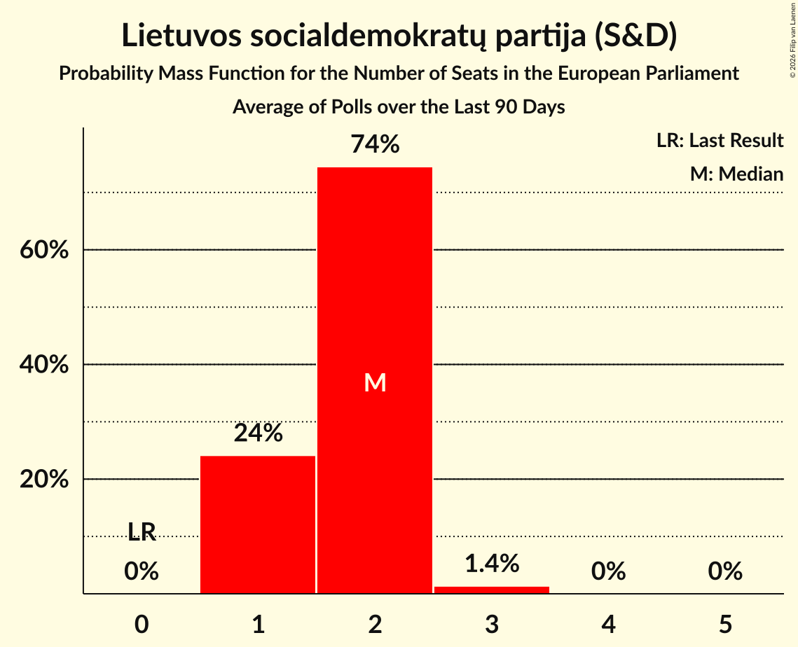

# Lietuvos socialdemokratų partija (S&D)

<a href="#voting-intentions">Voting Intentions</a> | <a href="#seats">Seats</a>

## Voting Intentions

Last result: **0.0%** (General Election of 9 June 2024)

### Confidence Intervals

| Period     | Polling firm/Commissioner(s) | Median | 80% Confidence Interval | 90% Confidence Interval | 95% Confidence Interval | 99% Confidence Interval |
|:----------:|:----------------:|:-----------:|:-----------------------:|:-----------------------:|:-----------------------:|:-----------------------:|
| N/A | [Poll Average](average.html) | 17.5% | 10.8–20.1% | 10.3–20.6% | 9.9–21.1% | 9.2–22.0% |
| [19 February–2 March 2026](2026-03-02-Baltijostyrimai.html) | Baltijos tyrimai   ELTA | 17.8% | 16.0–19.7% | 15.5–20.2% | 15.1–20.7% | 14.3–21.7% |
| [19–29 January 2026](2026-01-29-Spintertyrimai.html) | Spinter tyrimai   Delfi | 11.2% | 10.0–12.6% | 9.7–13.0% | 9.4–13.3% | 8.9–14.0% |
| [8–24 January 2026](2026-01-24-Baltijostyrimai.html) | Baltijos tyrimai   ELTA | 17.7% | 16.2–19.3% | 15.9–19.7% | 15.5–20.1% | 14.8–20.9% |
| [12–30 December 2025](2025-12-30-Vilmorus.html) | Vilmorus   Lietuvos Rytas | 19.1% | 17.6–20.8% | 17.1–21.2% | 16.8–21.7% | 16.1–22.5% |
| [11–29 December 2025](2025-12-29-Baltijostyrimai.html) | Baltijos tyrimai   ELTA | 17.8% | N/A | N/A | N/A | N/A |
| [13–22 December 2025](2025-12-22-Spintertyrimai.html) | Spinter tyrimai   Delfi | 13.8% | N/A | N/A | N/A | N/A |
| [11–29 November 2025](2025-11-29-Baltijostyrimai.html) | Baltijos tyrimai   ELTA | 16.9% | N/A | N/A | N/A | N/A |
| [17–28 November 2025](2025-11-28-Spintertyrimai.html) | Spinter tyrimai   Delfi | 14.3% | N/A | N/A | N/A | N/A |
| [6–16 November 2025](2025-11-16-Vilmorus.html) | Vilmorus   Lietuvos Rytas | 20.1% | N/A | N/A | N/A | N/A |
| [16–28 October 2025](2025-10-28-Baltijostyrimai.html) | Baltijos tyrimai   ELTA | 16.2% | N/A | N/A | N/A | N/A |
| [17–27 October 2025](2025-10-27-Spintertyrimai.html) | Spinter tyrimai   Delfi | 19.1% | N/A | N/A | N/A | N/A |
| [24 September–9 October 2025](2025-10-09-Baltijostyrimai.html) | Baltijos tyrimai   ELTA | 20.0% | N/A | N/A | N/A | N/A |
| [17–27 September 2025](2025-09-27-Spintertyrimai.html) | Spinter tyrimai   Delfi | 15.7% | N/A | N/A | N/A | N/A |
| [4–13 September 2025](2025-09-13-Vilmorus.html) | Vilmorus   Lietuvos Rytas | 24.4% | N/A | N/A | N/A | N/A |
| [21 August–2 September 2025](2025-09-02-Baltijostyrimai.html) | Baltijos tyrimai   ELTA | 21.9% | N/A | N/A | N/A | N/A |
| [18–25 July 2025](2025-07-25-Spintertyrimai.html) | Spinter tyrimai   Delfi | 15.5% | N/A | N/A | N/A | N/A |
| [19–29 June 2025](2025-06-29-Spintertyrimai.html) | Spinter tyrimai   Delfi | 17.0% | N/A | N/A | N/A | N/A |
| [11–22 June 2025](2025-06-22-Vilmorus.html) | Vilmorus   Lietuvos Rytas | 23.8% | N/A | N/A | N/A | N/A |
| [26 April–18 May 2025](2025-05-18-Spintertyrimai.html) | Spinter tyrimai | 19.3% | N/A | N/A | N/A | N/A |
| [2–12 May 2025](2025-05-12-Vilmorus.html) | Vilmorus   Lietuvos Rytas | 25.3% | N/A | N/A | N/A | N/A |
| [19–29 April 2025](2025-04-29-Spintertyrimai.html) | Spinter tyrimai   Delfi | 20.7% | N/A | N/A | N/A | N/A |
| [17–28 April 2025](2025-04-28-Vilmorus.html) | Vilmorus   Lietuvos Rytas | 24.7% | N/A | N/A | N/A | N/A |
| [5–19 April 2025](2025-04-19-Baltijostyrimai.html) | Baltijos tyrimai   ELTA | 20.0% | N/A | N/A | N/A | N/A |
| [18–28 March 2025](2025-03-28-Spintertyrimai.html) | Spinter tyrimai   Delfi | 18.7% | N/A | N/A | N/A | N/A |
| [8–24 March 2025](2025-03-24-Baltijostyrimai.html) | Baltijos tyrimai   Elta | 22.0% | N/A | N/A | N/A | N/A |
| [14–23 February 2025](2025-02-23-Vilmorus.html) | Vilmorus   Lietuvos Rytas | 22.1% | N/A | N/A | N/A | N/A |
| [25 January–8 February 2025](2025-02-08-Baltijostyrimai.html) | Baltijos tyrimai   Elta | 22.6% | N/A | N/A | N/A | N/A |
| [18–29 January 2025](2025-01-29-Spintertyrimai.html) | Spinter tyrimai   Delfi | 16.3% | N/A | N/A | N/A | N/A |
| [13–20 December 2024](2024-12-20-Spintertyrimai.html) | Spinter tyrimai   Delfi | 18.4% | N/A | N/A | N/A | N/A |
| [12 November–1 December 2024](2024-12-01-Baltijostyrimai.html) | Baltijos tyrimai | 22.9% | N/A | N/A | N/A | N/A |
| [7–16 November 2024](2024-11-16-Vilmorus.html) | Vilmorus | 24.3% | N/A | N/A | N/A | N/A |
| [30 October–12 November 2024](2024-11-12-Baltijostyrimai.html) | Baltijos tyrimai | 18.8% | N/A | N/A | N/A | N/A |
| [16–25 September 2024](2024-09-25-Spintertyrimai.html) | Spinter tyrimai   Delfi | 24.1% | N/A | N/A | N/A | N/A |
| [13–21 September 2024](2024-09-21-Vilmorus.html) | Vilmorus | 26.4% | N/A | N/A | N/A | N/A |
| [6–20 September 2024](2024-09-20-Baltijostyrimai.html) | Baltijos tyrimai | 22.2% | N/A | N/A | N/A | N/A |
| [7–9 August 2024](2024-08-09-Baltijostyrimai.html) | Baltijos tyrimai   Delfi | 21.9% | N/A | N/A | N/A | N/A |
| [19–29 July 2024](2024-07-29-Spintertyrimai.html) | Spinter tyrimai   Delfi | 21.5% | N/A | N/A | N/A | N/A |
| [11–21 July 2024](2024-07-21-Vilmorus.html) | Vilmorus | 26.4% | N/A | N/A | N/A | N/A |
| [21 June–7 July 2024](2024-07-07-Baltijostyrimai.html) | Baltijos tyrimai   LRT | 23.2% | N/A | N/A | N/A | N/A |
| [18–28 June 2024](2024-06-28-Spintertyrimai.html) | Spinter tyrimai   Delfi | 21.3% | N/A | N/A | N/A | N/A |

### Probability Mass Function

The following table shows the probability mass function per percentage block of voting intentions for the [poll average](average.html) for Lietuvos socialdemokratų partija (S&D).

| Voting Intentions | Probability | Accumulated | Special Marks |
|:-----------------:|:-----------:|:-----------:|:-------------:|
| 0.0–0.5% | 0% | 100% | Last Result |
| 0.5–1.5% | 0% | 100% |  |
| 1.5–2.5% | 0% | 100% |  |
| 2.5–3.5% | 0% | 100% |  |
| 3.5–4.5% | 0% | 100% |  |
| 4.5–5.5% | 0% | 100% |  |
| 5.5–6.5% | 0% | 100% |  |
| 6.5–7.5% | 0% | 100% |  |
| 7.5–8.5% | 0.1% | 100% |  |
| 8.5–9.5% | 1.1% | 99.9% |  |
| 9.5–10.5% | 7% | 98.8% |  |
| 10.5–11.5% | 13% | 92% |  |
| 11.5–12.5% | 9% | 79% |  |
| 12.5–13.5% | 3% | 70% |  |
| 13.5–14.5% | 0.7% | 67% |  |
| 14.5–15.5% | 1.5% | 66% |  |
| 15.5–16.5% | 5% | 65% |  |
| 16.5–17.5% | 11% | 60% |  |
| 17.5–18.5% | 16% | 49% | Median |
| 18.5–19.5% | 17% | 33% |  |
| 19.5–20.5% | 11% | 16% |  |
| 20.5–21.5% | 4% | 6% |  |
| 21.5–22.5% | 1.0% | 1.2% |  |
| 22.5–23.5% | 0.2% | 0.2% |  |
| 23.5–24.5% | 0% | 0% |  |

## Seats

Last result: **0** seats (General Election of 9 June 2024)

### Confidence Intervals

| Period     | Polling firm/Commissioner(s) | Median | 80% Confidence Interval | 90% Confidence Interval | 95% Confidence Interval | 99% Confidence Interval |
|:----------:|:----------------:|:------:|:-----------------------:|:-----------------------:|:-----------------------:|:-----------------------:|
| N/A | [Poll Average](average.html) | 2 | 1–2 | 1–2 | 1–2 | 1–3 |
| [19 February–2 March 2026](2026-03-02-Baltijostyrimai.html) | Baltijos tyrimai   ELTA | 2 | 2 | 2 | 2 | 2–3 |
| [19–29 January 2026](2026-01-29-Spintertyrimai.html) | Spinter tyrimai   Delfi | 1 | 1–2 | 1–2 | 1–2 | 1–2 |
| [8–24 January 2026](2026-01-24-Baltijostyrimai.html) | Baltijos tyrimai   ELTA | 2 | 2 | 2 | 2 | 2–3 |
| [12–30 December 2025](2025-12-30-Vilmorus.html) | Vilmorus   Lietuvos Rytas | 2 | 2 | 2 | 2 | 2–3 |
| [11–29 December 2025](2025-12-29-Baltijostyrimai.html) | Baltijos tyrimai   ELTA |  |  |  |  |  |
| [13–22 December 2025](2025-12-22-Spintertyrimai.html) | Spinter tyrimai   Delfi |  |  |  |  |  |
| [11–29 November 2025](2025-11-29-Baltijostyrimai.html) | Baltijos tyrimai   ELTA |  |  |  |  |  |
| [17–28 November 2025](2025-11-28-Spintertyrimai.html) | Spinter tyrimai   Delfi |  |  |  |  |  |
| [6–16 November 2025](2025-11-16-Vilmorus.html) | Vilmorus   Lietuvos Rytas |  |  |  |  |  |
| [16–28 October 2025](2025-10-28-Baltijostyrimai.html) | Baltijos tyrimai   ELTA |  |  |  |  |  |
| [17–27 October 2025](2025-10-27-Spintertyrimai.html) | Spinter tyrimai   Delfi |  |  |  |  |  |
| [24 September–9 October 2025](2025-10-09-Baltijostyrimai.html) | Baltijos tyrimai   ELTA |  |  |  |  |  |
| [17–27 September 2025](2025-09-27-Spintertyrimai.html) | Spinter tyrimai   Delfi |  |  |  |  |  |
| [4–13 September 2025](2025-09-13-Vilmorus.html) | Vilmorus   Lietuvos Rytas |  |  |  |  |  |
| [21 August–2 September 2025](2025-09-02-Baltijostyrimai.html) | Baltijos tyrimai   ELTA |  |  |  |  |  |
| [18–25 July 2025](2025-07-25-Spintertyrimai.html) | Spinter tyrimai   Delfi |  |  |  |  |  |
| [19–29 June 2025](2025-06-29-Spintertyrimai.html) | Spinter tyrimai   Delfi |  |  |  |  |  |
| [11–22 June 2025](2025-06-22-Vilmorus.html) | Vilmorus   Lietuvos Rytas |  |  |  |  |  |
| [26 April–18 May 2025](2025-05-18-Spintertyrimai.html) | Spinter tyrimai |  |  |  |  |  |
| [2–12 May 2025](2025-05-12-Vilmorus.html) | Vilmorus   Lietuvos Rytas |  |  |  |  |  |
| [19–29 April 2025](2025-04-29-Spintertyrimai.html) | Spinter tyrimai   Delfi |  |  |  |  |  |
| [17–28 April 2025](2025-04-28-Vilmorus.html) | Vilmorus   Lietuvos Rytas |  |  |  |  |  |
| [5–19 April 2025](2025-04-19-Baltijostyrimai.html) | Baltijos tyrimai   ELTA |  |  |  |  |  |
| [18–28 March 2025](2025-03-28-Spintertyrimai.html) | Spinter tyrimai   Delfi |  |  |  |  |  |
| [8–24 March 2025](2025-03-24-Baltijostyrimai.html) | Baltijos tyrimai   Elta |  |  |  |  |  |
| [14–23 February 2025](2025-02-23-Vilmorus.html) | Vilmorus   Lietuvos Rytas |  |  |  |  |  |
| [25 January–8 February 2025](2025-02-08-Baltijostyrimai.html) | Baltijos tyrimai   Elta |  |  |  |  |  |
| [18–29 January 2025](2025-01-29-Spintertyrimai.html) | Spinter tyrimai   Delfi |  |  |  |  |  |
| [13–20 December 2024](2024-12-20-Spintertyrimai.html) | Spinter tyrimai   Delfi |  |  |  |  |  |
| [12 November–1 December 2024](2024-12-01-Baltijostyrimai.html) | Baltijos tyrimai |  |  |  |  |  |
| [7–16 November 2024](2024-11-16-Vilmorus.html) | Vilmorus |  |  |  |  |  |
| [30 October–12 November 2024](2024-11-12-Baltijostyrimai.html) | Baltijos tyrimai |  |  |  |  |  |
| [16–25 September 2024](2024-09-25-Spintertyrimai.html) | Spinter tyrimai   Delfi |  |  |  |  |  |
| [13–21 September 2024](2024-09-21-Vilmorus.html) | Vilmorus |  |  |  |  |  |
| [6–20 September 2024](2024-09-20-Baltijostyrimai.html) | Baltijos tyrimai |  |  |  |  |  |
| [7–9 August 2024](2024-08-09-Baltijostyrimai.html) | Baltijos tyrimai   Delfi |  |  |  |  |  |
| [19–29 July 2024](2024-07-29-Spintertyrimai.html) | Spinter tyrimai   Delfi |  |  |  |  |  |
| [11–21 July 2024](2024-07-21-Vilmorus.html) | Vilmorus |  |  |  |  |  |
| [21 June–7 July 2024](2024-07-07-Baltijostyrimai.html) | Baltijos tyrimai   LRT |  |  |  |  |  |
| [18–28 June 2024](2024-06-28-Spintertyrimai.html) | Spinter tyrimai   Delfi |  |  |  |  |  |

### Probability Mass Function

The following table shows the probability mass function per seat for the [poll average](average.html) for Lietuvos socialdemokratų partija (S&D).

| Number of Seats | Probability | Accumulated | Special Marks |
|:---------------:|:-----------:|:-----------:|:-------------:|
| 0 | 0% | 100% | Last Result |
| 1 | 24% | 100% |  |
| 2 | 74% | 76% | Median |
| 3 | 1.4% | 1.4% |  |
| 4 | 0% | 0% |  |

