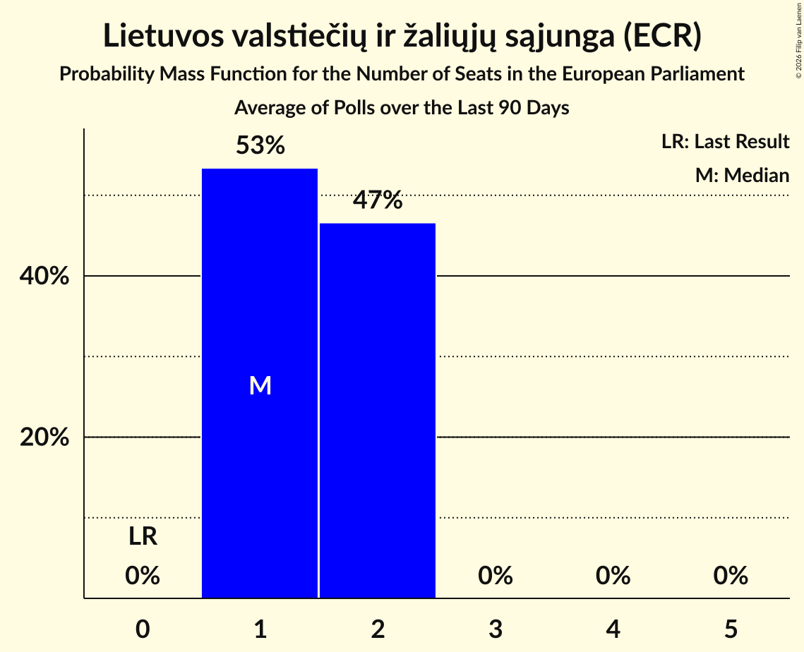

# Lietuvos valstiečių ir žaliųjų sąjunga (ECR)

<a href="#voting-intentions">Voting Intentions</a> | <a href="#seats">Seats</a>

## Voting Intentions

Last result: **0.0%** (General Election of 9 June 2024)

### Confidence Intervals

| Period     | Polling firm/Commissioner(s) | Median | 80% Confidence Interval | 90% Confidence Interval | 95% Confidence Interval | 99% Confidence Interval |
|:----------:|:----------------:|:-----------:|:-----------------------:|:-----------------------:|:-----------------------:|:-----------------------:|
| N/A | [Poll Average](average.html) | 12.4% | 10.6–14.4% | 10.1–14.9% | 9.8–15.3% | 9.2–16.1% |
| [11–29 November 2025](2025-11-29-Baltijostyrimai.html) | Baltijos tyrimai   ELTA | 13.6% | 12.3–15.1% | 12.0–15.5% | 11.7–15.9% | 11.1–16.6% |
| [17–28 November 2025](2025-11-28-Spintertyrimai.html) | Spinter tyrimai   Delfi | 11.1% | 10.0–12.5% | 9.6–12.9% | 9.3–13.2% | 8.8–13.9% |
| [6–16 November 2025](2025-11-16-Vilmorus.html) | Vilmorus   Lietuvos Rytas | 12.4% | 11.1–13.8% | 10.8–14.2% | 10.5–14.6% | 9.9–15.3% |
| [16–28 October 2025](2025-10-28-Baltijostyrimai.html) | Baltijos tyrimai   ELTA | 14.4% | 13.1–15.9% | 12.7–16.4% | 12.4–16.7% | 11.8–17.5% |
| [17–27 October 2025](2025-10-27-Spintertyrimai.html) | Spinter tyrimai   Delfi | 9.7% | 8.6–10.9% | 8.2–11.3% | 8.0–11.6% | 7.5–12.3% |
| [24 September–9 October 2025](2025-10-09-Baltijostyrimai.html) | Baltijos tyrimai   ELTA | 12.7% | 11.5–14.2% | 11.1–14.6% | 10.8–15.0% | 10.2–15.7% |
| [17–27 September 2025](2025-09-27-Spintertyrimai.html) | Spinter tyrimai   Delfi | 10.3% | 9.2–11.6% | 8.9–12.0% | 8.6–12.4% | 8.1–13.0% |
| [4–13 September 2025](2025-09-13-Vilmorus.html) | Vilmorus   Lietuvos Rytas | 11.6% | 10.1–13.4% | 9.7–14.0% | 9.3–14.4% | 8.7–15.3% |
| [21 August–2 September 2025](2025-09-02-Baltijostyrimai.html) | Baltijos tyrimai   ELTA | 12.8% | 11.6–14.3% | 11.2–14.7% | 10.9–15.0% | 10.3–15.8% |
| [18–25 July 2025](2025-07-25-Spintertyrimai.html) | Spinter tyrimai   Delfi | 9.3% | 8.2–10.6% | 7.9–11.0% | 7.7–11.3% | 7.2–11.9% |
| [19–29 June 2025](2025-06-29-Spintertyrimai.html) | Spinter tyrimai   Delfi | 7.9% | 6.9–9.0% | 6.6–9.4% | 6.4–9.7% | 5.9–10.3% |
| [11–22 June 2025](2025-06-22-Vilmorus.html) | Vilmorus   Lietuvos Rytas | 12.1% | 10.9–13.5% | 10.5–13.9% | 10.2–14.3% | 9.6–15.0% |
| [26 April–18 May 2025](2025-05-18-Spintertyrimai.html) | Spinter tyrimai | 7.7% | 6.7–8.9% | 6.4–9.2% | 6.2–9.5% | 5.8–10.1% |
| [2–12 May 2025](2025-05-12-Vilmorus.html) | Vilmorus   Lietuvos Rytas | 10.5% | 9.3–11.8% | 9.0–12.2% | 8.7–12.6% | 8.2–13.2% |
| [19–29 April 2025](2025-04-29-Spintertyrimai.html) | Spinter tyrimai   Delfi | 10.0% | 8.9–11.3% | 8.6–11.7% | 8.3–12.0% | 7.8–12.7% |
| [17–28 April 2025](2025-04-28-Vilmorus.html) | Vilmorus   Lietuvos Rytas | 10.1% | 9.0–11.4% | 8.6–11.8% | 8.4–12.1% | 7.9–12.8% |
| [5–19 April 2025](2025-04-19-Baltijostyrimai.html) | Baltijos tyrimai   ELTA | 12.1% | 10.9–13.5% | 10.5–13.9% | 10.2–14.3% | 9.7–15.0% |
| [18–28 March 2025](2025-03-28-Spintertyrimai.html) | Spinter tyrimai   Delfi | 10.3% | 8.9–11.9% | 8.6–12.4% | 8.2–12.8% | 7.6–13.6% |
| [8–24 March 2025](2025-03-24-Baltijostyrimai.html) | Baltijos tyrimai   Elta | 8.3% | 7.3–9.6% | 7.0–9.9% | 6.8–10.2% | 6.3–10.8% |
| [14–23 February 2025](2025-02-23-Vilmorus.html) | Vilmorus   Lietuvos Rytas | 11.4% | 10.2–12.8% | 9.9–13.2% | 9.6–13.5% | 9.0–14.2% |
| [25 January–8 February 2025](2025-02-08-Baltijostyrimai.html) | Baltijos tyrimai   Elta | 10.6% | N/A | N/A | N/A | N/A |
| [18–29 January 2025](2025-01-29-Spintertyrimai.html) | Spinter tyrimai   Delfi | 9.1% | N/A | N/A | N/A | N/A |
| [13–20 December 2024](2024-12-20-Spintertyrimai.html) | Spinter tyrimai   Delfi | 9.2% | N/A | N/A | N/A | N/A |
| [12 November–1 December 2024](2024-12-01-Baltijostyrimai.html) | Baltijos tyrimai | 8.5% | N/A | N/A | N/A | N/A |
| [7–16 November 2024](2024-11-16-Vilmorus.html) | Vilmorus | 9.6% | N/A | N/A | N/A | N/A |
| [30 October–12 November 2024](2024-11-12-Baltijostyrimai.html) | Baltijos tyrimai | 10.2% | N/A | N/A | N/A | N/A |
| [16–25 September 2024](2024-09-25-Spintertyrimai.html) | Spinter tyrimai   Delfi | 10.1% | N/A | N/A | N/A | N/A |
| [13–21 September 2024](2024-09-21-Vilmorus.html) | Vilmorus | 9.1% | N/A | N/A | N/A | N/A |
| [6–20 September 2024](2024-09-20-Baltijostyrimai.html) | Baltijos tyrimai | 11.3% | N/A | N/A | N/A | N/A |
| [7–9 August 2024](2024-08-09-Baltijostyrimai.html) | Baltijos tyrimai   Delfi | 11.6% | N/A | N/A | N/A | N/A |
| [19–29 July 2024](2024-07-29-Spintertyrimai.html) | Spinter tyrimai   Delfi | 13.3% | N/A | N/A | N/A | N/A |
| [11–21 July 2024](2024-07-21-Vilmorus.html) | Vilmorus | 13.8% | N/A | N/A | N/A | N/A |
| [21 June–7 July 2024](2024-07-07-Baltijostyrimai.html) | Baltijos tyrimai   LRT | 10.1% | N/A | N/A | N/A | N/A |
| [18–28 June 2024](2024-06-28-Spintertyrimai.html) | Spinter tyrimai   Delfi | 8.8% | N/A | N/A | N/A | N/A |

### Probability Mass Function

The following table shows the probability mass function per percentage block of voting intentions for the [poll average](average.html) for Lietuvos valstiečių ir žaliųjų sąjunga (ECR).

| Voting Intentions | Probability | Accumulated | Special Marks |
|:-----------------:|:-----------:|:-----------:|:-------------:|
| 0.0–0.5% | 0% | 100% | Last Result |
| 0.5–1.5% | 0% | 100% |  |
| 1.5–2.5% | 0% | 100% |  |
| 2.5–3.5% | 0% | 100% |  |
| 3.5–4.5% | 0% | 100% |  |
| 4.5–5.5% | 0% | 100% |  |
| 5.5–6.5% | 0% | 100% |  |
| 6.5–7.5% | 0% | 100% |  |
| 7.5–8.5% | 0.1% | 100% |  |
| 8.5–9.5% | 1.4% | 99.9% |  |
| 9.5–10.5% | 8% | 98.5% |  |
| 10.5–11.5% | 19% | 91% |  |
| 11.5–12.5% | 24% | 72% | Median |
| 12.5–13.5% | 23% | 47% |  |
| 13.5–14.5% | 16% | 24% |  |
| 14.5–15.5% | 6% | 8% |  |
| 15.5–16.5% | 1.5% | 2% |  |
| 16.5–17.5% | 0.2% | 0.2% |  |
| 17.5–18.5% | 0% | 0% |  |

## Seats

Last result: **0** seats (General Election of 9 June 2024)

### Confidence Intervals

| Period     | Polling firm/Commissioner(s) | Median | 80% Confidence Interval | 90% Confidence Interval | 95% Confidence Interval | 99% Confidence Interval |
|:----------:|:----------------:|:------:|:-----------------------:|:-----------------------:|:-----------------------:|:-----------------------:|
| N/A | [Poll Average](average.html) | 1 | 1–2 | 1–2 | 1–2 | 1–2 |
| [11–29 November 2025](2025-11-29-Baltijostyrimai.html) | Baltijos tyrimai   ELTA | 2 | 1–2 | 1–2 | 1–2 | 1–2 |
| [17–28 November 2025](2025-11-28-Spintertyrimai.html) | Spinter tyrimai   Delfi | 1 | 1 | 1 | 1–2 | 1–2 |
| [6–16 November 2025](2025-11-16-Vilmorus.html) | Vilmorus   Lietuvos Rytas | 1 | 1–2 | 1–2 | 1–2 | 1–2 |
| [16–28 October 2025](2025-10-28-Baltijostyrimai.html) | Baltijos tyrimai   ELTA | 2 | 2 | 1–2 | 1–2 | 1–2 |
| [17–27 October 2025](2025-10-27-Spintertyrimai.html) | Spinter tyrimai   Delfi | 1 | 1 | 1 | 1 | 1 |
| [24 September–9 October 2025](2025-10-09-Baltijostyrimai.html) | Baltijos tyrimai   ELTA | 2 | 1–2 | 1–2 | 1–2 | 1–2 |
| [17–27 September 2025](2025-09-27-Spintertyrimai.html) | Spinter tyrimai   Delfi | 1 | 1 | 1 | 1–2 | 1–2 |
| [4–13 September 2025](2025-09-13-Vilmorus.html) | Vilmorus   Lietuvos Rytas | 1 | 1–2 | 1–2 | 1–2 | 1–2 |
| [21 August–2 September 2025](2025-09-02-Baltijostyrimai.html) | Baltijos tyrimai   ELTA | 2 | 1–2 | 1–2 | 1–2 | 1–2 |
| [18–25 July 2025](2025-07-25-Spintertyrimai.html) | Spinter tyrimai   Delfi | 1 | 1 | 1 | 1 | 1 |
| [19–29 June 2025](2025-06-29-Spintertyrimai.html) | Spinter tyrimai   Delfi | 1 | 1 | 1 | 1 | 1 |
| [11–22 June 2025](2025-06-22-Vilmorus.html) | Vilmorus   Lietuvos Rytas | 1 | 1 | 1–2 | 1–2 | 1–2 |
| [26 April–18 May 2025](2025-05-18-Spintertyrimai.html) | Spinter tyrimai | 1 | 1 | 1 | 1 | 1 |
| [2–12 May 2025](2025-05-12-Vilmorus.html) | Vilmorus   Lietuvos Rytas | 1 | 1 | 1 | 1–2 | 1–2 |
| [19–29 April 2025](2025-04-29-Spintertyrimai.html) | Spinter tyrimai   Delfi | 1 | 1 | 1 | 1 | 1–2 |
| [17–28 April 2025](2025-04-28-Vilmorus.html) | Vilmorus   Lietuvos Rytas | 1 | 1 | 1 | 1 | 1 |
| [5–19 April 2025](2025-04-19-Baltijostyrimai.html) | Baltijos tyrimai   ELTA | 1 | 1–2 | 1–2 | 1–2 | 1–2 |
| [18–28 March 2025](2025-03-28-Spintertyrimai.html) | Spinter tyrimai   Delfi | 1 | 1 | 1–2 | 1–2 | 1–2 |
| [8–24 March 2025](2025-03-24-Baltijostyrimai.html) | Baltijos tyrimai   Elta | 1 | 1 | 1 | 1 | 1 |
| [14–23 February 2025](2025-02-23-Vilmorus.html) | Vilmorus   Lietuvos Rytas | 1 | 1 | 1 | 1–2 | 1–2 |
| [25 January–8 February 2025](2025-02-08-Baltijostyrimai.html) | Baltijos tyrimai   Elta |  |  |  |  |  |
| [18–29 January 2025](2025-01-29-Spintertyrimai.html) | Spinter tyrimai   Delfi |  |  |  |  |  |
| [13–20 December 2024](2024-12-20-Spintertyrimai.html) | Spinter tyrimai   Delfi |  |  |  |  |  |
| [12 November–1 December 2024](2024-12-01-Baltijostyrimai.html) | Baltijos tyrimai |  |  |  |  |  |
| [7–16 November 2024](2024-11-16-Vilmorus.html) | Vilmorus |  |  |  |  |  |
| [30 October–12 November 2024](2024-11-12-Baltijostyrimai.html) | Baltijos tyrimai |  |  |  |  |  |
| [16–25 September 2024](2024-09-25-Spintertyrimai.html) | Spinter tyrimai   Delfi |  |  |  |  |  |
| [13–21 September 2024](2024-09-21-Vilmorus.html) | Vilmorus |  |  |  |  |  |
| [6–20 September 2024](2024-09-20-Baltijostyrimai.html) | Baltijos tyrimai |  |  |  |  |  |
| [7–9 August 2024](2024-08-09-Baltijostyrimai.html) | Baltijos tyrimai   Delfi |  |  |  |  |  |
| [19–29 July 2024](2024-07-29-Spintertyrimai.html) | Spinter tyrimai   Delfi |  |  |  |  |  |
| [11–21 July 2024](2024-07-21-Vilmorus.html) | Vilmorus |  |  |  |  |  |
| [21 June–7 July 2024](2024-07-07-Baltijostyrimai.html) | Baltijos tyrimai   LRT |  |  |  |  |  |
| [18–28 June 2024](2024-06-28-Spintertyrimai.html) | Spinter tyrimai   Delfi |  |  |  |  |  |

### Probability Mass Function

The following table shows the probability mass function per seat for the [poll average](average.html) for Lietuvos valstiečių ir žaliųjų sąjunga (ECR).

| Number of Seats | Probability | Accumulated | Special Marks |
|:---------------:|:-----------:|:-----------:|:-------------:|
| 0 | 0% | 100% | Last Result |
| 1 | 68% | 100% | Median |
| 2 | 32% | 32% |  |
| 3 | 0% | 0% |  |

