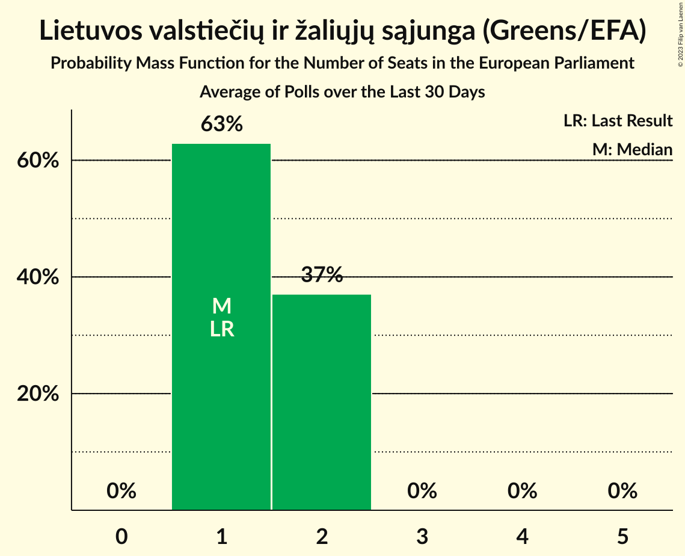

# Lietuvos valstiečių ir žaliųjų sąjunga (Greens/EFA)

<a href="#voting-intentions">Voting Intentions</a> | <a href="#seats">Seats</a>

## Voting Intentions

Last result: **6.6%** (General Election of 25 May 2014)

### Confidence Intervals

| Period     | Polling firm/Commissioner(s) | Median | 80% Confidence Interval | 90% Confidence Interval | 95% Confidence Interval | 99% Confidence Interval |
|:----------:|:----------------:|:-----------:|:-----------------------:|:-----------------------:|:-----------------------:|:-----------------------:|
| N/A | [Poll Average](average.html) | 21.0% | 19.4–22.7% | 19.0–23.2% | 18.6–23.6% | 17.9–24.5% |
| [16–30 October 2018](2018-10-30-Spintertyrimai.html) | Spinter tyrimai | 21.0% | 19.4–22.7% | 19.0–23.2% | 18.6–23.6% | 17.8–24.5% |
| [19–26 September 2018](2018-09-26-Spintertyrimai.html) | Spinter tyrimai | 24.0% | 22.4–25.8% | 21.9–26.3% | 21.5–26.8% | 20.7–27.6% |
| [24–31 August 2018](2018-08-31-Spintertyrimai.html) | Spinter tyrimai | 22.0% | 20.4–23.8% | 20.0–24.3% | 19.6–24.7% | 18.8–25.6% |
| [16–31 July 2018](2018-07-31-Baltijostyrimai.html) | Baltijos tyrimai | 17.0% | 15.5–18.6% | 15.1–19.0% | 14.8–19.4% | 14.1–20.2% |
| [19–27 June 2018](2018-06-27-Spintertyrimai.html) | Spinter tyrimai | 20.0% | 18.5–21.7% | 18.0–22.2% | 17.7–22.6% | 16.9–23.5% |
| [8–17 June 2018](2018-06-17-Vilmorus.html) | Vilmorus   Lietuvos rytas | 24.0% | 22.3–25.8% | 21.9–26.2% | 21.5–26.7% | 20.7–27.6% |
| [4–12 May 2018](2018-05-12-Vilmorus.html) | Vilmorus   Lietuvos rytas | 21.0% | 19.4–22.7% | 19.0–23.2% | 18.6–23.6% | 17.9–24.4% |
| [12–21 January 2018](2018-01-21-Vilmorus.html) | Vilmorus   Lietuvos rytas | 23.0% | 21.4–24.8% | 20.9–25.3% | 20.5–25.7% | 19.8–26.5% |

### Probability Mass Function

The following table shows the probability mass function per percentage block of voting intentions for the [poll average](average.html) for Lietuvos valstiečių ir žaliųjų sąjunga (Greens/EFA).

| Voting Intentions | Probability | Accumulated | Special Marks |
|:-----------------:|:-----------:|:-----------:|:-------------:|
| 6.5–7.5% | 0% | 100% | Last Result |
| 7.5–8.5% | 0% | 100% |  |
| 8.5–9.5% | 0% | 100% |  |
| 9.5–10.5% | 0% | 100% |  |
| 10.5–11.5% | 0% | 100% |  |
| 11.5–12.5% | 0% | 100% |  |
| 12.5–13.5% | 0% | 100% |  |
| 13.5–14.5% | 0% | 100% |  |
| 14.5–15.5% | 0% | 100% |  |
| 15.5–16.5% | 0% | 100% |  |
| 16.5–17.5% | 0.2% | 100% |  |
| 17.5–18.5% | 2% | 99.8% |  |
| 18.5–19.5% | 10% | 98% |  |
| 19.5–20.5% | 23% | 88% |  |
| 20.5–21.5% | 30% | 65% | Median |
| 21.5–22.5% | 22% | 34% |  |
| 22.5–23.5% | 9% | 12% |  |
| 23.5–24.5% | 2% | 3% |  |
| 24.5–25.5% | 0.4% | 0.4% |  |
| 25.5–26.5% | 0% | 0% |  |

## Seats

Last result: **1** seats (General Election of 25 May 2014)

### Confidence Intervals

| Period     | Polling firm/Commissioner(s) | Median | 80% Confidence Interval | 90% Confidence Interval | 95% Confidence Interval | 99% Confidence Interval |
|:----------:|:----------------:|:------:|:-----------------------:|:-----------------------:|:-----------------------:|:-----------------------:|
| N/A | [Poll Average](average.html) | 2 | 2–3 | 2–3 | 2–3 | 2–3 |
| [16–30 October 2018](2018-10-30-Spintertyrimai.html) | Spinter tyrimai | 2 | 2–3 | 2–3 | 2–3 | 2–3 |
| [19–26 September 2018](2018-09-26-Spintertyrimai.html) | Spinter tyrimai | 3 | 2–3 | 2–3 | 2–3 | 2–3 |
| [24–31 August 2018](2018-08-31-Spintertyrimai.html) | Spinter tyrimai | 2 | 2–3 | 2–3 | 2–3 | 2–3 |
| [16–31 July 2018](2018-07-31-Baltijostyrimai.html) | Baltijos tyrimai | 2 | 2 | 2 | 1–2 | 1–2 |
| [19–27 June 2018](2018-06-27-Spintertyrimai.html) | Spinter tyrimai | 2 | 2–3 | 2–3 | 2–3 | 2–3 |
| [8–17 June 2018](2018-06-17-Vilmorus.html) | Vilmorus   Lietuvos rytas | 3 | 3 | 3 | 3 | 2–4 |
| [4–12 May 2018](2018-05-12-Vilmorus.html) | Vilmorus   Lietuvos rytas | 2 | 2–3 | 2–3 | 2–3 | 2–3 |
| [12–21 January 2018](2018-01-21-Vilmorus.html) | Vilmorus   Lietuvos rytas | 3 | 2–3 | 2–3 | 2–3 | 2–3 |

### Probability Mass Function

The following table shows the probability mass function per seat for the [poll average](average.html) for Lietuvos valstiečių ir žaliųjų sąjunga (Greens/EFA).

| Number of Seats | Probability | Accumulated | Special Marks |
|:---------------:|:-----------:|:-----------:|:-------------:|
| 1 | 0% | 100% | Last Result |
| 2 | 73% | 100% | Median |
| 3 | 27% | 27% |  |
| 4 | 0% | 0% |  |

