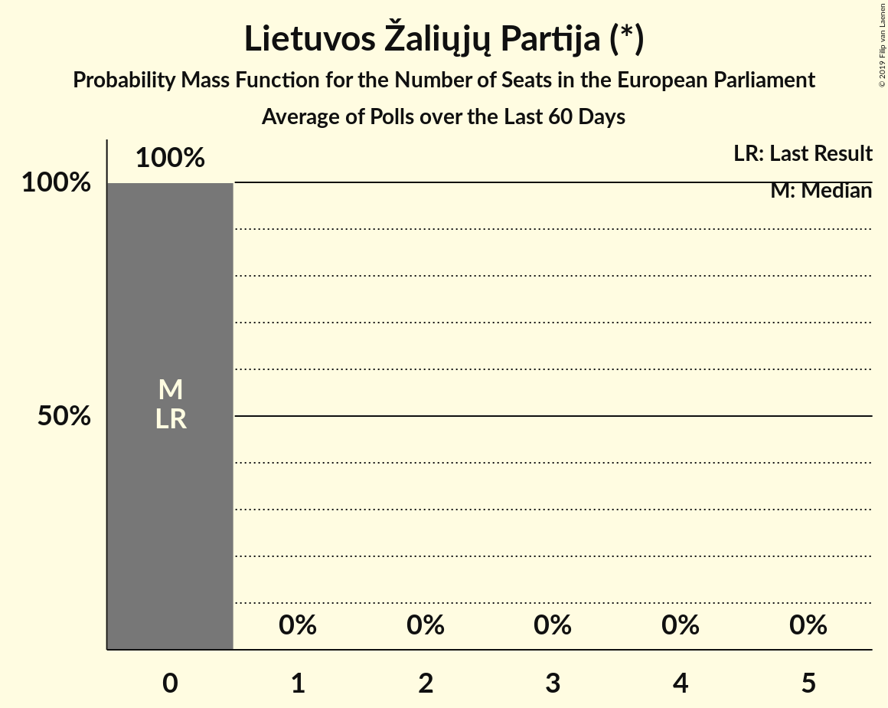

# Lietuvos Žaliųjų Partija (*)

<a href="#voting-intentions">Voting Intentions</a> | <a href="#seats">Seats</a>

## Voting Intentions

Last result: **3.6%** (General Election of 25 May 2014)

### Confidence Intervals

| Period     | Polling firm/Commissioner(s) | Median | 80% Confidence Interval | 90% Confidence Interval | 95% Confidence Interval | 99% Confidence Interval |
|:----------:|:----------------:|:-----------:|:-----------------------:|:-----------------------:|:-----------------------:|:-----------------------:|
| N/A | [Poll Average](average.html) | 2.1% | 1.5–2.7% | 1.4–2.9% | 1.3–3.0% | 1.1–3.4% |
| [20–29 April 2019](2019-04-29-Spintertyrimai.html) | Spinter tyrimai   Delfi | 0.0% | N/A | N/A | N/A | N/A |
| [12–26 April 2019](2019-04-26-Baltijostyrimai.html) | Baltijos tyrimai   ELTA | 2.0% | 1.5–2.7% | 1.4–2.9% | 1.3–3.0% | 1.1–3.4% |
| [4–15 April 2019](2019-04-15-Vilmorus.html) | Vilmorus   Lietuvos rytas | 0.0% | N/A | N/A | N/A | N/A |
| [15 March–10 April 2019](2019-04-10-Baltijostyrimai.html) | Baltijos tyrimai   Delfi | 0.0% | N/A | N/A | N/A | N/A |
| [18–28 March 2019](2019-03-28-Spintertyrimai.html) | Spinter tyrimai   Delfi | 0.0% | N/A | N/A | N/A | N/A |
| [7–15 March 2019](2019-03-15-Vilmorus.html) | Vilmorus   Lietuvos rytas | 0.0% | N/A | N/A | N/A | N/A |
| [18–28 February 2019](2019-02-28-Spintertyrimai.html) | Spinter tyrimai | 0.0% | N/A | N/A | N/A | N/A |
| [15–26 February 2019](2019-02-26-Baltijostyrimai.html) | Baltijos tyrimai | 0.0% | N/A | N/A | N/A | N/A |
| [8–17 February 2019](2019-02-17-Vilmorus.html) | Vilmorus   Lietuvos rytas | 0.0% | N/A | N/A | N/A | N/A |
| [23 January–3 February 2019](2019-02-03-Baltijostyrimai.html) | Baltijos tyrimai | 0.0% | N/A | N/A | N/A | N/A |
| [15–26 January 2019](2019-01-26-Spintertyrimai.html) | Spinter tyrimai | 0.0% | N/A | N/A | N/A | N/A |
| [11–20 January 2019](2019-01-20-Vilmorus.html) | Vilmorus   Lietuvos rytas | 0.0% | N/A | N/A | N/A | N/A |
| [9 December 2018](2018-12-09-Vilmorus.html) | Vilmorus   Lietuvos rytas | 0.0% | N/A | N/A | N/A | N/A |
| [19–30 November 2018](2018-11-30-Spintertyrimai.html) | Spinter tyrimai | 0.0% | N/A | N/A | N/A | N/A |
| [9–26 November 2018](2018-11-26-Baltijostyrimai.html) | Baltijos tyrimai | 0.0% | N/A | N/A | N/A | N/A |
| [16–30 October 2018](2018-10-30-Spintertyrimai.html) | Spinter tyrimai | 0.0% | N/A | N/A | N/A | N/A |
| [10–26 October 2018](2018-10-26-Baltijostyrimai.html) | Baltijos tyrimai | 0.0% | N/A | N/A | N/A | N/A |
| [24 September–7 October 2018](2018-10-07-Baltijostyrimai.html) | Baltijos tyrimai | 0.0% | N/A | N/A | N/A | N/A |
| [19–26 September 2018](2018-09-26-Spintertyrimai.html) | Spinter tyrimai | 0.0% | N/A | N/A | N/A | N/A |
| [24–31 August 2018](2018-08-31-Spintertyrimai.html) | Spinter tyrimai | 0.0% | N/A | N/A | N/A | N/A |
| [21–31 August 2018](2018-08-31-Baltijostyrimai.html) | Baltijos tyrimai | 0.0% | N/A | N/A | N/A | N/A |
| [16–31 July 2018](2018-07-31-Baltijostyrimai.html) | Baltijos tyrimai | 0.0% | N/A | N/A | N/A | N/A |
| [19–27 June 2018](2018-06-27-Spintertyrimai.html) | Spinter tyrimai | 0.0% | N/A | N/A | N/A | N/A |
| [8–17 June 2018](2018-06-17-Vilmorus.html) | Vilmorus   Lietuvos rytas | 0.0% | N/A | N/A | N/A | N/A |
| [4–12 May 2018](2018-05-12-Vilmorus.html) | Vilmorus   Lietuvos rytas | 0.0% | N/A | N/A | N/A | N/A |
| [12–21 January 2018](2018-01-21-Vilmorus.html) | Vilmorus   Lietuvos rytas | 1.0% | 0.7–1.5% | 0.6–1.6% | 0.5–1.8% | 0.4–2.1% |

### Probability Mass Function

The following table shows the probability mass function per percentage block of voting intentions for the [poll average](average.html) for Lietuvos Žaliųjų Partija (*).

| Voting Intentions | Probability | Accumulated | Special Marks |
|:-----------------:|:-----------:|:-----------:|:-------------:|
| 0.0–0.5% | 0% | 100% |  |
| 0.5–1.5% | 11% | 100% |  |
| 1.5–2.5% | 74% | 89% | Median |
| 2.5–3.5% | 15% | 15% |  |
| 3.5–4.5% | 0.3% | 0.3% | Last Result |
| 4.5–5.5% | 0% | 0% |  |

## Seats

Last result: **0** seats (General Election of 25 May 2014)

### Confidence Intervals

| Period     | Polling firm/Commissioner(s) | Median | 80% Confidence Interval | 90% Confidence Interval | 95% Confidence Interval | 99% Confidence Interval |
|:----------:|:----------------:|:------:|:-----------------------:|:-----------------------:|:-----------------------:|:-----------------------:|
| N/A | [Poll Average](average.html) | 0 | 0 | 0 | 0 | 0 |
| [20–29 April 2019](2019-04-29-Spintertyrimai.html) | Spinter tyrimai   Delfi |  |  |  |  |  |
| [12–26 April 2019](2019-04-26-Baltijostyrimai.html) | Baltijos tyrimai   ELTA | 0 | 0 | 0 | 0 | 0 |
| [4–15 April 2019](2019-04-15-Vilmorus.html) | Vilmorus   Lietuvos rytas |  |  |  |  |  |
| [15 March–10 April 2019](2019-04-10-Baltijostyrimai.html) | Baltijos tyrimai   Delfi |  |  |  |  |  |
| [18–28 March 2019](2019-03-28-Spintertyrimai.html) | Spinter tyrimai   Delfi |  |  |  |  |  |
| [7–15 March 2019](2019-03-15-Vilmorus.html) | Vilmorus   Lietuvos rytas |  |  |  |  |  |
| [18–28 February 2019](2019-02-28-Spintertyrimai.html) | Spinter tyrimai |  |  |  |  |  |
| [15–26 February 2019](2019-02-26-Baltijostyrimai.html) | Baltijos tyrimai |  |  |  |  |  |
| [8–17 February 2019](2019-02-17-Vilmorus.html) | Vilmorus   Lietuvos rytas |  |  |  |  |  |
| [23 January–3 February 2019](2019-02-03-Baltijostyrimai.html) | Baltijos tyrimai |  |  |  |  |  |
| [15–26 January 2019](2019-01-26-Spintertyrimai.html) | Spinter tyrimai |  |  |  |  |  |
| [11–20 January 2019](2019-01-20-Vilmorus.html) | Vilmorus   Lietuvos rytas |  |  |  |  |  |
| [9 December 2018](2018-12-09-Vilmorus.html) | Vilmorus   Lietuvos rytas |  |  |  |  |  |
| [19–30 November 2018](2018-11-30-Spintertyrimai.html) | Spinter tyrimai |  |  |  |  |  |
| [9–26 November 2018](2018-11-26-Baltijostyrimai.html) | Baltijos tyrimai |  |  |  |  |  |
| [16–30 October 2018](2018-10-30-Spintertyrimai.html) | Spinter tyrimai |  |  |  |  |  |
| [10–26 October 2018](2018-10-26-Baltijostyrimai.html) | Baltijos tyrimai |  |  |  |  |  |
| [24 September–7 October 2018](2018-10-07-Baltijostyrimai.html) | Baltijos tyrimai |  |  |  |  |  |
| [19–26 September 2018](2018-09-26-Spintertyrimai.html) | Spinter tyrimai |  |  |  |  |  |
| [24–31 August 2018](2018-08-31-Spintertyrimai.html) | Spinter tyrimai |  |  |  |  |  |
| [21–31 August 2018](2018-08-31-Baltijostyrimai.html) | Baltijos tyrimai |  |  |  |  |  |
| [16–31 July 2018](2018-07-31-Baltijostyrimai.html) | Baltijos tyrimai |  |  |  |  |  |
| [19–27 June 2018](2018-06-27-Spintertyrimai.html) | Spinter tyrimai |  |  |  |  |  |
| [8–17 June 2018](2018-06-17-Vilmorus.html) | Vilmorus   Lietuvos rytas |  |  |  |  |  |
| [4–12 May 2018](2018-05-12-Vilmorus.html) | Vilmorus   Lietuvos rytas |  |  |  |  |  |
| [12–21 January 2018](2018-01-21-Vilmorus.html) | Vilmorus   Lietuvos rytas | 0 | 0 | 0 | 0 | 0 |

### Probability Mass Function

The following table shows the probability mass function per seat for the [poll average](average.html) for Lietuvos Žaliųjų Partija (*).

| Number of Seats | Probability | Accumulated | Special Marks |
|:---------------:|:-----------:|:-----------:|:-------------:|
| 0 | 100% | 100% | Last Result, Median |

