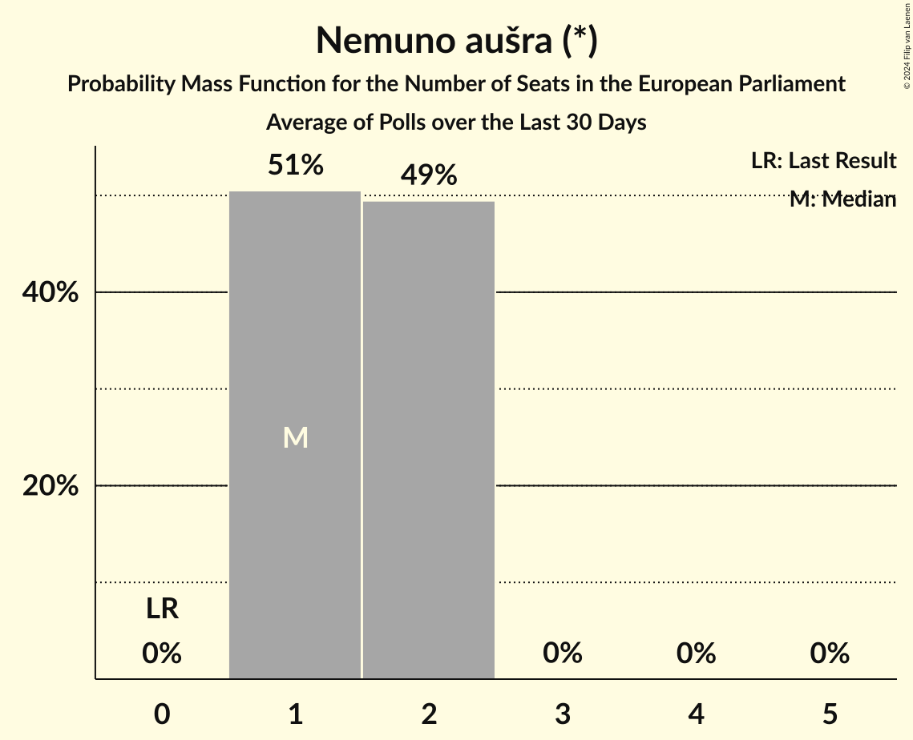

# Nemuno aušra (*)

<a href="#voting-intentions">Voting Intentions</a> | <a href="#seats">Seats</a>

## Voting Intentions

Last result: **0.0%** (General Election of 9 June 2024)

### Confidence Intervals

| Period     | Polling firm/Commissioner(s) | Median | 80% Confidence Interval | 90% Confidence Interval | 95% Confidence Interval | 99% Confidence Interval |
|:----------:|:----------------:|:-----------:|:-----------------------:|:-----------------------:|:-----------------------:|:-----------------------:|
| N/A | [Poll Average](average.html) | 13.0% | 11.7–14.4% | 11.4–14.8% | 11.1–15.2% | 10.5–15.9% |
| [18–29 January 2025](2025-01-29-Spintertyrimai.html) | Spinter tyrimai   Delfi | 13.0% | 11.7–14.4% | 11.4–14.8% | 11.1–15.2% | 10.5–15.9% |
| [13–20 December 2024](2024-12-20-Spintertyrimai.html) | Spinter tyrimai   Delfi | 17.9% | 16.4–19.5% | 16.0–20.0% | 15.7–20.4% | 15.0–21.2% |
| [12 November–1 December 2024](2024-12-01-Baltijostyrimai.html) | Baltijos tyrimai | 17.1% | 15.7–18.7% | 15.2–19.1% | 14.9–19.5% | 14.2–20.3% |
| [7–16 November 2024](2024-11-16-Vilmorus.html) | Vilmorus | 20.7% | 19.1–22.4% | 18.7–22.9% | 18.3–23.3% | 17.6–24.2% |
| [30 October–12 November 2024](2024-11-12-Baltijostyrimai.html) | Baltijos tyrimai | 20.3% | 18.7–22.0% | 18.3–22.5% | 17.9–22.9% | 17.2–23.7% |
| [16–25 September 2024](2024-09-25-Spintertyrimai.html) | Spinter tyrimai   Delfi | 16.0% | 14.6–17.5% | 14.2–18.0% | 13.8–18.4% | 13.2–19.1% |
| [13–21 September 2024](2024-09-21-Vilmorus.html) | Vilmorus | 16.7% | 15.0–18.7% | 14.6–19.2% | 14.1–19.7% | 13.4–20.7% |
| [6–20 September 2024](2024-09-20-Baltijostyrimai.html) | Baltijos tyrimai | 11.5% | 10.3–13.0% | 9.9–13.4% | 9.6–13.8% | 9.0–14.5% |
| [7–9 August 2024](2024-08-09-Baltijostyrimai.html) | Baltijos tyrimai   Delfi | 11.1% | 10.0–12.5% | 9.6–12.9% | 9.3–13.2% | 8.8–13.9% |
| [19–29 July 2024](2024-07-29-Spintertyrimai.html) | Spinter tyrimai   Delfi | 17.0% | 15.5–18.6% | 15.1–19.0% | 14.8–19.4% | 14.1–20.2% |
| [11–21 July 2024](2024-07-21-Vilmorus.html) | Vilmorus | 9.9% | 8.8–11.2% | 8.5–11.6% | 8.2–11.9% | 7.7–12.6% |
| [21 June–7 July 2024](2024-07-07-Baltijostyrimai.html) | Baltijos tyrimai   LRT | 9.8% | 8.6–11.0% | 8.3–11.4% | 8.1–11.8% | 7.6–12.4% |
| [18–28 June 2024](2024-06-28-Spintertyrimai.html) | Spinter tyrimai   Delfi | 13.4% | 12.1–14.9% | 11.8–15.3% | 11.5–15.7% | 10.9–16.4% |

### Probability Mass Function

The following table shows the probability mass function per percentage block of voting intentions for the [poll average](average.html) for Nemuno aušra (*).

| Voting Intentions | Probability | Accumulated | Special Marks |
|:-----------------:|:-----------:|:-----------:|:-------------:|
| 0.0–0.5% | 0% | 100% | Last Result |
| 0.5–1.5% | 0% | 100% |  |
| 1.5–2.5% | 0% | 100% |  |
| 2.5–3.5% | 0% | 100% |  |
| 3.5–4.5% | 0% | 100% |  |
| 4.5–5.5% | 0% | 100% |  |
| 5.5–6.5% | 0% | 100% |  |
| 6.5–7.5% | 0% | 100% |  |
| 7.5–8.5% | 0% | 100% |  |
| 8.5–9.5% | 0% | 100% |  |
| 9.5–10.5% | 0.6% | 100% |  |
| 10.5–11.5% | 7% | 99.4% |  |
| 11.5–12.5% | 25% | 93% |  |
| 12.5–13.5% | 37% | 68% | Median |
| 13.5–14.5% | 23% | 31% |  |
| 14.5–15.5% | 7% | 8% |  |
| 15.5–16.5% | 1.1% | 1.2% |  |
| 16.5–17.5% | 0.1% | 0.1% |  |
| 17.5–18.5% | 0% | 0% |  |

## Seats

Last result: **0** seats (General Election of 9 June 2024)

### Confidence Intervals

| Period     | Polling firm/Commissioner(s) | Median | 80% Confidence Interval | 90% Confidence Interval | 95% Confidence Interval | 99% Confidence Interval |
|:----------:|:----------------:|:------:|:-----------------------:|:-----------------------:|:-----------------------:|:-----------------------:|
| N/A | [Poll Average](average.html) | 2 | 1–2 | 1–2 | 1–2 | 1–2 |
| [18–29 January 2025](2025-01-29-Spintertyrimai.html) | Spinter tyrimai   Delfi | 2 | 1–2 | 1–2 | 1–2 | 1–2 |
| [13–20 December 2024](2024-12-20-Spintertyrimai.html) | Spinter tyrimai   Delfi | 2 | 2 | 2 | 2 | 2–3 |
| [12 November–1 December 2024](2024-12-01-Baltijostyrimai.html) | Baltijos tyrimai | 2 | 2–3 | 2–3 | 2–3 | 2–3 |
| [7–16 November 2024](2024-11-16-Vilmorus.html) | Vilmorus | 3 | 2–3 | 2–3 | 2–3 | 2–3 |
| [30 October–12 November 2024](2024-11-12-Baltijostyrimai.html) | Baltijos tyrimai | 3 | 2–3 | 2–3 | 2–3 | 2–3 |
| [16–25 September 2024](2024-09-25-Spintertyrimai.html) | Spinter tyrimai   Delfi | 2 | 2 | 2 | 2 | 2 |
| [13–21 September 2024](2024-09-21-Vilmorus.html) | Vilmorus | 2 | 2 | 2–3 | 2–3 | 2–3 |
| [6–20 September 2024](2024-09-20-Baltijostyrimai.html) | Baltijos tyrimai | 2 | 1–2 | 1–2 | 1–2 | 1–2 |
| [7–9 August 2024](2024-08-09-Baltijostyrimai.html) | Baltijos tyrimai   Delfi | 1 | 1–2 | 1–2 | 1–2 | 1–2 |
| [19–29 July 2024](2024-07-29-Spintertyrimai.html) | Spinter tyrimai   Delfi | 2 | 2 | 2 | 2 | 2 |
| [11–21 July 2024](2024-07-21-Vilmorus.html) | Vilmorus | 1 | 1 | 1–2 | 1–2 | 1–2 |
| [21 June–7 July 2024](2024-07-07-Baltijostyrimai.html) | Baltijos tyrimai   LRT | 1 | 1–2 | 1–2 | 1–2 | 1–2 |
| [18–28 June 2024](2024-06-28-Spintertyrimai.html) | Spinter tyrimai   Delfi | 1 | 1–2 | 1–2 | 1–2 | 1–2 |

### Probability Mass Function

The following table shows the probability mass function per seat for the [poll average](average.html) for Nemuno aušra (*).

| Number of Seats | Probability | Accumulated | Special Marks |
|:---------------:|:-----------:|:-----------:|:-------------:|
| 0 | 0% | 100% | Last Result |
| 1 | 41% | 100% |  |
| 2 | 59% | 59% | Median |
| 3 | 0% | 0% |  |

