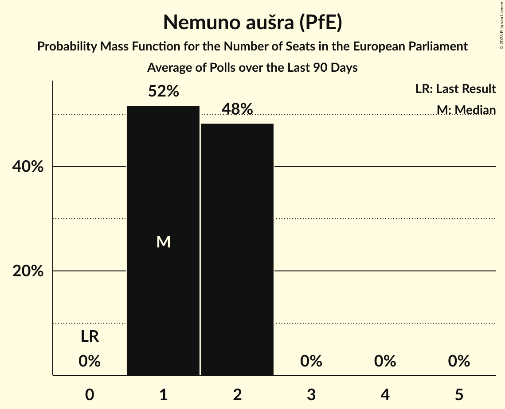

# Nemuno aušra (PfE)

<a href="#voting-intentions">Voting Intentions</a> | <a href="#seats">Seats</a>

## Voting Intentions

Last result: **0.0%** (General Election of 9 June 2024)

### Confidence Intervals

| Period     | Polling firm/Commissioner(s) | Median | 80% Confidence Interval | 90% Confidence Interval | 95% Confidence Interval | 99% Confidence Interval |
|:----------:|:----------------:|:-----------:|:-----------------------:|:-----------------------:|:-----------------------:|:-----------------------:|
| N/A | [Poll Average](average.html) | 13.7% | 11.1–16.5% | 10.6–17.1% | 10.2–17.6% | 9.5–18.6% |
| [21–31 July 2026](2026-07-31-Baltijostyrimai.html) | Baltijos tyrimai   ELTA | 15.3% | 13.7–17.1% | 13.2–17.6% | 12.8–18.1% | 12.1–19.0% |
| [18–28 July 2026](2026-07-28-Spintertyrimai.html) | Spinter tyrimai   Delfi | 12.0% | 10.6–13.7% | 10.2–14.2% | 9.9–14.6% | 9.2–15.5% |
| [19–30 June 2026](2026-06-30-Baltijostyrimai.html) | Baltijos tyrimai   ELTA | 14.0% | N/A | N/A | N/A | N/A |
| [18–28 June 2026](2026-06-28-Spintertyrimai.html) | Spinter tyrimai   Delfi | 8.4% | 7.2–9.9% | 6.8–10.3% | 6.6–10.7% | 6.0–11.5% |
| [21–31 May 2026](2026-05-31-Baltijostyrimai.html) | Baltijos tyrimai   ELTA | 12.4% | 10.9–14.1% | 10.5–14.5% | 10.2–15.0% | 9.5–15.8% |
| [18–30 May 2026](2026-05-30-Spintertyrimai.html) | Spinter tyrimai   Delfi | 9.8% | 8.5–11.5% | 8.1–11.9% | 7.8–12.3% | 7.1–13.2% |
| [23 April–7 May 2026](2026-05-07-Baltijostyrimai.html) | Baltijos tyrimai   ELTA | 16.5% | 14.8–18.5% | 14.3–19.0% | 13.9–19.5% | 13.1–20.5% |
| [18–28 April 2026](2026-04-28-Spintertyrimai.html) | Spinter tyrimai   Delfi | 10.3% | 8.9–12.0% | 8.5–12.5% | 8.2–12.9% | 7.6–13.7% |
| [19–30 March 2026](2026-03-30-Baltijostyrimai.html) | Baltijos tyrimai   ELTA | 12.7% | 11.3–14.4% | 10.9–14.8% | 10.5–15.3% | 9.9–16.1% |
| [18–28 March 2026](2026-03-28-Spintertyrimai.html) | Spinter tyrimai   Delfi | 9.1% | 7.8–10.7% | 7.5–11.2% | 7.2–11.6% | 6.6–12.4% |
| [19 February–2 March 2026](2026-03-02-Baltijostyrimai.html) | Baltijos tyrimai   ELTA | 13.0% | 11.6–14.8% | 11.1–15.3% | 10.8–15.7% | 10.1–16.6% |
| [18–28 February 2026](2026-02-28-Spintertyrimai.html) | Spinter tyrimai   Delfi | 11.6% | 10.1–13.4% | 9.6–13.9% | 9.3–14.3% | 8.6–15.2% |
| [19–29 January 2026](2026-01-29-Spintertyrimai.html) | Spinter tyrimai   Delfi | 11.5% | 10.3–12.9% | 10.0–13.3% | 9.7–13.6% | 9.1–14.3% |
| [8–24 January 2026](2026-01-24-Baltijostyrimai.html) | Baltijos tyrimai   ELTA | 13.5% | 12.3–15.0% | 11.9–15.4% | 11.6–15.7% | 11.0–16.4% |
| [12–30 December 2025](2025-12-30-Vilmorus.html) | Vilmorus   Lietuvos Rytas | 16.8% | 15.4–18.4% | 15.0–18.9% | 14.6–19.3% | 13.9–20.0% |
| [11–29 December 2025](2025-12-29-Baltijostyrimai.html) | Baltijos tyrimai   ELTA | 14.2% | N/A | N/A | N/A | N/A |
| [13–22 December 2025](2025-12-22-Spintertyrimai.html) | Spinter tyrimai   Delfi | 9.2% | N/A | N/A | N/A | N/A |
| [11–29 November 2025](2025-11-29-Baltijostyrimai.html) | Baltijos tyrimai   ELTA | 12.1% | N/A | N/A | N/A | N/A |
| [17–28 November 2025](2025-11-28-Spintertyrimai.html) | Spinter tyrimai   Delfi | 8.6% | N/A | N/A | N/A | N/A |
| [6–16 November 2025](2025-11-16-Vilmorus.html) | Vilmorus   Lietuvos Rytas | 16.7% | N/A | N/A | N/A | N/A |
| [16–28 October 2025](2025-10-28-Baltijostyrimai.html) | Baltijos tyrimai   ELTA | 11.6% | N/A | N/A | N/A | N/A |
| [17–27 October 2025](2025-10-27-Spintertyrimai.html) | Spinter tyrimai   Delfi | 8.5% | N/A | N/A | N/A | N/A |
| [24 September–9 October 2025](2025-10-09-Baltijostyrimai.html) | Baltijos tyrimai   ELTA | 12.3% | N/A | N/A | N/A | N/A |
| [17–27 September 2025](2025-09-27-Spintertyrimai.html) | Spinter tyrimai   Delfi | 12.7% | N/A | N/A | N/A | N/A |
| [4–13 September 2025](2025-09-13-Vilmorus.html) | Vilmorus   Lietuvos Rytas | 17.6% | N/A | N/A | N/A | N/A |
| [21 August–2 September 2025](2025-09-02-Baltijostyrimai.html) | Baltijos tyrimai   ELTA | 11.7% | N/A | N/A | N/A | N/A |
| [18–25 July 2025](2025-07-25-Spintertyrimai.html) | Spinter tyrimai   Delfi | 5.2% | N/A | N/A | N/A | N/A |
| [19–29 June 2025](2025-06-29-Spintertyrimai.html) | Spinter tyrimai   Delfi | 7.3% | N/A | N/A | N/A | N/A |
| [11–22 June 2025](2025-06-22-Vilmorus.html) | Vilmorus   Lietuvos Rytas | 15.1% | N/A | N/A | N/A | N/A |
| [26 April–18 May 2025](2025-05-18-Spintertyrimai.html) | Spinter tyrimai | 7.9% | N/A | N/A | N/A | N/A |
| [2–12 May 2025](2025-05-12-Vilmorus.html) | Vilmorus   Lietuvos Rytas | 12.9% | N/A | N/A | N/A | N/A |
| [19–29 April 2025](2025-04-29-Spintertyrimai.html) | Spinter tyrimai   Delfi | 9.3% | N/A | N/A | N/A | N/A |
| [17–28 April 2025](2025-04-28-Vilmorus.html) | Vilmorus   Lietuvos Rytas | 18.7% | N/A | N/A | N/A | N/A |
| [5–19 April 2025](2025-04-19-Baltijostyrimai.html) | Baltijos tyrimai   ELTA | 13.8% | N/A | N/A | N/A | N/A |
| [18–28 March 2025](2025-03-28-Spintertyrimai.html) | Spinter tyrimai   Delfi | 10.4% | N/A | N/A | N/A | N/A |
| [8–24 March 2025](2025-03-24-Baltijostyrimai.html) | Baltijos tyrimai   Elta | 13.2% | N/A | N/A | N/A | N/A |
| [14–23 February 2025](2025-02-23-Vilmorus.html) | Vilmorus   Lietuvos Rytas | 21.7% | N/A | N/A | N/A | N/A |
| [25 January–8 February 2025](2025-02-08-Baltijostyrimai.html) | Baltijos tyrimai   Elta | 17.4% | N/A | N/A | N/A | N/A |
| [18–29 January 2025](2025-01-29-Spintertyrimai.html) | Spinter tyrimai   Delfi | 13.0% | N/A | N/A | N/A | N/A |
| [13–20 December 2024](2024-12-20-Spintertyrimai.html) | Spinter tyrimai   Delfi | 17.9% | N/A | N/A | N/A | N/A |
| [12 November–1 December 2024](2024-12-01-Baltijostyrimai.html) | Baltijos tyrimai | 17.1% | N/A | N/A | N/A | N/A |
| [7–16 November 2024](2024-11-16-Vilmorus.html) | Vilmorus | 20.7% | N/A | N/A | N/A | N/A |
| [30 October–12 November 2024](2024-11-12-Baltijostyrimai.html) | Baltijos tyrimai | 20.3% | N/A | N/A | N/A | N/A |
| [16–25 September 2024](2024-09-25-Spintertyrimai.html) | Spinter tyrimai   Delfi | 16.0% | N/A | N/A | N/A | N/A |
| [13–21 September 2024](2024-09-21-Vilmorus.html) | Vilmorus | 16.7% | N/A | N/A | N/A | N/A |
| [6–20 September 2024](2024-09-20-Baltijostyrimai.html) | Baltijos tyrimai | 11.5% | N/A | N/A | N/A | N/A |
| [7–9 August 2024](2024-08-09-Baltijostyrimai.html) | Baltijos tyrimai   Delfi | 11.1% | N/A | N/A | N/A | N/A |
| [19–29 July 2024](2024-07-29-Spintertyrimai.html) | Spinter tyrimai   Delfi | 17.0% | N/A | N/A | N/A | N/A |
| [11–21 July 2024](2024-07-21-Vilmorus.html) | Vilmorus | 9.9% | N/A | N/A | N/A | N/A |
| [21 June–7 July 2024](2024-07-07-Baltijostyrimai.html) | Baltijos tyrimai   LRT | 9.8% | N/A | N/A | N/A | N/A |
| [18–28 June 2024](2024-06-28-Spintertyrimai.html) | Spinter tyrimai   Delfi | 13.4% | N/A | N/A | N/A | N/A |

### Probability Mass Function

The following table shows the probability mass function per percentage block of voting intentions for the [poll average](average.html) for Nemuno aušra (PfE).

| Voting Intentions | Probability | Accumulated | Special Marks |
|:-----------------:|:-----------:|:-----------:|:-------------:|
| 0.0–0.5% | 0% | 100% | Last Result |
| 0.5–1.5% | 0% | 100% |  |
| 1.5–2.5% | 0% | 100% |  |
| 2.5–3.5% | 0% | 100% |  |
| 3.5–4.5% | 0% | 100% |  |
| 4.5–5.5% | 0% | 100% |  |
| 5.5–6.5% | 0% | 100% |  |
| 6.5–7.5% | 0% | 100% |  |
| 7.5–8.5% | 0% | 100% |  |
| 8.5–9.5% | 0.6% | 100% |  |
| 9.5–10.5% | 4% | 99.4% |  |
| 10.5–11.5% | 12% | 96% |  |
| 11.5–12.5% | 17% | 84% |  |
| 12.5–13.5% | 15% | 68% |  |
| 13.5–14.5% | 15% | 52% | Median |
| 14.5–15.5% | 16% | 38% |  |
| 15.5–16.5% | 13% | 22% |  |
| 16.5–17.5% | 7% | 9% |  |
| 17.5–18.5% | 2% | 3% |  |
| 18.5–19.5% | 0.5% | 0.6% |  |
| 19.5–20.5% | 0.1% | 0.1% |  |
| 20.5–21.5% | 0% | 0% |  |

## Seats

Last result: **0** seats (General Election of 9 June 2024)

### Confidence Intervals

| Period     | Polling firm/Commissioner(s) | Median | 80% Confidence Interval | 90% Confidence Interval | 95% Confidence Interval | 99% Confidence Interval |
|:----------:|:----------------:|:------:|:-----------------------:|:-----------------------:|:-----------------------:|:-----------------------:|
| N/A | [Poll Average](average.html) | 2 | 1–2 | 1–2 | 1–3 | 1–3 |
| [21–31 July 2026](2026-07-31-Baltijostyrimai.html) | Baltijos tyrimai   ELTA | 2 | 2 | 2–3 | 2–3 | 1–3 |
| [18–28 July 2026](2026-07-28-Spintertyrimai.html) | Spinter tyrimai   Delfi | 1 | 1 | 1–2 | 1–2 | 1–2 |
| [19–30 June 2026](2026-06-30-Baltijostyrimai.html) | Baltijos tyrimai   ELTA |  |  |  |  |  |
| [18–28 June 2026](2026-06-28-Spintertyrimai.html) | Spinter tyrimai   Delfi | 1 | 1 | 1 | 1 | 1 |
| [21–31 May 2026](2026-05-31-Baltijostyrimai.html) | Baltijos tyrimai   ELTA | 2 | 1–2 | 1–2 | 1–2 | 1–2 |
| [18–30 May 2026](2026-05-30-Spintertyrimai.html) | Spinter tyrimai   Delfi | 1 | 1 | 1 | 1 | 1–2 |
| [23 April–7 May 2026](2026-05-07-Baltijostyrimai.html) | Baltijos tyrimai   ELTA | 2 | 2–3 | 2–3 | 2–3 | 2–3 |
| [18–28 April 2026](2026-04-28-Spintertyrimai.html) | Spinter tyrimai   Delfi | 1 | 1 | 1 | 1–2 | 1–2 |
| [19–30 March 2026](2026-03-30-Baltijostyrimai.html) | Baltijos tyrimai   ELTA | 2 | 1–2 | 1–2 | 1–2 | 1–2 |
| [18–28 March 2026](2026-03-28-Spintertyrimai.html) | Spinter tyrimai   Delfi | 1 | 1 | 1 | 1 | 1 |
| [19 February–2 March 2026](2026-03-02-Baltijostyrimai.html) | Baltijos tyrimai   ELTA | 2 | 1–2 | 1–2 | 1–2 | 1–2 |
| [18–28 February 2026](2026-02-28-Spintertyrimai.html) | Spinter tyrimai   Delfi | 1 | 1–2 | 1–2 | 1–2 | 1–2 |
| [19–29 January 2026](2026-01-29-Spintertyrimai.html) | Spinter tyrimai   Delfi | 1 | 1–2 | 1–2 | 1–2 | 1–2 |
| [8–24 January 2026](2026-01-24-Baltijostyrimai.html) | Baltijos tyrimai   ELTA | 2 | 1–2 | 1–2 | 1–2 | 1–2 |
| [12–30 December 2025](2025-12-30-Vilmorus.html) | Vilmorus   Lietuvos Rytas | 2 | 2 | 2 | 2 | 2 |
| [11–29 December 2025](2025-12-29-Baltijostyrimai.html) | Baltijos tyrimai   ELTA |  |  |  |  |  |
| [13–22 December 2025](2025-12-22-Spintertyrimai.html) | Spinter tyrimai   Delfi |  |  |  |  |  |
| [11–29 November 2025](2025-11-29-Baltijostyrimai.html) | Baltijos tyrimai   ELTA |  |  |  |  |  |
| [17–28 November 2025](2025-11-28-Spintertyrimai.html) | Spinter tyrimai   Delfi |  |  |  |  |  |
| [6–16 November 2025](2025-11-16-Vilmorus.html) | Vilmorus   Lietuvos Rytas |  |  |  |  |  |
| [16–28 October 2025](2025-10-28-Baltijostyrimai.html) | Baltijos tyrimai   ELTA |  |  |  |  |  |
| [17–27 October 2025](2025-10-27-Spintertyrimai.html) | Spinter tyrimai   Delfi |  |  |  |  |  |
| [24 September–9 October 2025](2025-10-09-Baltijostyrimai.html) | Baltijos tyrimai   ELTA |  |  |  |  |  |
| [17–27 September 2025](2025-09-27-Spintertyrimai.html) | Spinter tyrimai   Delfi |  |  |  |  |  |
| [4–13 September 2025](2025-09-13-Vilmorus.html) | Vilmorus   Lietuvos Rytas |  |  |  |  |  |
| [21 August–2 September 2025](2025-09-02-Baltijostyrimai.html) | Baltijos tyrimai   ELTA |  |  |  |  |  |
| [18–25 July 2025](2025-07-25-Spintertyrimai.html) | Spinter tyrimai   Delfi |  |  |  |  |  |
| [19–29 June 2025](2025-06-29-Spintertyrimai.html) | Spinter tyrimai   Delfi |  |  |  |  |  |
| [11–22 June 2025](2025-06-22-Vilmorus.html) | Vilmorus   Lietuvos Rytas |  |  |  |  |  |
| [26 April–18 May 2025](2025-05-18-Spintertyrimai.html) | Spinter tyrimai |  |  |  |  |  |
| [2–12 May 2025](2025-05-12-Vilmorus.html) | Vilmorus   Lietuvos Rytas |  |  |  |  |  |
| [19–29 April 2025](2025-04-29-Spintertyrimai.html) | Spinter tyrimai   Delfi |  |  |  |  |  |
| [17–28 April 2025](2025-04-28-Vilmorus.html) | Vilmorus   Lietuvos Rytas |  |  |  |  |  |
| [5–19 April 2025](2025-04-19-Baltijostyrimai.html) | Baltijos tyrimai   ELTA |  |  |  |  |  |
| [18–28 March 2025](2025-03-28-Spintertyrimai.html) | Spinter tyrimai   Delfi |  |  |  |  |  |
| [8–24 March 2025](2025-03-24-Baltijostyrimai.html) | Baltijos tyrimai   Elta |  |  |  |  |  |
| [14–23 February 2025](2025-02-23-Vilmorus.html) | Vilmorus   Lietuvos Rytas |  |  |  |  |  |
| [25 January–8 February 2025](2025-02-08-Baltijostyrimai.html) | Baltijos tyrimai   Elta |  |  |  |  |  |
| [18–29 January 2025](2025-01-29-Spintertyrimai.html) | Spinter tyrimai   Delfi |  |  |  |  |  |
| [13–20 December 2024](2024-12-20-Spintertyrimai.html) | Spinter tyrimai   Delfi |  |  |  |  |  |
| [12 November–1 December 2024](2024-12-01-Baltijostyrimai.html) | Baltijos tyrimai |  |  |  |  |  |
| [7–16 November 2024](2024-11-16-Vilmorus.html) | Vilmorus |  |  |  |  |  |
| [30 October–12 November 2024](2024-11-12-Baltijostyrimai.html) | Baltijos tyrimai |  |  |  |  |  |
| [16–25 September 2024](2024-09-25-Spintertyrimai.html) | Spinter tyrimai   Delfi |  |  |  |  |  |
| [13–21 September 2024](2024-09-21-Vilmorus.html) | Vilmorus |  |  |  |  |  |
| [6–20 September 2024](2024-09-20-Baltijostyrimai.html) | Baltijos tyrimai |  |  |  |  |  |
| [7–9 August 2024](2024-08-09-Baltijostyrimai.html) | Baltijos tyrimai   Delfi |  |  |  |  |  |
| [19–29 July 2024](2024-07-29-Spintertyrimai.html) | Spinter tyrimai   Delfi |  |  |  |  |  |
| [11–21 July 2024](2024-07-21-Vilmorus.html) | Vilmorus |  |  |  |  |  |
| [21 June–7 July 2024](2024-07-07-Baltijostyrimai.html) | Baltijos tyrimai   LRT |  |  |  |  |  |
| [18–28 June 2024](2024-06-28-Spintertyrimai.html) | Spinter tyrimai   Delfi |  |  |  |  |  |

### Probability Mass Function

The following table shows the probability mass function per seat for the [poll average](average.html) for Nemuno aušra (PfE).

| Number of Seats | Probability | Accumulated | Special Marks |
|:---------------:|:-----------:|:-----------:|:-------------:|
| 0 | 0% | 100% | Last Result |
| 1 | 47% | 100% |  |
| 2 | 50% | 53% | Median |
| 3 | 4% | 4% |  |
| 4 | 0% | 0% |  |

