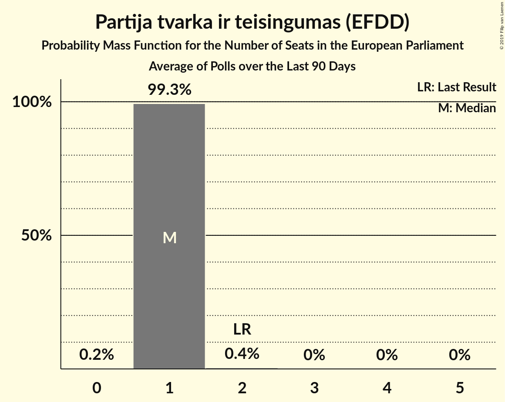

# Partija tvarka ir teisingumas (EFDD)

<a href="#voting-intentions">Voting Intentions</a> | <a href="#seats">Seats</a>

## Voting Intentions

Last result: **14.2%** (General Election of 25 May 2014)

### Confidence Intervals

| Period     | Polling firm/Commissioner(s) | Median | 80% Confidence Interval | 90% Confidence Interval | 95% Confidence Interval | 99% Confidence Interval |
|:----------:|:----------------:|:-----------:|:-----------------------:|:-----------------------:|:-----------------------:|:-----------------------:|
| N/A | [Poll Average](average.html) | 9.2% | 7.5–12.6% | 7.2–13.2% | 6.9–13.6% | 6.3–14.4% |
| [23 January–3 February 2019](2019-02-03-Baltijostyrimai.html) | Baltijos tyrimai | 12.0% | 10.8–13.4% | 10.4–13.8% | 10.2–14.2% | 9.6–14.9% |
| [15–26 January 2019](2019-01-26-Spintertyrimai.html) | Spinter tyrimai | 8.0% | 7.0–9.2% | 6.7–9.6% | 6.5–9.9% | 6.0–10.5% |
| [11–20 January 2019](2019-01-20-Vilmorus.html) | Vilmorus   Lietuvos rytas | 9.0% | 7.9–10.2% | 7.6–10.6% | 7.4–10.9% | 6.9–11.5% |
| [19–30 November 2018](2018-11-30-Spintertyrimai.html) | Spinter tyrimai | 11.0% | 9.8–12.3% | 9.4–12.7% | 9.2–13.0% | 8.6–13.7% |
| [9–26 November 2018](2018-11-26-Baltijostyrimai.html) | Baltijos tyrimai | 10.0% | 8.9–11.4% | 8.6–11.7% | 8.3–12.0% | 7.8–12.7% |
| [16–30 October 2018](2018-10-30-Spintertyrimai.html) | Spinter tyrimai | 12.0% | 10.8–13.5% | 10.5–13.9% | 10.2–14.2% | 9.6–14.9% |
| [10–26 October 2018](2018-10-26-Baltijostyrimai.html) | Baltijos tyrimai | 11.0% | 9.8–12.4% | 9.5–12.8% | 9.2–13.1% | 8.7–13.8% |
| [24 September–7 October 2018](2018-10-07-Baltijostyrimai.html) | Baltijos tyrimai | 12.0% | 10.8–13.4% | 10.4–13.8% | 10.2–14.2% | 9.6–14.9% |
| [19–26 September 2018](2018-09-26-Spintertyrimai.html) | Spinter tyrimai | 10.0% | 8.9–11.3% | 8.6–11.7% | 8.3–12.0% | 7.8–12.7% |
| [24–31 August 2018](2018-08-31-Spintertyrimai.html) | Spinter tyrimai | 11.0% | 9.8–12.4% | 9.5–12.8% | 9.2–13.1% | 8.7–13.8% |
| [21–31 August 2018](2018-08-31-Baltijostyrimai.html) | Baltijos tyrimai | 10.0% | 8.9–11.4% | 8.6–11.7% | 8.3–12.0% | 7.8–12.7% |
| [16–31 July 2018](2018-07-31-Baltijostyrimai.html) | Baltijos tyrimai | 13.0% | 11.7–14.5% | 11.4–14.9% | 11.1–15.2% | 10.5–16.0% |
| [19–27 June 2018](2018-06-27-Spintertyrimai.html) | Spinter tyrimai | 11.0% | 9.8–12.3% | 9.5–12.7% | 9.2–13.1% | 8.6–13.7% |
| [8–17 June 2018](2018-06-17-Vilmorus.html) | Vilmorus   Lietuvos rytas | 10.0% | 8.9–11.3% | 8.5–11.6% | 8.3–11.9% | 7.8–12.6% |
| [4–12 May 2018](2018-05-12-Vilmorus.html) | Vilmorus   Lietuvos rytas | 11.0% | 9.8–12.3% | 9.5–12.7% | 9.2–13.0% | 8.7–13.7% |
| [12–21 January 2018](2018-01-21-Vilmorus.html) | Vilmorus   Lietuvos rytas | 14.0% | 12.7–15.5% | 12.3–15.9% | 12.0–16.3% | 11.4–17.0% |

### Probability Mass Function

The following table shows the probability mass function per percentage block of voting intentions for the [poll average](average.html) for Partija tvarka ir teisingumas (EFDD).

| Voting Intentions | Probability | Accumulated | Special Marks |
|:-----------------:|:-----------:|:-----------:|:-------------:|
| 4.5–5.5% | 0% | 100% |  |
| 5.5–6.5% | 1.0% | 100% |  |
| 6.5–7.5% | 9% | 99.0% |  |
| 7.5–8.5% | 23% | 90% |  |
| 8.5–9.5% | 22% | 67% | Median |
| 9.5–10.5% | 11% | 44% |  |
| 10.5–11.5% | 10% | 33% |  |
| 11.5–12.5% | 13% | 23% |  |
| 12.5–13.5% | 8% | 11% |  |
| 13.5–14.5% | 2% | 3% | Last Result |
| 14.5–15.5% | 0.3% | 0.4% |  |
| 15.5–16.5% | 0% | 0% |  |

## Seats

Last result: **2** seats (General Election of 25 May 2014)

### Confidence Intervals

| Period     | Polling firm/Commissioner(s) | Median | 80% Confidence Interval | 90% Confidence Interval | 95% Confidence Interval | 99% Confidence Interval |
|:----------:|:----------------:|:------:|:-----------------------:|:-----------------------:|:-----------------------:|:-----------------------:|
| N/A | [Poll Average](average.html) | 1 | 1 | 1 | 1–2 | 1–2 |
| [23 January–3 February 2019](2019-02-03-Baltijostyrimai.html) | Baltijos tyrimai | 1 | 1 | 1–2 | 1–2 | 1–2 |
| [15–26 January 2019](2019-01-26-Spintertyrimai.html) | Spinter tyrimai | 1 | 1 | 1 | 1 | 1 |
| [11–20 January 2019](2019-01-20-Vilmorus.html) | Vilmorus   Lietuvos rytas | 1 | 1 | 1 | 1–2 | 1–2 |
| [19–30 November 2018](2018-11-30-Spintertyrimai.html) | Spinter tyrimai | 1 | 1–2 | 1–2 | 1–2 | 1–2 |
| [9–26 November 2018](2018-11-26-Baltijostyrimai.html) | Baltijos tyrimai | 1 | 1 | 1 | 1 | 1–2 |
| [16–30 October 2018](2018-10-30-Spintertyrimai.html) | Spinter tyrimai | 1 | 1–2 | 1–2 | 1–2 | 1–2 |
| [10–26 October 2018](2018-10-26-Baltijostyrimai.html) | Baltijos tyrimai | 1 | 1 | 1 | 1 | 1 |
| [24 September–7 October 2018](2018-10-07-Baltijostyrimai.html) | Baltijos tyrimai | 1 | 1 | 1 | 1 | 1–2 |
| [19–26 September 2018](2018-09-26-Spintertyrimai.html) | Spinter tyrimai | 1 | 1 | 1 | 1 | 1 |
| [24–31 August 2018](2018-08-31-Spintertyrimai.html) | Spinter tyrimai | 1 | 1 | 1 | 1 | 1–2 |
| [21–31 August 2018](2018-08-31-Baltijostyrimai.html) | Baltijos tyrimai | 1 | 1 | 1 | 1 | 1 |
| [16–31 July 2018](2018-07-31-Baltijostyrimai.html) | Baltijos tyrimai | 1 | 1 | 1–2 | 1–2 | 1–2 |
| [19–27 June 2018](2018-06-27-Spintertyrimai.html) | Spinter tyrimai | 1 | 1 | 1 | 1 | 1–2 |
| [8–17 June 2018](2018-06-17-Vilmorus.html) | Vilmorus   Lietuvos rytas | 1 | 1 | 1–2 | 1–2 | 1–2 |
| [4–12 May 2018](2018-05-12-Vilmorus.html) | Vilmorus   Lietuvos rytas | 1 | 1 | 1 | 1 | 1–2 |
| [12–21 January 2018](2018-01-21-Vilmorus.html) | Vilmorus   Lietuvos rytas | 2 | 1–2 | 1–2 | 1–2 | 1–2 |

### Probability Mass Function

The following table shows the probability mass function per seat for the [poll average](average.html) for Partija tvarka ir teisingumas (EFDD).

| Number of Seats | Probability | Accumulated | Special Marks |
|:---------------:|:-----------:|:-----------:|:-------------:|
| 1 | 96% | 100% | Median |
| 2 | 4% | 4% | Last Result |
| 3 | 0% | 0% |  |

