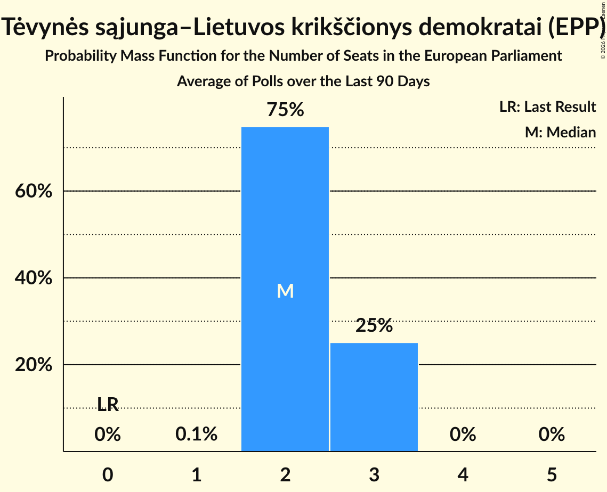

# Tėvynės sąjunga–Lietuvos krikščionys demokratai (EPP)

<a href="#voting-intentions">Voting Intentions</a> | <a href="#seats">Seats</a>

## Voting Intentions

Last result: **17.4%** (General Election of 26 May 2019)

### Confidence Intervals

| Period     | Polling firm/Commissioner(s) | Median | 80% Confidence Interval | 90% Confidence Interval | 95% Confidence Interval | 99% Confidence Interval |
|:----------:|:----------------:|:-----------:|:-----------------------:|:-----------------------:|:-----------------------:|:-----------------------:|
| N/A | [Poll Average](average.html) | 24.9% | 21.6–28.4% | 21.1–29.0% | 20.6–29.5% | 19.8–30.5% |
| [18–27 January 2021](2021-01-27-Spintertyrimai.html) | Spinter tyrimai   Delfi | 27.1% | 25.4–29.0% | 24.9–29.5% | 24.5–30.0% | 23.7–30.9% |
| [10–20 December 2020](2020-12-20-Spintertyrimai.html) | Spinter tyrimai   Delfi | 23.2% | 21.6–25.0% | 21.1–25.5% | 20.7–26.0% | 20.0–26.8% |
| [6–30 November 2020](2020-11-30-Baltijostyrimai.html) | Baltijos tyrimai   ELTA | 22.7% | 21.1–24.5% | 20.6–25.0% | 20.2–25.4% | 19.4–26.3% |
| [17–27 September 2020](2020-09-27-Baltijostyrimai.html) | Baltijos tyrimai   ELTA | 17.7% | 16.2–19.3% | 15.8–19.8% | 15.5–20.2% | 14.8–21.0% |
| [4–12 September 2020](2020-09-12-Vilmorus.html) | Vilmorus   Lietuvos rytas | 20.7% | 19.2–22.5% | 18.7–22.9% | 18.3–23.4% | 17.6–24.2% |
| [26 August–4 September 2020](2020-09-04-Spintertyrimai.html) | Spinter tyrimai   Delfi | 21.7% | 20.1–23.5% | 19.7–24.0% | 19.3–24.4% | 18.5–25.2% |
| [22 August–4 September 2020](2020-09-04-Baltijostyrimai.html) | Baltijos tyrimai   ELTA | 19.2% | 17.7–20.8% | 17.2–21.3% | 16.9–21.7% | 16.2–22.5% |
| [29 July–31 August 2020](2020-08-31-Norstat.html) | Norstat   LRT | 32.8% | 30.9–34.8% | 30.4–35.3% | 29.9–35.8% | 29.1–36.7% |
| [16–30 July 2020](2020-07-30-Baltijostyrimai.html) | Baltijos tyrimai   ELTA | 19.2% | 17.7–20.9% | 17.2–21.4% | 16.9–21.8% | 16.2–22.6% |
| [16–26 July 2020](2020-07-26-Spintertyrimai.html) | Spinter tyrimai   Delfi | 22.8% | 21.2–24.6% | 20.7–25.1% | 20.3–25.5% | 19.6–26.4% |
| [10–18 July 2020](2020-07-18-Vilmorus.html) | Vilmorus   Lietuvos rytas | 26.5% | 23.6–27.1% | 23.1–27.6% | 22.7–28.0% | 21.9–28.9% |
| [18–26 June 2020](2020-06-26-Spintertyrimai.html) | Spinter tyrimai   Delfi | 25.1% | 23.5–27.0% | 23.0–27.5% | 22.6–27.9% | 21.8–28.8% |
| [15–25 June 2020](2020-06-25-Baltijostyrimai.html) | Baltijos tyrimai   ELTA | 18.2% | 16.7–19.8% | 16.3–20.3% | 15.9–20.7% | 15.2–21.5% |
| [5–13 June 2020](2020-06-13-Vilmorus.html) | Vilmorus   Lietuvos rytas | 25.1% | 23.4–26.9% | 22.9–27.5% | 22.5–27.9% | 21.7–28.8% |
| [20–30 April 2020](2020-04-30-Spintertyrimai.html) | Spinter tyrimai   Delfi | 26.4% | 24.7–28.2% | 24.2–28.8% | 23.8–29.2% | 23.0–30.1% |
| [17–30 March 2020](2020-03-30-Spintertyrimai.html) | Spinter tyrimai   Delfi | 30.1% | 28.3–32.0% | 27.8–32.6% | 27.4–33.0% | 26.5–34.0% |
| [6–13 March 2020](2020-03-13-Vilmorus.html) | Vilmorus   Lietuvos rytas | 29.0% | 27.1–30.9% | 26.6–31.4% | 26.2–31.9% | 25.3–32.8% |
| [13–26 February 2020](2020-02-26-Baltijostyrimai.html) | Baltijos tyrimai   ELTA | 24.3% | 22.6–26.0% | 22.1–26.6% | 21.7–27.0% | 21.0–27.9% |
| [18–25 February 2020](2020-02-25-Spintertyrimai.html) | Spinter tyrimai   Delfi | 27.7% | 25.9–29.5% | 25.4–30.1% | 25.0–30.5% | 24.2–31.4% |
| [7–13 February 2020](2020-02-13-Vilmorus.html) | Vilmorus   Lietuvos rytas | 29.4% | 27.5–31.3% | 27.0–31.8% | 26.6–32.3% | 25.7–33.2% |
| [20–28 January 2020](2020-01-28-Spintertyrimai.html) | Spinter tyrimai   Delfi | 26.7% | 25.0–28.5% | 24.5–29.1% | 24.1–29.5% | 23.3–30.4% |
| [10–18 January 2020](2020-01-18-Vilmorus.html) | Vilmorus   Lietuvos rytas | 28.0% | 26.3–29.9% | 25.8–30.5% | 25.3–30.9% | 24.5–31.8% |
| [10–21 December 2019](2019-12-21-Baltijostyrimai.html) | Baltijos tyrimai   ELTA | 23.8% | 22.2–25.6% | 21.7–26.1% | 21.3–26.5% | 20.5–27.4% |
| [29 November–7 December 2019](2019-12-07-Vilmorus.html) | Vilmorus   Lietuvos rytas | 26.1% | 24.3–27.9% | 23.8–28.4% | 23.4–28.9% | 22.6–29.8% |
| [19–29 November 2019](2019-11-29-Spintertyrimai.html) | Spinter tyrimai   Delfi | 27.5% | 25.8–29.4% | 25.3–29.9% | 24.9–30.4% | 24.0–31.3% |
| [14–27 November 2019](2019-11-27-Baltijostyrimai.html) | Baltijos tyrimai   ELTA | 26.3% | 24.6–28.2% | 24.1–28.7% | 23.7–29.1% | 22.8–30.0% |
| [8–16 November 2019](2019-11-16-Vilmorus.html) | Vilmorus   Lietuvos rytas | 26.9% | 25.1–28.7% | 24.6–29.2% | 24.2–29.7% | 23.4–30.6% |
| [15–29 October 2019](2019-10-29-Baltijostyrimai.html) | Baltijos tyrimai   ELTA | 24.2% | 22.5–26.0% | 22.1–26.5% | 21.6–27.0% | 20.9–27.8% |
| [17–28 October 2019](2019-10-28-Spintertyrimai.html) | Spinter tyrimai   Delfi | 26.0% | 24.3–27.8% | 23.8–28.3% | 23.4–28.8% | 22.6–29.7% |
| [4–13 October 2019](2019-10-13-Vilmorus.html) | Vilmorus   Lietuvos rytas | 26.7% | 25.0–28.6% | 24.5–29.2% | 24.1–29.6% | 23.2–30.5% |
| [21 September–5 October 2019](2019-10-05-Baltijostyrimai.html) | Baltijos tyrimai   ELTA | 26.5% | 24.8–28.4% | 24.3–28.9% | 23.9–29.4% | 23.1–30.3% |
| [18–27 September 2019](2019-09-27-Spintertyrimai.html) | Spinter tyrimai   Delfi | 26.2% | 24.5–28.0% | 24.0–28.5% | 23.6–29.0% | 22.8–29.9% |
| [6–14 September 2019](2019-09-14-Vilmorus.html) | Vilmorus   Lietuvos rytas | 23.2% | 21.6–25.0% | 21.1–25.5% | 20.7–26.0% | 19.9–26.8% |
| [26 August–8 September 2019](2019-09-08-Baltijostyrimai.html) | Baltijos tyrimai   ELTA | 20.0% | 18.5–21.7% | 18.0–22.2% | 17.7–22.6% | 17.0–23.4% |
| [15–29 July 2019](2019-07-29-Baltijostyrimai.html) | Baltijos tyrimai   ELTA | 21.0% | 19.4–22.7% | 19.0–23.2% | 18.6–23.6% | 17.8–24.5% |
| [17–26 July 2019](2019-07-26-Spintertyrimai.html) | Spinter tyrimai   Delfi | 26.2% | 24.5–28.1% | 24.0–28.6% | 23.6–29.0% | 22.8–29.9% |
| [5–13 July 2019](2019-07-13-Vilmorus.html) | Vilmorus   Lietuvos rytas | 25.6% | 23.9–27.5% | 23.4–28.0% | 23.0–28.5% | 22.2–29.4% |
| [14–28 June 2019](2019-06-28-Baltijostyrimai.html) | Baltijos tyrimai   ELTA | 22.1% | 20.5–23.9% | 20.1–24.4% | 19.7–24.8% | 18.9–25.6% |
| [18–27 June 2019](2019-06-27-Spintertyrimai.html) | Spinter tyrimai   Delfi | 26.9% | 25.2–28.8% | 24.7–29.3% | 24.3–29.8% | 23.5–30.6% |
| [7–15 June 2019](2019-06-15-Vilmorus.html) | Vilmorus   Lietuvos rytas | 26.2% | 24.4–28.0% | 23.9–28.6% | 23.5–29.0% | 22.7–29.9% |
| [27 May–9 June 2019](2019-06-09-Baltijostyrimai.html) | Baltijos tyrimai   ELTA | 22.4% | 20.8–24.2% | 20.4–24.7% | 20.0–25.1% | 19.2–26.0% |

### Probability Mass Function

The following table shows the probability mass function per percentage block of voting intentions for the [poll average](average.html) for Tėvynės sąjunga–Lietuvos krikščionys demokratai (EPP).

| Voting Intentions | Probability | Accumulated | Special Marks |
|:-----------------:|:-----------:|:-----------:|:-------------:|
| 16.5–17.5% | 0% | 100% | Last Result |
| 17.5–18.5% | 0% | 100% |  |
| 18.5–19.5% | 0.3% | 100% |  |
| 19.5–20.5% | 2% | 99.7% |  |
| 20.5–21.5% | 7% | 98% |  |
| 21.5–22.5% | 13% | 91% |  |
| 22.5–23.5% | 14% | 78% |  |
| 23.5–24.5% | 10% | 63% |  |
| 24.5–25.5% | 8% | 53% | Median |
| 25.5–26.5% | 11% | 45% |  |
| 26.5–27.5% | 14% | 34% |  |
| 27.5–28.5% | 11% | 20% |  |
| 28.5–29.5% | 6% | 8% |  |
| 29.5–30.5% | 2% | 2% |  |
| 30.5–31.5% | 0.4% | 0.5% |  |
| 31.5–32.5% | 0.1% | 0.1% |  |
| 32.5–33.5% | 0% | 0% |  |

## Seats

Last result: **2** seats (General Election of 26 May 2019)

### Confidence Intervals

| Period     | Polling firm/Commissioner(s) | Median | 80% Confidence Interval | 90% Confidence Interval | 95% Confidence Interval | 99% Confidence Interval |
|:----------:|:----------------:|:------:|:-----------------------:|:-----------------------:|:-----------------------:|:-----------------------:|
| N/A | [Poll Average](average.html) | 3 | 3 | 3 | 2–3 | 2–4 |
| [18–27 January 2021](2021-01-27-Spintertyrimai.html) | Spinter tyrimai   Delfi | 3 | 3 | 3 | 3 | 3–4 |
| [10–20 December 2020](2020-12-20-Spintertyrimai.html) | Spinter tyrimai   Delfi | 3 | 2–3 | 2–3 | 2–3 | 2–3 |
| [6–30 November 2020](2020-11-30-Baltijostyrimai.html) | Baltijos tyrimai   ELTA | 3 | 3 | 2–3 | 2–3 | 2–3 |
| [17–27 September 2020](2020-09-27-Baltijostyrimai.html) | Baltijos tyrimai   ELTA | 2 | 2 | 2–3 | 2–3 | 2–3 |
| [4–12 September 2020](2020-09-12-Vilmorus.html) | Vilmorus   Lietuvos rytas | 3 | 2–3 | 2–3 | 2–3 | 2–3 |
| [26 August–4 September 2020](2020-09-04-Spintertyrimai.html) | Spinter tyrimai   Delfi | 3 | 2–3 | 2–3 | 2–3 | 2–3 |
| [22 August–4 September 2020](2020-09-04-Baltijostyrimai.html) | Baltijos tyrimai   ELTA | 2 | 2–3 | 2–3 | 2–3 | 2–3 |
| [29 July–31 August 2020](2020-08-31-Norstat.html) | Norstat   LRT | 4 | 4 | 4 | 3–4 | 3–5 |
| [16–30 July 2020](2020-07-30-Baltijostyrimai.html) | Baltijos tyrimai   ELTA | 2 | 2–3 | 2–3 | 2–3 | 2–3 |
| [16–26 July 2020](2020-07-26-Spintertyrimai.html) | Spinter tyrimai   Delfi | 3 | 2–3 | 2–3 | 2–3 | 2–3 |
| [10–18 July 2020](2020-07-18-Vilmorus.html) | Vilmorus   Lietuvos rytas | 3 | 3–4 | 3–4 | 3–4 | 3–4 |
| [18–26 June 2020](2020-06-26-Spintertyrimai.html) | Spinter tyrimai   Delfi | 3 | 2–3 | 2–3 | 2–3 | 2–3 |
| [15–25 June 2020](2020-06-25-Baltijostyrimai.html) | Baltijos tyrimai   ELTA | 2 | 2 | 2 | 2–3 | 2–3 |
| [5–13 June 2020](2020-06-13-Vilmorus.html) | Vilmorus   Lietuvos rytas | 3 | 3–4 | 3–4 | 3–4 | 3–4 |
| [20–30 April 2020](2020-04-30-Spintertyrimai.html) | Spinter tyrimai   Delfi | 3 | 3 | 3 | 3 | 3–4 |
| [17–30 March 2020](2020-03-30-Spintertyrimai.html) | Spinter tyrimai   Delfi | 4 | 3–4 | 3–4 | 3–4 | 3–4 |
| [6–13 March 2020](2020-03-13-Vilmorus.html) | Vilmorus   Lietuvos rytas | 4 | 3–4 | 3–4 | 3–4 | 3–4 |
| [13–26 February 2020](2020-02-26-Baltijostyrimai.html) | Baltijos tyrimai   ELTA | 3 | 3 | 3–4 | 3–4 | 3–4 |
| [18–25 February 2020](2020-02-25-Spintertyrimai.html) | Spinter tyrimai   Delfi | 3 | 3–4 | 3–4 | 3–4 | 3–4 |
| [7–13 February 2020](2020-02-13-Vilmorus.html) | Vilmorus   Lietuvos rytas | 4 | 3–4 | 3–4 | 3–4 | 3–4 |
| [20–28 January 2020](2020-01-28-Spintertyrimai.html) | Spinter tyrimai   Delfi | 3 | 3–4 | 3–4 | 3–4 | 3–4 |
| [10–18 January 2020](2020-01-18-Vilmorus.html) | Vilmorus   Lietuvos rytas | 4 | 3–4 | 3–4 | 3–4 | 3–4 |
| [10–21 December 2019](2019-12-21-Baltijostyrimai.html) | Baltijos tyrimai   ELTA | 3 | 3 | 3 | 3 | 2–4 |
| [29 November–7 December 2019](2019-12-07-Vilmorus.html) | Vilmorus   Lietuvos rytas | 3 | 3–4 | 3–4 | 3–4 | 3–4 |
| [19–29 November 2019](2019-11-29-Spintertyrimai.html) | Spinter tyrimai   Delfi | 4 | 3–4 | 3–4 | 3–4 | 3–4 |
| [14–27 November 2019](2019-11-27-Baltijostyrimai.html) | Baltijos tyrimai   ELTA | 3 | 3 | 3–4 | 3–4 | 3–4 |
| [8–16 November 2019](2019-11-16-Vilmorus.html) | Vilmorus   Lietuvos rytas | 3 | 3–4 | 3–4 | 3–4 | 3–4 |
| [15–29 October 2019](2019-10-29-Baltijostyrimai.html) | Baltijos tyrimai   ELTA | 3 | 3 | 3 | 3 | 2–3 |
| [17–28 October 2019](2019-10-28-Spintertyrimai.html) | Spinter tyrimai   Delfi | 3 | 3–4 | 3–4 | 3–4 | 3–4 |
| [4–13 October 2019](2019-10-13-Vilmorus.html) | Vilmorus   Lietuvos rytas | 3 | 3–4 | 3–4 | 3–4 | 3–4 |
| [21 September–5 October 2019](2019-10-05-Baltijostyrimai.html) | Baltijos tyrimai   ELTA | 3 | 3–4 | 3–4 | 3–4 | 3–4 |
| [18–27 September 2019](2019-09-27-Spintertyrimai.html) | Spinter tyrimai   Delfi | 3 | 3–4 | 3–4 | 3–4 | 3–4 |
| [6–14 September 2019](2019-09-14-Vilmorus.html) | Vilmorus   Lietuvos rytas | 3 | 3 | 2–3 | 2–3 | 2–3 |
| [26 August–8 September 2019](2019-09-08-Baltijostyrimai.html) | Baltijos tyrimai   ELTA | 3 | 2–3 | 2–3 | 2–3 | 2–3 |
| [15–29 July 2019](2019-07-29-Baltijostyrimai.html) | Baltijos tyrimai   ELTA | 3 | 2–3 | 2–3 | 2–3 | 2–3 |
| [17–26 July 2019](2019-07-26-Spintertyrimai.html) | Spinter tyrimai   Delfi | 3 | 3 | 3 | 3 | 3–4 |
| [5–13 July 2019](2019-07-13-Vilmorus.html) | Vilmorus   Lietuvos rytas | 3 | 3–4 | 3–4 | 3–4 | 3–4 |
| [14–28 June 2019](2019-06-28-Baltijostyrimai.html) | Baltijos tyrimai   ELTA | 3 | 2–3 | 2–3 | 2–3 | 2–3 |
| [18–27 June 2019](2019-06-27-Spintertyrimai.html) | Spinter tyrimai   Delfi | 3 | 3 | 3–4 | 3–4 | 3–4 |
| [7–15 June 2019](2019-06-15-Vilmorus.html) | Vilmorus   Lietuvos rytas | 3 | 3–4 | 3–4 | 3–4 | 3–4 |
| [27 May–9 June 2019](2019-06-09-Baltijostyrimai.html) | Baltijos tyrimai   ELTA | 3 | 2–3 | 2–3 | 2–3 | 2–3 |

### Probability Mass Function

The following table shows the probability mass function per seat for the [poll average](average.html) for Tėvynės sąjunga–Lietuvos krikščionys demokratai (EPP).

| Number of Seats | Probability | Accumulated | Special Marks |
|:---------------:|:-----------:|:-----------:|:-------------:|
| 2 | 3% | 100% | Last Result |
| 3 | 96% | 97% | Median |
| 4 | 0.9% | 0.9% |  |
| 5 | 0% | 0% |  |

